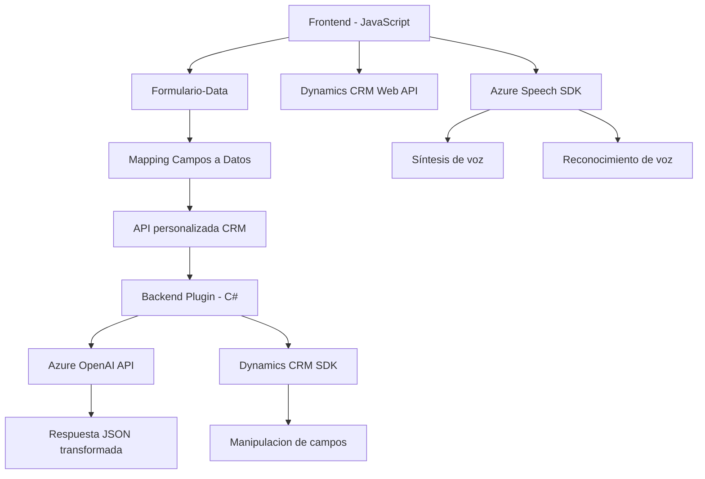

### Breve Resumen Técnico
El repositorio contiene archivos distribuidos entre el frontend y el backend (plugins). Los archivos implementan funcionalidades relacionadas con la síntesis, reconocimiento de voz y transformación de texto mediante integración con servicios externos como **Azure Speech SDK** y **Azure OpenAI**. Las soluciones están orientadas al entorno de **Microsoft Dynamics CRM**, donde realizan tareas sobre formularios y campos de la plataforma.

---

### Descripción de Arquitectura
- **Tipo de solución**: Integración de servicios externos (Azure Speech SDK y Azure OpenAI) para la funcionalidad de procesamiento de voz y transformación de texto, conectada directamente con Dynamics CRM.
- **Patrones de diseño**: Modularidad funcional con separación clara entre lógica de frontend (procesamiento de datos del navegador y gestión de formularios) y lógica de backend (implementada en plugins para Dynamics CRM). En el backend, se sigue el **patrón de plugins (Dynamics CRM)** para personalizar eventos en el sistema.

La arquitectura general resulta ser una **n capas**, donde:
1. **Capa de presentación (Frontend)**: Implementada en JavaScript usando el SDK de Azure Speech.
2. **Capa de lógica de negocio (Backend)**: Con plugins (.NET) que procesan texto mediante Azure OpenAI y manipulan datos en el sistema CRM.
3. **Capa de integración**: Conectada a Azure Speech SDK y Azure OpenAI.

---

### Tecnologías Usadas
- **Frontend**:
  - **JavaScript**: Modular y procedural, usado para manipulación de DOM en formularios y para consumir el SDK de Azure Speech.
  - **Azure Speech SDK**: Para lectura de texto y síntesis de voz, integrado dinámicamente.
  - **Dynamics CRM Web API**: Interacción con campos y formularios del sistema CRM.

- **Backend**:
  - **C# (.NET)**: Para desarrollo de plugins personalizados en Dynamics CRM.
  - **Azure OpenAI API**: Para transformación avanzada de texto con inteligencia artificial.
  - **Dynamics CRM SDK (Microsoft.Xrm.Sdk)**: Para extender procesos del sistema CRM.
  - Librerías auxiliares: `Newtonsoft.Json`, `System.Net.Http`, `System.Text.Json`.

---

### Dependencias y Componentes Externos Potenciales
1. **Azure Speech SDK**: Aporta capacidades de reconocimiento y síntesis de voz en el frontend.
2. **Azure OpenAI API**: Proporciona procesamiento de lenguaje natural para la transformación del texto.
3. **Dynamics CRM Web API**: Para interactuar con datos y formularios.
4. **External libraries**:
   - `System.Net.Http` for HTTP requests.
   - `Newtonsoft.Json` and `System.Text.Json` for JSON parsing.
5. Potential external connections:
   - REST APIs in Azure Cloud.
   - Dynamics CRM-related services hosted in Microsoft Dataverse.

---

### Diagrama Mermaid válido para GitHub Markdown

---

### Conclusión Final
El análisis revela que el repositorio implementa una solución **n capas** centrada en la integración con **Dynamics CRM** a través de **eventos y formularios**. El frontend (JavaScript) usa el **Azure Speech SDK** para integrar funciones de reconocimiento y síntesis de voz, generando inputs que alimentan al backend. El backend, a través de plugins en **C#**, interactúa con el entorno CRM y servicios externos como **Azure OpenAI API**, transformando datos de entrada a formatos específicos. El diseño modular y la separación de capas son apropiados para mantener independencia tecnológica y facilitar el mantenimiento.