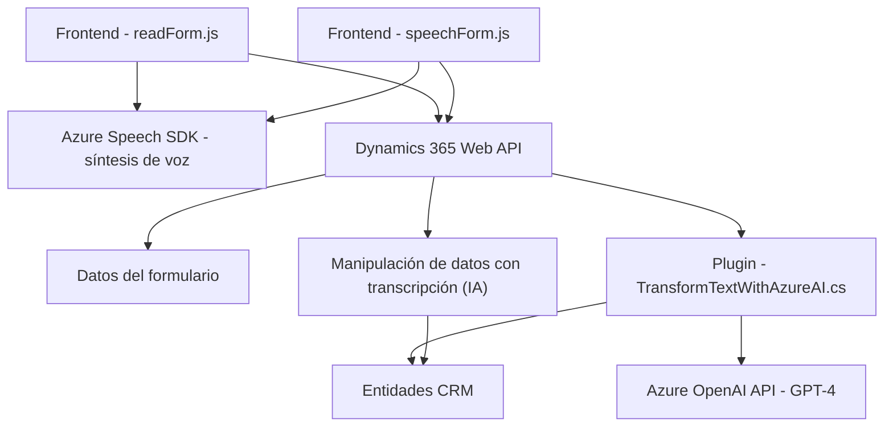

### Resumen técnico
El repositorio contiene múltiples archivos dedicados a integrar capacidades de **sintetización de voz** y **procesamiento de texto** mediante Microsoft Dynamics 365 y servicios de Azure, lo que indica una solución orientada a la accesibilidad y automatización basada en **IA conversacional**. En particular:
- **Frontend**: Funcionalidades escritas en JavaScript que interactúan directamente con formularios en Dynamics 365, usando el **Azure Speech SDK** para la conversión de texto en voz y viceversa.
- **Backend**: Un plugin de Microsoft Dynamics CRM escrito en C# que utiliza **Azure OpenAI API** para transformar texto y devolver resultados en formato JSON.

---

### Arquitectura de la solución
El repositorio mezcla diferentes paradigmas arquitectónicos:
1. **Monolito distribuido**:
   - Aunque los componentes frontend y backend están separados, trabajan integrados en un sistema principal, Dynamics 365, eliminando comunicación entre procesos independientes.
   
2. **N-capas**:
   - La arquitectura presenta capas separadas:
     - **Frontend**: Validaciones y procesamiento inicial de datos del usuario.
     - **Backend (Plugins)**: Transformaciones más pesadas basadas en Azure OpenAI y lógica asociada al CRM.
     - **Servicios externos**: Azure Speech SDK y OpenAI API para sintetización y transformación del texto.

3. **Integración vía SDK y API**:
   - El sistema utiliza servicios externos para facilitar su funcionalidad (Azure Speech SDK y OpenAI API), asegurando extensibilidad para diferentes tipos de proyectos en Dynamics 365.

---

### Tecnologías y frameworks usados
1. **Frontend**:
   - **JavaScript**, orientado a la interacción del cliente con formularios Dynamics 365.
   - **Azure Speech SDK**, para funcionalidades de reconocimiento y síntesis de voz.
   - Manejo de estructuras y atributos específicos de Dynamics 365 (`Xrm.WebApi`).

2. **Backend**:
   - **C#** para la implementación de plugins en Dynamics CRM, usando bibliotecas estándares:
     - `Microsoft.Xrm.Sdk`, `System.Net.Http`, `Newtonsoft.Json.Linq`.
   - **Azure OpenAI API**, para transformar texto con reglas específicas.
   - **REST APIs**, conectando el plugin al servicio de Azure.

3. **Patrones**:
   - **SDK Wrapper**, usado para encapsular la lógica compleja (e.g., cargar dinámicamente el Speech SDK en JS).
   - **Facade**, simplificando procesos del CRM y los servicios externos mediante interfaces de fácil uso.
   - **Microkernel (Plugins)**, usado en Dynamics 365, donde los plugins extienden funcionalidades específicas para el marco base.
   - **Repository**, interactuando con datos de CRM mediante APIs (`Xrm.WebApi`) o mapeos directos (p. ej., `getFieldMap`).

---

### Dependencias y componentes externos presentes
1. **Dependencias internas**:
   - Manipulación de entidades, atributos y datos estructurados en formularios Dynamics 365.
   - Plugins CRM personalizados y dependencias del framework SDK de Dynamics.

2. **Dependencias externas**:
   - **Azure Speech SDK**: Sintetización y reconocimiento de voz, cargado dinámicamente en JS.
   - **Azure OpenAI API**: Procesamiento de texto con GPT-4 para tareas específicas basadas en IA.
   - **Dynamics 365 Web APIs**: Manipulación de datos/entidades (lookup, valores de atributos, etc.).
   - **Newtonsoft.Json**: Librería para la manipulación de JSON en backend de C#.

---

### Diagrama **Mermaid**

---

### Conclusión final
- El repositorio configura una solución que extiende las capacidades de Dynamics 365 mediante integración con tecnologías de Microsoft Azure, enfocándose en accesibilidad (sintetización y transcripción de voz) y el uso de IA para el procesamiento de texto estructurado.
- Su arquitectura mezcla patrones de **monolito distribuido** y **n-capas**, destacando una separación clara entre capas frontend, backend y servicios externos.
- El sistema demuestra un diseño sólido para entornos empresariales que requieren automatización y accesibilidad avanzada, pero también depende fuertemente de servicios de terceros como el SDK de Azure y OpenAI.
