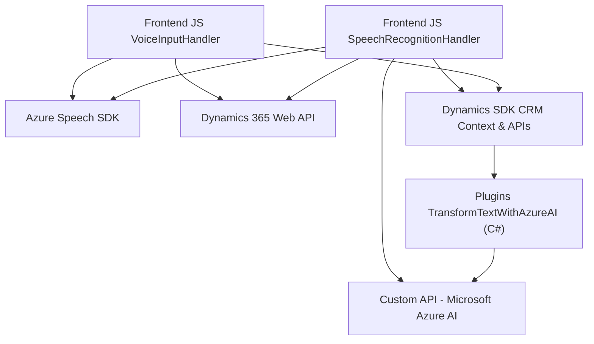

### Breve resumen técnico
El repositorio es una solución integral que permite incorporar capacidades de voz e inteligencia artificial dentro de un entorno Microsoft Dynamics CRM (Dynamics 365). Incluye integración del reconocimiento y síntesis de voz basado en **Azure Speech SDK**, manipulación de formularios del CRM en el frontend mediante **JavaScript**, y un plugin en backend con **C#**, que utiliza **Azure OpenAI API** para procesamiento avanzado de texto.

### Descripción de arquitectura
La solución sigue una **arquitectura n-capas híbrida**, donde cada capa desempeña un papel específico:
1. **Frontend**: Contiene scripts en JavaScript que interactúan directamente con el CRM usando su contexto de formulario, delegando capacidades a servicios externos como el **Azure Speech SDK**.
2. **Backend/Plugins**: Implementa lógica de servidor en **C#** a través de la API de Microsoft Dynamics CRM (Xrm SDK). Los plugins representan una capa que conecta el backend del CRM con servicios externos, como **Azure OpenAI**, utilizado para procesamiento avanzado.
3. **API externas**: Se integran servicios como **Azure Speech SDK** y **Azure OpenAI API** para la síntesis y reconocimiento de voz, junto con la transformación avanzada de textos.

### Tecnologías usadas
1. **Frontend:**
   - **JavaScript**: Lógica para reconocimiento y síntesis de voz en formularios de Dynamics 365.
   - **Azure Speech SDK**: Integración para procesamiento de voz.
   - **Dynamics 365 APIs/Web API**: Manipulación del contexto del CRM para interacciones con formularios.

2. **Backend:**
   - **C#:** Desarrollo de plugins en Dynamics 365.
   - **Microsoft Dynamics SDK**: Gestión del contexto organizacional dentro del CRM.
   - **Azure OpenAI API**: Procesamiento de texto mediante modelos GPT.
   - **Newtonsoft.Json** y **System.Net.Http**: Librerías para integración y manejo de datos en el formato JSON.

3. **Patrones arquitectónicos:**
   - **Modularidad**: Separación de responsabilidades por archivos y funciones independientes.
   - **Integración externa**: Uso de APIs SaaS (Azure Speech SDK y Azure OpenAI).
   - **Eventos/Asíncronía**: Uso de callbacks y promesas para sincronización de datos y eventos.

### Diagrama Mermaid válido para GitHub

### Conclusión final
La solución está diseñada para extender las capacidades de Microsoft Dynamics CRM, incorporando características de voz e inteligencia artificial en el frontend y backend. Utiliza una arquitectura **n-capas modular** que combina operaciones frontales inmediatas con procesamiento avanzado en el servidor, conectado a servicios externos como **Azure Speech SDK** y **Azure OpenAI API**. Esta integración potencia la experiencia del usuario y facilita la interacción mediante voz y procesamiento automático de datos estructurados.