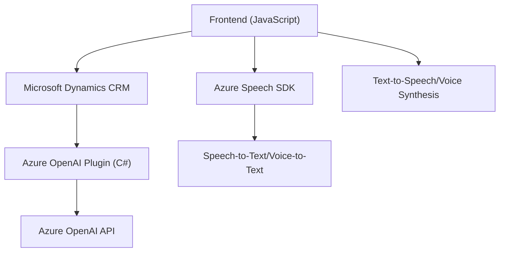

# Análisis técnico completo

## Resumen técnico
El repositorio parece implementar una solución que combina un **frontend dinámico basado en JavaScript** integrado a **formularios dinámicos de Microsoft Dynamics** y un plugin desarrollado en **C#** para utilizar **servicios de Azure OpenAI**. La funcionalidad principal radica en la interacción basada en voz y texto con un sistema de formularios, proporcionando capacidades de síntesis de voz y transcripción vía **Azure Speech SDK**, y procesamiento avanzado de textos mediante **Azure OpenAI**.

---

## Arquitectura
### Tipo de solución: 
La solución corresponde a un **sistema híbrido** que combina:
1. **Frontend** para formularios dinámicos con entrada y salida de datos en base a **voz** (Speech-to-Text y Text-to-Speech).
2. **Backend** en forma de **plugin** para Dynamics CRM con capacidad de comunicación directa con **Azure OpenAI**.

### Patrón arquitectónico:
- **Arquitectura por capas:**
  La solución se organiza en capas, con una separación entre:
  - **Presentación:** Interfaces del cliente (archivos Javascript para formularios).
  - **Capa de negocio:** Plugins dentro de Dynamics que gestionan los datos y la lógica de negocio.
  - **Servicios externos:** El sistema aprovecha servicios de terceros (Azure Speech SDK y Azure OpenAI API) en una arquitectura orientada hacia servicios.

- **Integración de Microservicios:**
  Los plugins actúan como microservicios encargados de transformar y procesar datos con Azure OpenAI. Cada interacción de servicios operativos es realizada bajo una estructura desacoplada.

---

## Tecnologías utilizadas
1. **Frontend:**
   - **JavaScript:** Lógica y procesamiento de datos de formularios dinámicos.
   - **Azure Speech SDK:** Para la síntesis de voz y transcripción de entrada de voz.
   - **Microsoft Dynamics CRM contexto de formulario (Xrm):** Manipulación directa de formularios en Dynamics y llamadas a APIs internas.

2. **Backend (Plugins):**
   - **C#:** Desarrollo de plugins para Dynamics CRM.
   - **Azure OpenAI API:** Procesamiento de texto mediante IA.
   - **HTTP Client:** Para conexión y comunicación con Azure OpenAI.
   - **JSON y Newtonsoft.Json:** Manejo de datos estructurados para entrada y salida dentro del sistema.

3. **APIs Externas:**
   - **Microsoft Dynamics APIs:** Manipulación de registros, entidades y suscripciones en Dynamics.
   - **Azure Speech SDK:** Lógica del reconocimiento y síntesis de voz.
   - **Azure OpenAI:** Procesamiento avanzado de textos.

---

## Dependencias y componentes externos
1. **Externos:**
   - **Azure Speech SDK:** Llamadas a servicios de Microsoft para transcripción y síntesis de voz.
   - **Azure OpenAI API:** Procesamiento avanzado de texto estructurado con reglas específicas.
   - **Microsoft Dynamics Xrm WebAPI:** Gestión de datos en los formularios dinámicos.

2. **Internos:**
   - Manejo de atributos y lógica de formularios (%) mediante el contexto de Dynamics.
   - Plugins para integrar y ejecutar reglas en tiempo real.

---

## Diagrama Mermaid **(revisar compatibilidad con GitHub Markdown)**

---

## Conclusión final
El repositorio combina varias tecnologías avanzadas para implementar una solución de entrada basada en **voz** y procesamiento de texto mediante IA. La arquitectura apunta a un modelo **híbrido en capas**, soportado por componentes externos como **Azure Speech SDK** y **Azure OpenAI API**, y sistemas internos alrededor de **Microsoft Dynamics CRM**. El diseño es modular con una separación clara de responsabilidades y utiliza patrones como **callback-based execution**, integración de servicios, y arquitectura orientada a microservicios. Esto garantiza escalabilidad y adaptabilidad, especialmente dentro de entornos corporativos que requieren capacidades avanzadas de interacción entre datos y usuarios.