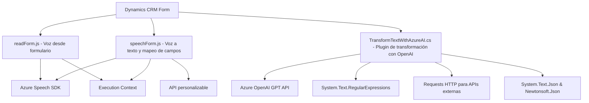

### Breve resumen técnico

El repositorio contiene la implementación de varias funcionalidades centradas en la interacción entre formularios web (presentes en Dynamics CRM) y servicios externos, como el **Azure Speech SDK** y **Azure OpenAI API**. 

Los módulos principales son: uno para procesar formularios a través de síntesis de voz, otro que gestiona el reconocimiento de voz y conexión con APIs externas, y un plugin que integra el procesamiento avanzado de datos textuales con **OpenAI GPT**.

---

### Descripción de arquitectura

La arquitectura muestra tres componentes principales que interactúan con un sistema Dynamics CRM y APIs externas: 
1. **Frontend layer**: Maneja interacciones con los formularios del usuario que están integrados en Dynamics CRM.
2. **Service integration layer**: Utiliza el **Azure Speech SDK** para síntesis de voz y reconocimiento de voz. Este SDK se carga de forma dinámica.
3. **Plugin backend layer**: Procesa texto utilizando el **Azure AI OpenAI API (GPT)** por medio de requests JSON estructurados. Su integración sigue el patrón de plugin diseñado específicamente para extensiones de Microsoft Dynamics CRM.

En términos generales, la arquitectura combina elementos de una **arquitectura de capas** (n capas) con componentes funcionales que se integran con servicios de terceros para enriquecer la funcionalidad del sistema principal.

---

### Tecnologías usadas

1. **Azure Speech SDK**:
   - Usado para la síntesis de voz y reconocimiento de voz a partir de los datos de un formulario.

2. **Dynamics CRM Web API**:
   - Usada para interactuar con los datos de los formularios, permitiendo actualizar atributos dinámicamente y realizar búsquedas en las entidades.

3. **Azure OpenAI API (GPT)**:
   - Implementada en el plugin `TransformTextWithAzureAI.cs` para la transformación de texto a través de reglas predefinidas.

4. **JavaScript**:
   - Lenguaje principal en los archivos de frontend (`readForm.js`, `speechForm.js`) para implementar la lógica de interacción con formularios y servicios.

5. **C#**:
   - Utilizado en el plugin `TransformTextWithAzureAI.cs` para la ejecución en el contexto de Dynamics CRM y conexión con servicios externos.

6. **Architectural Patterns**:
   - **Adapter Pattern**: Usado para convertir datos de diferentes formatos a un estándar único en funciones como `getReadableValue`.
   - **Event Handling with Callbacks**: Para cargar dinámicamente el SDK y ejecutar funciones específicas.
   - **Repository Pattern**: Aplicado al manejo de atributos para acceder y modificar datos directamente en Dynamics CRM.

---

### Diagrama Mermaid

---

### Conclusión final

Este repositorio implementa un conjunto de herramientas que enriquecen las interacciones con formularios de datos en un entorno **Microsoft Dynamics CRM**, empleando tecnologías modernas orientadas a servicios como **Azure Speech SDK** y **Azure OpenAI GPT API** para integrar capacidades de voz (síntesis y reconocimiento) e inteligencia artificial.

La arquitectura general del código puede clasificarse como una **n capas**, con una clara separación en frontend y backend. Además, se observa una implementación modular que utiliza patrones como adaptadores y manejadores de eventos para integrar servicios externos eficientemente.

Sugerencias de mejora:
- Implementar un manejo más seguro de las claves API.
- Reducir las dependencias fuertes de la plataforma Dynamics CRM para un mejor desacoplamiento.
- Documentar los procesos de configuración para facilitar la extensibilidad del código a otros entornos.