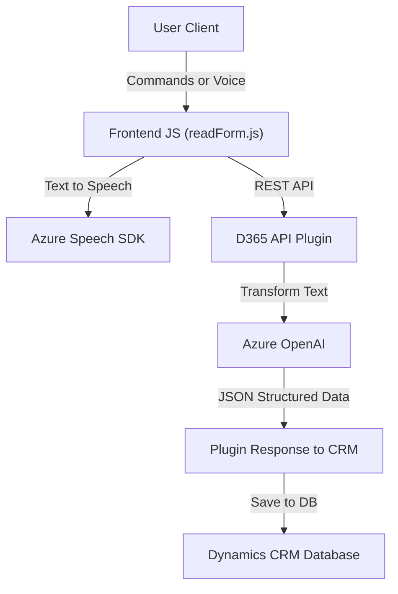

### Breve Resumen Técnico
El repositorio parece estar diseñado para integrar funcionalidades de reconocimiento de voz, accesibilidad mediante síntesis de voz, y conversión de texto en datos estructurados dentro de la plataforma Dynamics 365. Se utiliza el **Azure Speech SDK** para procesamiento de voz y **Azure OpenAI Service** para transformación de texto en datos JSON. Esto permite enriquecer la experiencia de usuario con interacciones avanzadas mediante IA y servicios en la nube.

---

### Descripción de la Arquitectura
La arquitectura general es de **n capas**:
1. **Capa Cliente** (Frontend JavaScript): Procesa datos de formularios dinámicos o comandos de voz y interactúa con servicios externos como Azure Speech SDK y una API personalizada alojada en Dynamics 365.
2. **Capa de Servicios** (API Dynamics Plugins): Contiene lógica empresarial pesada mediante la interacción directa con Azure OpenAI y procesamiento de texto.
3. **Capa de Datos**: Implementada por Dynamics CRM para almacenar y gestionar los registros resultantes de las interacciones.

**Patrones usados**:
- **Plugin Architecture**: Dynamics CRM utiliza plugins para extender su funcionalidad, integrándolo directamente con servicios externos como Azure.
- **Event-Driven**: Los clientes JS dependen de eventos (como clics o contextos de ejecución) y callbacks para realizar operaciones asíncronas.
- **Técnicas de accesibilidad** están diseñadas para mejorar la integración con formularios dinámicos y proporcionar voz sintetizada a los usuarios.

---

### Tecnologías Usadas
1. **Frontend (JavaScript)**:
   - **Azure Speech SDK**: Para reconocimiento y síntesis de voz.
   - **D365 API**: Personalización y transformación de datos mediante llamadas API.
   - **Browser-compatible JavaScript Dynamic Loading**: Para cargar dinámicamente el SDK de Azure.

2. **Backend (C# Plugin)**:
   - **Dynamics CRM SDK (Microsoft.Xrm.Sdk)**: Proporciona APIs para interacción con CRM.
   - **System.Net.Http**: Ejecuta solicitudes HTTP para consumir la API de Azure OpenAI.
   - **Azure OpenAI (GPT-4)**: IA generativa para procesamiento de texto.

3. **Externo**:
   - **Azure Services**: Funcionalidades basadas en la nube como reconocimiento de voz y GPT, utilizando claves de suscripción y configuraciones regionales.

---

### Diagrama Mermaid

---

### Conclusión Final
Este repositorio implementa una solución sofisticada de accesibilidad y automatización en **Dynamics 365**, utilizando tecnologías avanzadas de IA como el **Azure OpenAI** para generación de datos estructurados y **Azure Speech SDK** para voz. La arquitectura es de **n capas**, con una comunicación fluida entre clientes, backend, y servicios externos, manteniendo principios de modularidad y extensibilidad.

Es adecuado para mejorar la experiencia del usuario en entornos empresariales, como CRM, mediante interacciones de voz, reconocimiento dinámico y acceso a datos transformados por IA. Puede ser extendido fácilmente para incluir funcionalidades adicionales como análisis de sentimiento o traducción automática con Azure Cognitive Services.