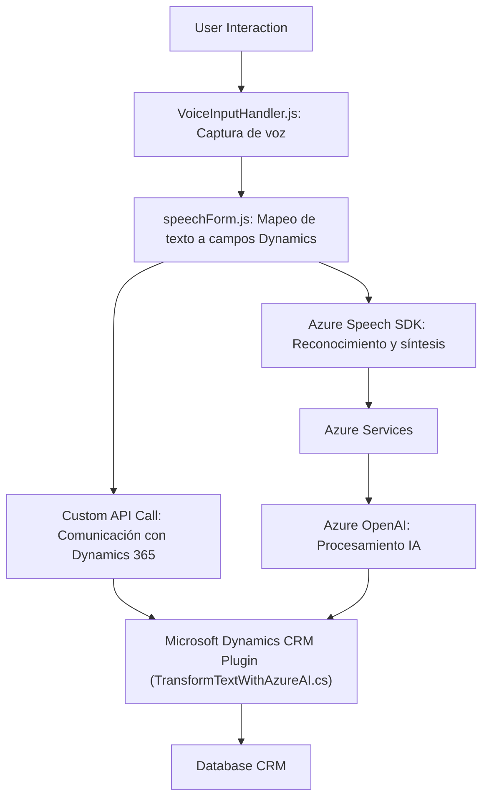

### **Breve resumen técnico**
El repositorio incluye una solución orientada a la interacción dinámica entre un sistema basado en Microsoft Dynamics CRM, Azure Speech SDK y Azure OpenAI. Constan de tres componentes principales: 

1. **Frontend (JavaScript)** para la captura de entrada por voz, conversión de voz a texto y manejo de datos asociados a formularios.
2. **Plugin (C#)** que implementa lógica para transformar texto usando el servicio Azure OpenAI.
3. **Integración API** para comunicación entre el frontend, Dynamics CRM y servicios externos de Azure.

---

### **Descripción de arquitectura**

La solución tiene una arquitectura híbrida:
- **Frontend:** Un frontend modular en JavaScript implementado con funciones específicas que interactúan directamente con el DOM y el contexto del formulario.
- **Backend (CRM Plugin):** Un servicio basado en plugins para Dynamics CRM desarrollado en C# con el patrón `IPlugin`.
- **Servicios externos:** Integración con **Azure Speech SDK** para entrada/salida de voz y **Azure OpenAI API** para procesamiento de texto con AI.

En términos de arquitectura general:
- Utiliza una **estructura distribuida**: el frontend interactúa con la interfaz del usuario, el backend procesa datos con APIs, y servicios externos como Azure gestionan la lógica avanzada.
- Sigue principios de integración basada en API.
- Segrega responsabilidades en módulos: reconocimiento de voz, procesamiento por IA y modificación de datos.

---

### **Tecnologías usadas**
1. **Frontend (JavaScript):**
   - **Azure Speech SDK:** Para reconocimiento de voz y síntesis de texto.
   - DOM API (`document`, `window`, etc.) para interactuar con formularios dinámicos.
   - Integración con Microsoft Dynamics CRM (`executionContext`, `formContext`).

2. **Backend Plugin (C#):**
   - **Microsoft Dynamics SDK (`IPlugin`, `Xrm.Sdk`)**: Modificaciones programáticas del CRM.
   - **Azure OpenAI API:** Para aplicar transformación semántica compleja a texto.
   - **JSON Manipulación:** Uso de `Newtonsoft.Json.Linq` y `System.Text.Json`.

3. **Patrones:**
   - **Modularidad:** Fragmentación en métodos independientes (cada método tiene su propia responsabilidad).
   - **Lazy Load:** SDK cargado dinámicamente solo cuando se necesita (`Speech SDK`).
   - **Encapsulación:** Separación entre lógica de voz (JavaScript) y lógica de transformación (C# Plugin).
   - **Integración API:** Patrones de consumo de servicios externos mediante `HTTP Request`.

---

### **Diagrama Mermaid**

---

### **Conclusión final**

La solución presentada tiene un enfoque robusto para aplicaciones empresariales basadas en **Microsoft Dynamics CRM**. Combina capacidades avanzadas de reconocimiento de voz y procesamiento de lenguaje natural mediante Azure Speech SDK y Azure OpenAI. La arquitectura es flexible y adecuada para integrar formularios interactivos con procesamiento dinámico en un entorno CRM.

Esta solución es ideal para empresas que buscan automatizar la entrada y procesamiento de datos en sus sistemas mediante tecnologías de voz e Inteligencia Artificial, aprovechando servicios externos escalables como los ofrecidos por Azure.