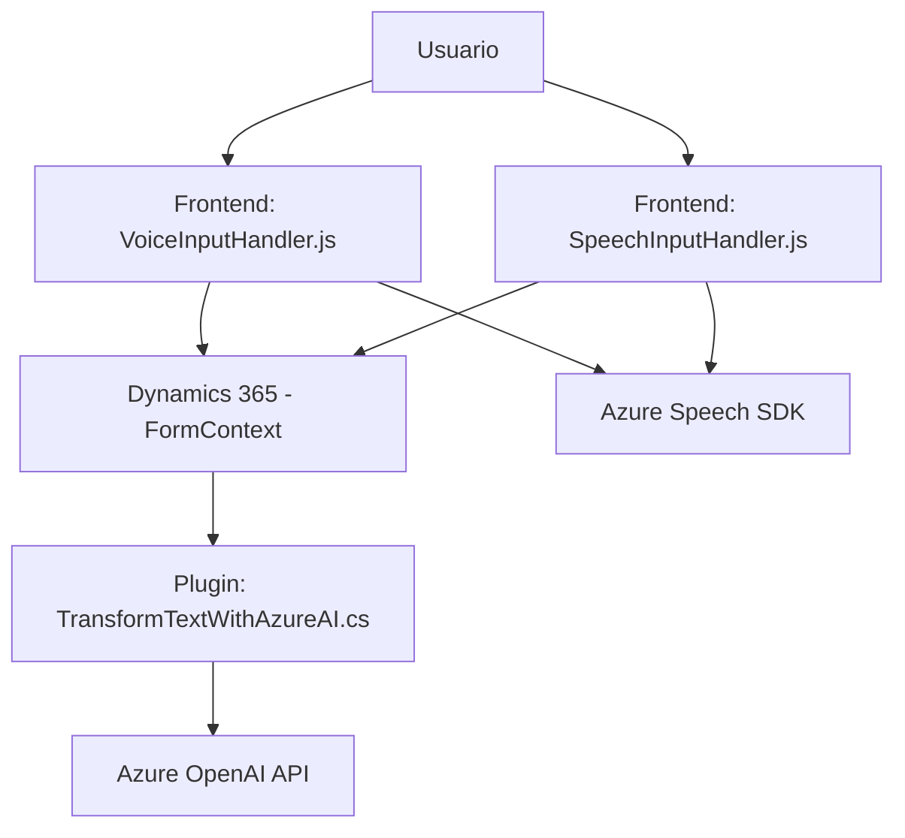

### Breve resumen técnico
El repositorio es una solución compuesta principalmente por tres componentes:
1. **Frontend (JavaScript)**: Lógica del cliente para lectura y asignación de campos del formulario de Dynamics 365 y gestión de voz mediante Azure Speech SDK.
2. **Plugin (C#)**: Transformación de textos en JSON utilizando servicios externos como Azure OpenAI.
3. **Integración con Dynamics 365**: Interacción directa con formularios de la plataforma Dynamics 365.

Es una solución que integra múltiples servicios de Azure para enriquecer funcionalidades sobre Dynamics 365 y tiene un enfoque modular y orientado a servicios.

---

### Descripción de arquitectura
La arquitectura tiene un enfoque híbrido:
1. **Cliente-Servidor**: El frontend se encarga de interactuar directamente con el usuario y los formularios del cliente. La lógica del plugin trabaja desde el lado del servidor en Dynamics 365.
2. **Interacción con servicios externos**: La solución consume APIs de Azure, como Speech SDK y OpenAI, lo cual refuerza el uso de un patrón basado en microservicios y componentes externos.
3. **Modularidad**: Las funciones están altamente segmentadas con responsabilidades específicas, lo que facilita la mantenibilidad y escalabilidad.
4. **Arquitectura orientada a servicios**: Cada componente cumple un rol específico y puede integrarse con otros sistemas mediante APIs externas.

---

### Tecnologías, frameworks y patrones observados
1. **Tecnologías usadas:**
   - **Frontend**:
     - JavaScript: Para lógica de cliente.
     - Azure Speech SDK: Para sintetización de voz.
   - **Backend/Plugin (C#)**:
     - Dynamics 365 SDK: Para interacción con APIs de Dynamics.
     - Azure OpenAI Service: Para transformación de texto en JSON.
     - Newtonsoft Json y System.Text.Json: Para manejo de datos en formato JSON.
     - HTTP Client en C#: Para integración REST.
2. **Frameworks:** Dynamics 365 SDK, Azure SDK.
3. **Patrones usados:**
   - **Dependency Injection** (en plugins): Acceso a servicios utilizando `IServiceProvider`.
   - **Carga en tiempo de ejecución**: Dinámica del SDK de Azure en el frontend.
   - **Modularización**: Uso de funciones y clases dedicadas con responsabilidades específicas.
   - **Orientación a servicios**: Componentes interconectados mediante APIs (Azure Speech SDK y OpenAI) y el servidor (Dynamics).

---

### Diagrama Mermaid

---

### Conclusión Final
La solución del repositorio muestra una integración avanzada de frontend, backend y microservicios alojados en Azure para ampliar la funcionalidad de Dynamics 365. Combina implementación modular y orientada a servicios, permitiendo adaptabilidad y expansión. Los componentes están bien desacoplados, cuentan con funcionalidades específicas y dependen de servicios externos para tareas como reconocimiento de voz y generación de texto por IA.

Este diseño es ideal para soluciones empresariales donde se requiera interacción enriquecida con formularios, una experiencia de usuario mejorada mediante reconocimiento y síntesis de voz, y procesamiento avanzado de texto en formato estructurado JSON.