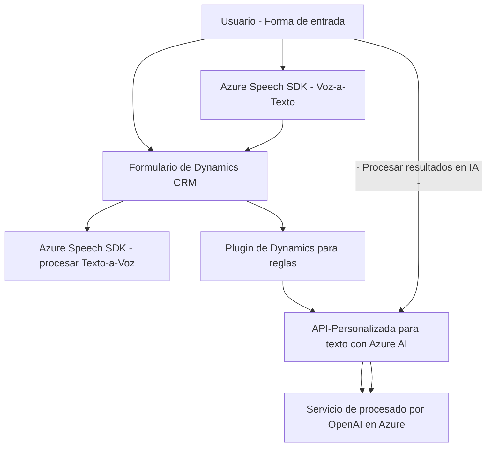

### Breve resumen técnico

La estructura del código y las descripciones evidencian que el repositorio contiene módulos que implementan funcionalidades específicas en una solución que integra un sistema de reconocimiento de voz y síntesis de texto para interacción con formularios en un entorno Dynamics CRM. Esto se complementa con un backend basado en plugins de Dynamics para realizar el procesamiento avanzado de texto usando el servicio OpenAI de Azure.

---

### Descripción de arquitectura

1. **Arquitectura General**: Esta solución sigue una arquitectura híbrida que mezcla principios de arquitectura **n-capas** y **orientada a microservicios**.  
   - El frontend tiene una capa modular estructurada en función de tareas específicas (dominio funcional).
   - En el backend, se implementa la **plugin-based architecture** en Dynamics CRM que funciona como punto de integración entre el sistema CRM y el servicio externo de Azure OpenAI.  
   - El diseño se complementa con una integración a través de API de un servicio externo (Azure Speech SDK para síntesis de texto a voz y reconocimiento de voz).

2. **Componentes Clave**:  
   - **Frontend** es responsable del procesamiento de voz y texto, con funcionalidades de sintetización y transcripción mediante la integración con un SDK externo.  
   - **Backend** utiliza el plugin model de Dynamics para realizar el procesamiento avanzado del texto mediante servicios de inteligencia artificial alojados en Azure OpenAI.  
   - **Servicios Externos**: Uso de Azure Speech SDK para capacidades de procesamiento de voz y OpenAI API para la generación de texto estructurado.  

3. **Comunicación y patrones**:  
   - **Event-driven workflows**: Utilizado ampliamente en el frontend para coordinar la carga de SDK y el proceso de voz y texto.  
   - **Service Adapter Pattern**: Abstracta la comunicación con los APIs de Azure a través de funciones de integración.  
   - **Separation of Concerns (SoC)**: Existe una separación clara entre el frontend (procesamiento de voz, interacción con el usuario) y el backend (procesamiento avanzado del texto).  

---

### Tecnologías usadas

1. **Frontend**:
   - **JavaScript**: Código modular basado en funciones para manipulación de DOM y procesamiento de datos.  
   - **Azure Speech SDK**: Para sintetización de texto a voz y transcripción de voz a texto.  
   - **Microsoft Dynamics SDK API**: Interacción con elementos del formulario dentro del CRM.  

2. **Backend**:
   - **C#**: Lenguaje del plugin.
   - **Dynamics CRM Plugins Framework** (`IPlugin`): Para extender las capacidades de Dynamics y registrar eventos personalizados.  
   - **Azure OpenAI**: Endpoint para procesamiento de texto mediante un modelo de lenguaje avanzado.  
   - Bibliotecas como `Newtonsoft.Json` y `System.Text.Json` para manipulación de datos JSON.  

---

### Diagrama Mermaid válido para GitHub

---

### Conclusión final

Este repositorio proporciona una solución integral que combina un frontend en JavaScript con procesamiento de voz y texto y un backend basado en plugins para agilizar procesos personalizados dentro de Dynamics CRM. Usa patrones bien definidos como **event-driven programming**, **adapter pattern**, y **separation of concerns** para garantizar una integración robusta y modular de servicios internos y externos.

La elección de Azure Speech SDK y Azure OpenAI como dependencias externas enfatiza el uso de capacidades avanzadas en la nube para tareas como reconocimiento de voz y generación de texto estructurado. La arquitectura híbrida n-capas con microservicios permite flexibilidad y escalabilidad en el diseño de soluciones empresariales.

