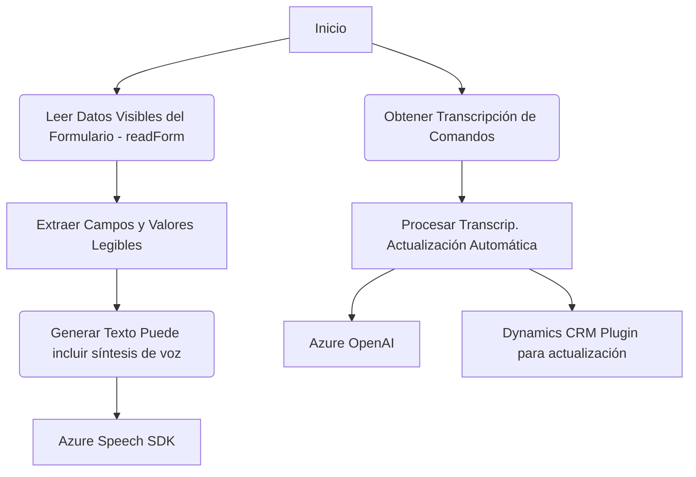

### Breve resumen técnico:
Los tres archivos del repositorio presentan una solución orientada a la lectura de datos de formularios dinámicos, procesado y conversión a voz, captación de comandos por voz y procesos automatizados. Integran servicios como Azure Speech SDK para voces sintetizadas y Azure OpenAI para interpretación avanzada de texto mediante IA. El diseño favorece modularidad y escalabilidad, siendo compatible con entornos Dynamics CRM.

---

### Descripción de arquitectura:
La solución se basa en **event-driven architecture**, con integración hacia APIs y SDKs externos. Es modular, con funciones claras para lectura y procesamiento de datos en tiempo real, separando las responsabilidades (por ejemplo, lectura de formularios vs síntesis de voz). También utiliza un **patrón de arquitectura de n capas**, dividiendo la lógica de negocio (procesamiento de datos, comunicación con APIs) de la interfaz (formularios y contextos).

---

### Tecnologías usadas:
1. **Frontend:** JavaScript.
2. **Backend:** C# (para plugins).
3. **Frameworks:** Microsoft Dynamics CRM SDK.
4. **Servicios de Microsoft Azure:**
   - Azure Speech SDK para entrada y salida de voz.
   - Azure OpenAI API para transformación avanzada de texto en JSON.
5. **Librerías externas:**
   - `Newtonsoft.Json.Linq` y `System.Text.Json` para manipulación y serialización de JSON.
   - `System.Net.Http` para solicitudes API.
6. **Patrones evidentes:**
   - Carga diferida (Lazy Loading).
   - Modularización de funciones (Single Responsibility Principle).
   - Plugin-based architecture (para extensibilidad en Dynamics CRM).

---

### Diagrama Mermaid válido para GitHub:

---

### Conclusión final:
La solución descrita en los archivos tiene como objetivo la integración eficiente entre Dynamics CRM y servicios avanzados de Microsoft Azure, creando una experiencia automatizada y moderna: desde la lectura y procesamiento de datos visibles del formulario, hasta la entrada por comandos de voz para actualizar el CRM, con el soporte de inteligencia artificial. Su arquitectura modular y n capas facilita el mantenimiento y escalabilidad. Sin embargo, la documentación y gestión de configuraciones sensibles como claves de API podría mejorar.