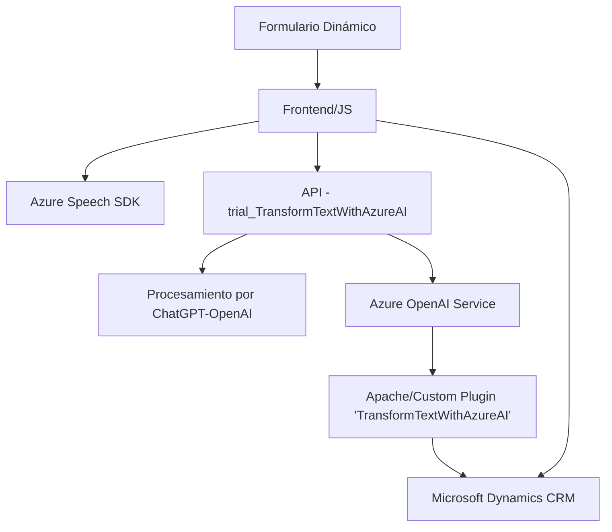

### Breve Resumen Técnico:
El repositorio está diseñado para integrar funcionalidades avanzadas de reconocimiento de voz y procesamiento textual en Microsoft Dynamics 365. Usa el **Azure Speech SDK** y el **Azure OpenAI Service** para convertir información de formularios en voz y para transformar comandos de voz en texto procesable. Además, incorpora un plugin en la capa de backend del CRM para delegar trabajo al servicio de Azure OpenAI.

### Descripción de la Arquitectura:
La solución parece ser una arquitectura de **plugins y extensiones de Microsoft Dynamics CRM**, que puede ser considerada una mezcla entre una arquitectura de **n capas** (para la estructura interna de Dynamics CRM) y una **service-oriented architecture (SOA)**, dado que hace uso de recursos de terceros como Azure Speech y OpenAI a través de HTTP. Los archivos JavaScript constituyen una capa "frontend/cliente" que interactúa directamente con el usuario en el contexto de los formularios de Dynamics, mientras que los plugins en `C#` constituyen una capa "backend/servidor" que integra la solución con los servicios de Azure. 

- **Frontend (JS):** Implementa funcionalidades para convertir valores de formularios en texto para sintetizarlos como audio, además de posibilitar la entrada de comandos de voz. La información transcrita se procesa y mapea en campos dinámicos según los datos del CRM.
  
- **Backend (C# Plugin):** Apoya el procesamiento de las transcripciones usando Azure OpenAI, transformándolas en JSON estructurado y delegando la responsabilidad de interpretar los datos al servicio de inteligencia artificial.

### Tecnologías Usadas:
1. **Frontend (JavaScript):**
   - **Azure Speech SDK:** Reconocimiento de voz y síntesis de texto a voz.
   - **Microsoft Dynamics CRM SDK (Xrm/WebAPI):** Interacción con formularios y registros de Dynamics.
   - **Event-driven programming:** Usado para manejar callbacks de carga de SDK y eventos de transcripción.
   - **Patrones de delegación y fachada:** Estructuran la integración del SDK, simplificando su uso.

2. **Backend (C# Plugin):**
   - **Azure OpenAI Service:** Procesa texto para estructurarlo dinámicamente en un formato JSON.
   - **Microsoft.Xrm.Sdk:** SDK para desarrollo y extensión de funcionalidades en Dynamics CRM.
   - **Newtonsoft.Json, System.Text.Json:** Para manipulación y serialización/deserialización de datos JSON.
   - **Singleton pattern:** Uso de `HttpClient` como un recurso estático en el contexto del plugin.

---

### Diagrama **Mermaid** válido para GitHub:

### Conclusión Final:
Este proyecto tiene como objetivo integrar capacidades avanzadas de procesamiento de texto y voz en aplicaciones basadas en **form CRM Dynamics**. La arquitectura refleja una **solución en capas**, con integración de servicios externos de Azure (SOA). Los patrones de diseño priorizan la modularidad y separan las responsabilidades del frontend/scripts de Dynamics 365 y los plugins con procesamiento avanzado en C#. La solución presenta un uso innovador de tecnologías como **Azure Speech SDK** y **OpenAI**, pero podría mejorar la gestión de configuraciones sensibles para incrementar la seguridad del sistema.