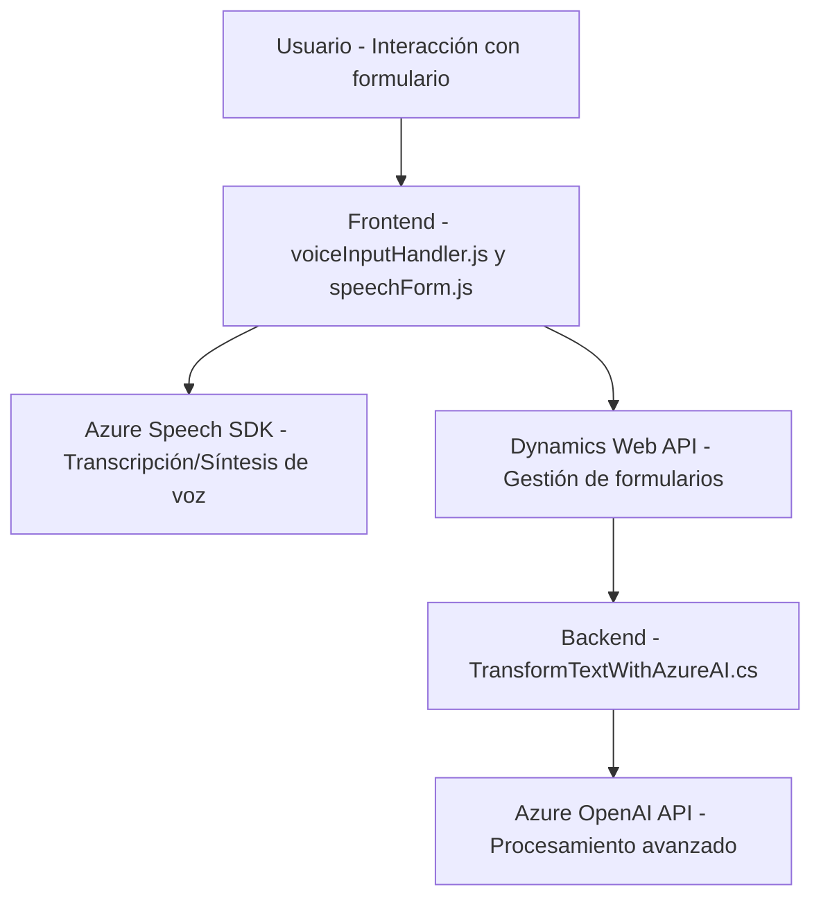

### Resumen Técnico

El repositorio expone tres archivos interrelacionados que definen componentes de una solución híbrida que combina capacidades **client-side (frontend)** y **server-side (plugin en Dynamics CRM)**. En el frontend se utilizan soluciones basadas en JavaScript para integrar el **Azure Speech SDK** y Microsoft Dynamics CRM. En el backend, se incluye un plugin desarrollado en **C#** que utiliza la **Azure OpenAI API** junto con servicios proporcionados por Dynamics CRM para realizar procesos avanzados, como transformar texto en formato JSON.

---

### Descripción de arquitectura

La solución presenta una arquitectura de **n capas**, los componentes se dividen de la siguiente manera:

1. **Frontend**:
   - Responsable de la interacción con el usuario.
   - Implementa la lógica de captura de voz y transcripción mediante el SDK de Azure Speech.
   - Permite la integración directa con formularios de Dynamics CRM.
   - Enfoque modular con funciones dedicadas para cada parte del proceso.
   - Gestiona la lógica de negocio de los comandos transcritos desde voz hasta la actualización del formulario.
   - Diseño fuertemente orientado al DOM y al contexto del formulario de Dynamics.

2. **Backend**:
   - Contiene un plugin C# basado en la arquitectura **SOA (Service-Oriented Architecture)** que utiliza servicios externos (Azure OpenAI).
   - Ofrece procesamiento avanzado de texto en formato estructurado (`JSON`), incluyendo interpretación basada en normas definidas.
   - Opera dentro del ciclo de vida de Dynamics CRM como un plugin.

---

### Tecnologías Usadas

1. **Frontend**:
   - **JavaScript ES6+**: Estructura modular del código.
   - **Azure Speech SDK**: Utilizado dinámicamente en el navegador para manejar transcripciones de voz y síntesis de texto.
   - **Dynamics 365 Web API**: Para interactuar con los formularios en el cliente.

2. **Backend**:
   - **C#** (.NET Framework): Lenguaje de programación empleado en los plugins de Dynamics CRM.
   - **Azure OpenAI API**:
     - Modelo `gpt-4o` para interpretación y transformación del texto.
   - **Microsoft Dynamics SDK**:
     - Service Factories: Interacción con entidades del CRM.
   - **HTTPClient** y **JsonSerializer**: Para comunicaciones HTTP hacia Azure OpenAI API y manejo de respuestas JSON.

---

### Diagrama Mermaid (Compatible con GitHub Markdown)

---

### Conclusión Final

La solución presentada combina un **frontend dinámico** y **backend basado en plugins** dentro de la plataforma Dynamics CRM. La arquitectura de **n capas** permite una integración fluida de servicios externos como el Azure Speech SDK y Azure OpenAI API, lo que la hace adecuada para entornos empresariales que requieren interacción avanzada entre usuario y sistema, basada en comandos de voz. Se destacan leyes de modularidad y desacoplamiento al diseñar funciones especializadas y patrones bien establecidos como Façade y SOA.

Sin embargo, se observan oportunidades de mejora como la eliminación de dependencias redundantes y la protección de claves sensibles (Azure Key, Region) mediante variables seguras. Esta solución ofrece una experiencia modernizada para usuarios de negocio soportada por tecnologías de inteligencia artificial avanzada y sistemas CRM en cloud computing.