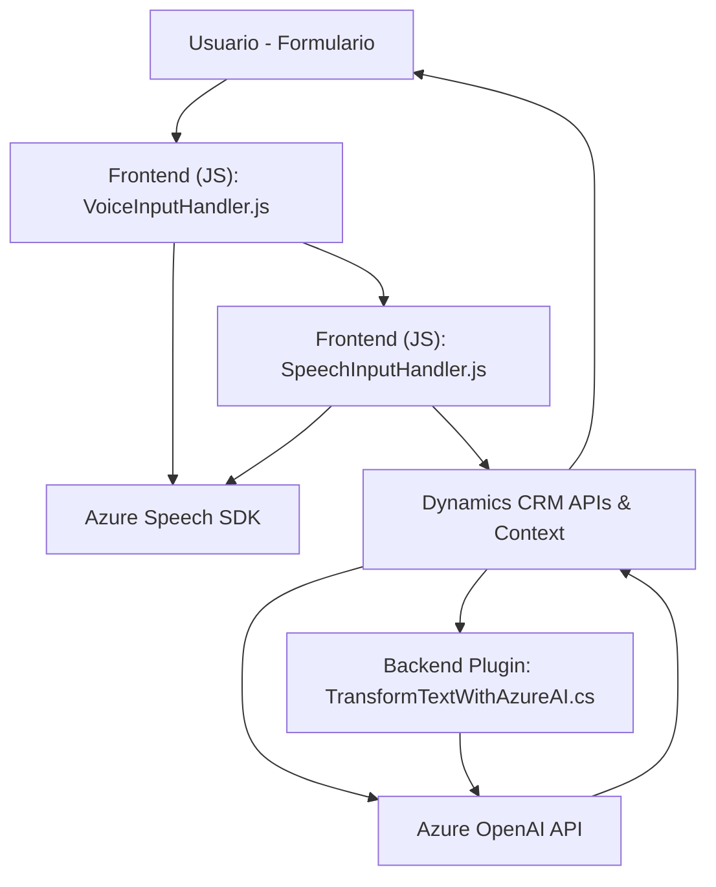

### **Breve resumen técnico**
Tras analizar los archivos y la estructura del repositorio, es evidente que el proyecto integra reconocimiento de voz, síntesis de texto a voz, procesamiento de formulario y transformación de texto mediante inteligencia artificial usando servicios de **Azure Speech SDK** y **Azure OpenAI GPT**. La solución está orientada principalmente a un **frontend de formulario dinámico integrado con Dynamics CRM**, acompañado por un **plugin backend**.

---

### **Descripción de arquitectura**
1. **Tipo de solución:**
   - **Híbrida**, incluyéndose:
     - **Frontend basado en eventos y sincrónico**, focalizado en interacción hombre-máquina (formulario con voz y procesamiento de datos).
     - **Plugin backend** que extiende y complementa el procesamiento mediante servicios Azure OpenAI exclusivamente en el entorno Dynamics CRM.
   
2. **Arquitectura:**
   - El repositorio sugiere una solución **modular** y **n capas**, en donde:
     - La capa de presentación interactúa con respuestas del usuario mediante reconocimiento de voz y generación de texto a voz usando SDK de Azure.
     - La lógica de negocio del backend se implementa como **plugin asociado al CRM**, ideal para la validación y enriquecimiento de datos (en JSON mediante OpenAI GPT y CRM SDK).

3. **Diseño modular y orientado a servicios:**
   - Encapsulación del SDK de Azure Speech en el frontend.
   - Procesamiento dinámico de elementos del formulario en tiempo real.
   - Un plugin con patrón de interacción directa con servicios externos mediante RESTful APIs.

---

### **Tecnologías empleadas**
1. **Frontend:**
   - **JavaScript (ES6)** con modularidad.
   - Azure Speech SDK (cargado dinámicamente desde CDN).
   - Manipulación de formularios de Dynamics CRM (Context API).

2. **Backend:**
   - Dynamics CRM SDK (`Microsoft.Xrm.Sdk`) para lógica y operaciones en el CRM.
   - Integración REST con Azure OpenAI para procesamiento de texto utilizando `System.Net.Http`.

3. **Servicios externos:**
   - **Azure Speech SDK:** Reconocimiento de voz y generación de texto a voz sobre frontend.
   - **Azure OpenAI GPT-4:** Transformación avanzada de texto en objetos semánticos con JSON (backend plugin).
   - APIs CRM internamente disponibles (`Xrm.WebApi`, `IOrganizationService`).

---

### **Diagrama Mermaid**

---

### **Conclusión final**
El proyecto está diseñado para integrar funcionalidades avanzadas de reconocimiento y generación de voz (Azure Speech SDK), junto con enriquecimiento de texto (Azure OpenAI), en formularios dinámicos manejados desde **Dynamics CRM**. La arquitectura orientada a capas y modular mejora la separación de responsabilidades.

- **Mayor fortaleza:** Modularidad y especialización de cada componente en su rol correspondiente (frontend o backend).
- **Aplicaciones ideales:** Escenarios en los que las interfaces intuitivas, como entrada de voz y generación de texto enriquecido, facilitan la captura y manejo eficiente de información. Por ejemplo:
  - CRM personal personalizado.
  - Soluciones onboarding semiautomatizadas.
  
Por último, la elección de **Azure Speech SDK** y **Azure OpenAI** demuestra una solución estratégica que aprovecha el poder de los servicios en la nube avanzados.