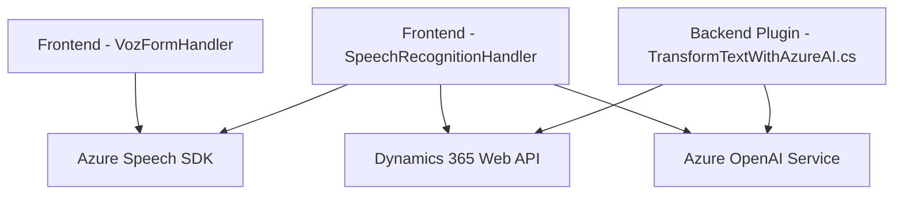

### Breve Resumen Técnico

La estructura del repositorio forma parte de una solución basada en Dynamics 365 y Azure AI con componentes dedicados a interacción por voz, procesamiento de texto, y trazabilidad de formularios dinámicos. Se observa integración directa con servicios externos (Azure Speech y OpenAI) y uso extensivo de estructuras y patrones que reflejan modularidad, integración en capas, y dependencia desacoplada.

---

### Descripción de la Arquitectura

La solución utiliza una **arquitectura de n capas** y muestra una combinación entre monolito (en la capa de plugins para Dynamics CRM) e integración con microservicios externos (Azure Speech SDK y Azure OpenAI). Su estructura está dividida en las siguientes capas:

1. **Frontend (Javascript):**
   - Procesos de lectura, síntesis y reconocimiento de voz (usando Azure Speech SDK).
   - Interacción directa con formularios a través de Dynamics 365.

2. **Plugins (C#):**
   - Extensiones de lógica del CRM con integración directa a servicios de Azure OpenAI para procesamiento de texto.

3. **Servicios Externos:**
   - Uso de SDK y APIs de Azure para procesamiento de voz, manejo de formularios dinámicos y transformación de texto.

El diseño refleja principios como modularidad, desacoplamiento de dependencias, y encapsulación de responsabilidades para tareas específicas.

---

### Tecnologías Usadas

1. **Frontend:**
   - **Lenguaje:** JavaScript.
   - **Frameworks:** Dynamics 365 Web API.
   - **SDK externo:** Azure Speech SDK para síntesis y reconocimiento de voz.

2. **Backend - Plugins:**
   - **Lenguaje:** C#.
   - **Framework:** Microsoft Dynamics CRM Plugin architecture.
   - **Librerías:** `Newtonsoft.Json`, `System.Net.Http`.

3. **Servicios externos:**
   - **Azure Speech SDK:** Procesamiento de voz/síntesis de texto.
   - **Azure OpenAI Service:** Transformaciones avanzadas de texto mediante GPT-4.

4. **Patrones:**
   - Modulación funcional para tareas específicas (lectura/síntesis/reconocimiento).
   - Plugin-based architecture (backend en CRM).
   - Integración con servicios externos vía API.

---

### Diagrama Mermaid

El siguiente diagrama representa la estructura y flujo principal de la solución:

---

### Conclusión Final

La solución combina tecnología avanzada de procesamiento de voz y texto con Dynamics CRM, creando un entorno interactivo y automatizado para usuarios finales. Su arquitectura de **n capas** refleja una adecuada separación de responsabilidades y desacoplamiento de dependencias. La presencia de servicios globales (Azure AI, Speech SDK) refuerza su adaptabilidad para implementaciones empresariales a gran escala.

Aunque el diseño es robusto, se recomienda revisar las credenciales almacenadas directamente en archivos para mejorar la seguridad. Además, podría beneficiarse de una estructura más estandarizada para la gestión de configuraciones dinámicas en los entornos de producción.