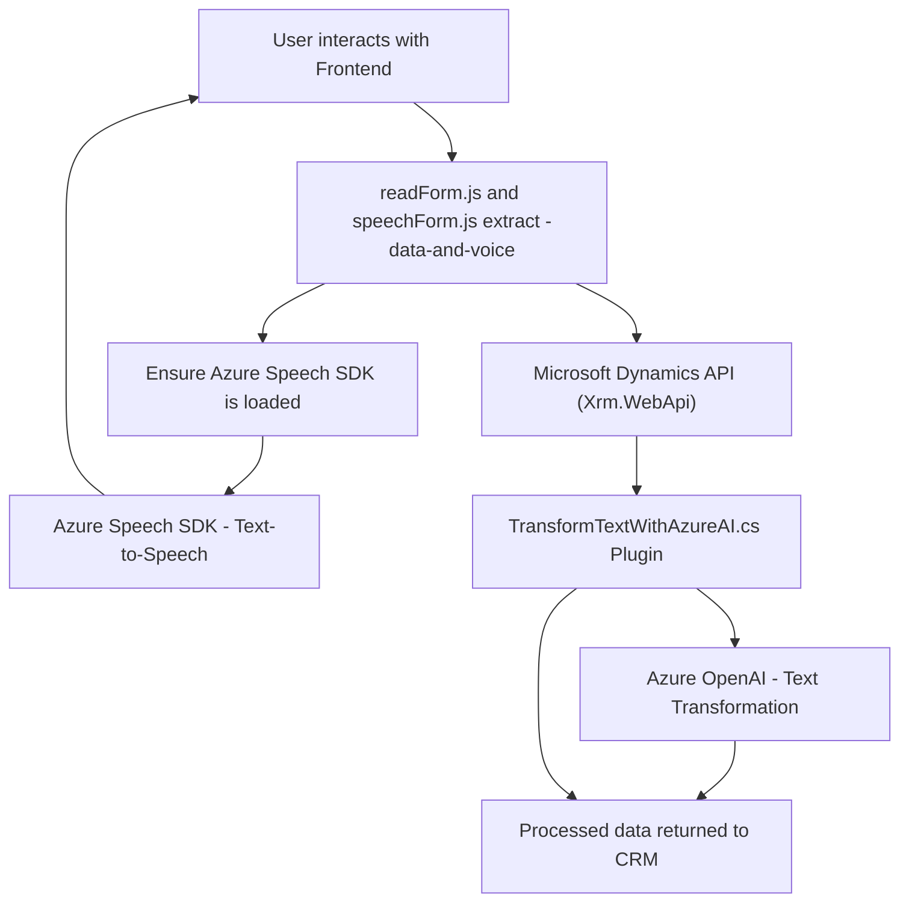

### Breve Resumen Técnico

El repositorio contiene implementaciones de código JavaScript y .NET que integran servicios de voz y procesamiento de texto utilizando tecnologías de Azure y APIs relacionadas con Microsoft Dynamics CRM. Está enfocado en un entorno donde se procesan formularios y datos dinámicos, con interacción entre frontend y backend.

---

### Descripción de la arquitectura

La solución parece estar orientada a aplicaciones basadas en servicios cuyo objetivo es mejorar la interacción entre los usuarios y un sistema de gestión de relaciones con clientes (CRM). Usa servicios de reconocimiento de voz, sintetización de texto-a-voz y la integración de modelos de inteligencia artificial, como Azure OpenAI y Azure Speech SDK.

La arquitectura es una combinación de **Arquitectura en n capas** y **Arquitectura orientada a servicios (SoA)**:

- **Capa de presentación (Frontend):** Los scripts JS presentes en los archivos `readForm.js` y `speechForm.js` son responsables de interactuar con el usuario, permitiéndole usar comandos de voz y texto-a-voz para capturar y manipular los datos de los formularios en Dynamics CRM o una plataforma similar.
- **Capa de dominio/servicio:** La lógica del plugin `TransformTextWithAzureAI.cs` está diseñada para integrarse con Dynamics CRM, comunicándose con Azure OpenAI para realizar transformaciones de datos y devolverlos al sistema.
- **Integración con servicios externos:** Los archivos JS se comunican con APIs externas como Azure Speech SDK y posiblemente APIs de Microsoft Dynamics, demostrando una orientación a servicios.

---

### Tecnologías y Patrones utilizados

#### **Tecnologías**:
1. **Azure Speech SDK**:
   - Funcionalidades de text-to-speech y speech-to-text para convertir datos hablados en texto y texto en audio.
2. **Azure OpenAI**:
   - Uso de modelos como GPT-4 para transformar texto basado en reglas específicas.
3. **Microsoft Dynamics CRM API (Xrm.WebApi)**:
   - Custom APIs y posible implementación directa desde la suite de Microsoft Dynamics para comunicación con formularios y datos de entidades.
4. **JavaScript DOM APIs**:
   - Uso de manipulación básica del DOM para cargar dinámicamente el Speech SDK en frontend.

#### **Patrones**:
1. **Lazy Loading:**
   - Carga dinámica de dependencias como Azure Speech SDK solo cuando son necesarias.
2. **Service-oriented Architecture (SOA):**
   - Las capacidades principales (Azure Speech y OpenAI) están estructuradas como servicios externos que realizan tareas específicas independientes.
3. **Modularidad:**
   - Cada archivo muestra alta separación de responsabilidades: extracción y procesamiento de datos en JS, transformación en backend.
4. **Plugin Architecture:**
   - Uso de interfaces de Dynamics CRM (`IPlugin`) para extender la funcionalidad del CRM con plugins.

---

### Dependencias o componentes externos

1. **Azure Speech SDK:** Cargado dinámicamente para sintetizar voz (más visible en `readForm.js` y `speechForm.js`).
2. **Azure OpenAI:** Utilizado en el plugin para la transformación de texto mediante inteligencia artificial.
3. **Microsoft Dynamics CRM:** Contexto de ejecución de los formularios y acceso a datos a través de APIs específicas.
4. **Frontend (JS Frameworks):** Es posible que utilicen alguna librería para simplificar el manejo de eventos en el frontend, aunque no se menciona explícitamente.
5. **HTTP requests:** El plugin `TransformTextWithAzureAI.cs` interactúa con Azure OpenAI mediante solicitudes HTTP estándar.

---

### Diagrama Mermaid

---

### Conclusión Final

La solución implementa un conjunto de herramientas para mejorar la interacción con los datos y formularios en una plataforma CRM (asumimos Dynamics CRM). Utiliza tecnologías avanzadas como Azure Speech SDK y Azure OpenAI para agregar capacidades de voz y procesamiento de texto avanzado. Con una estructura modular, Service-Oriented Architecture (SoA), y posibilidades de integración mediante plugins, la solución es escalable y adaptable a necesidades avanzadas.

El enfoque es ideal para sistemas que buscan mejorar la experiencia de usuarios finales mediante interfaces de voz y funcionalidades basadas en inteligencia artificial.