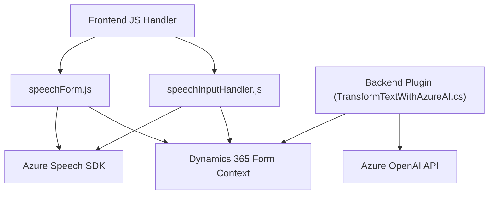

### Breve resumen técnico

El repositorio parece estar diseñado para resolver problemas relacionados con la interacción entre formularios de Dynamics 365 y servicios externos (e.g., Azure Speech SDK, Azure OpenAI API). La funcionalidad incluye reconocimiento de voz, síntesis de texto hablado, y procesamiento de datos en formularios mediante aplicaciones modulares.

---

### Descripción de arquitectura

La solución combina componentes de **arquitectura orientada a servicios** (SOA) con integración a través de APIs externas como Azure Speech y Azure OpenAI. Tiene una estructura de **n capas** que separa la lógica de presentación (frontend en JavaScript), lógica de dominio (procesamiento y manipulación en plugins de Dynamics CRM), y servicios externos que ofrecen procesamiento avanzado de texto y síntesis de voz.

El frontend es modular y gestiona el flujo de eventos en sincronización con el backend de Dynamics CRM. La inclusión del plugin de Dynamics CRM permite el uso de una arquitectura extendida donde se encapsula lógica específica para el análisis y transformación de datos.

---

### Tecnologías usadas

1. **Frontend**
   - Lenguaje: **JavaScript (ES6)**.
   - Frameworks: **Dynamics 365 SDK (FormContext y Web API)**.
   - Servicios: **Azure Speech SDK**.

2. **Backend**
   - Lenguaje: **C#**.
   - Frameworks:
     - **Microsoft Dynamics CRM SDK** para implementar `IPlugin`.
     - Dependencias: `Newtonsoft.Json` y `System.Net.Http` para gestión de datos y solicitudes REST.
   - Servicio/API:
     - **Azure OpenAI API** (para procesamiento de texto con AI).
  
3. **Diseño de interacción**
   - **Patrones observados**:
     - **CbC (Command by Callback)**: Uso de asincronía en el frontend (promesas y callbacks).
     - **Repository Pattern** (parcial): Mapeo y procesamiento de datos del formulario.
     - **Plugin pattern**: Extensión de la funcionalidad en Dynamics 365 usando `IPlugin`.

---

### Diagrama Mermaid

---

### Conclusión final

La solución representa una integración avanzada entre un sistema CRM (Dynamics 365) y servicios de cloud computing (Azure Speech y OpenAI API). 

1. La capa de **frontend** implementa modularmente funciones específicas para el manejo de formularios y la interacción con servicios de reconocimiento de voz y síntesis de voz.
2. La capa de **backend** extiende funcionalidades del CRM mediante plugins, implementando transformaciones avanzadas de texto y lógica de negocio al interactuar con Azure OpenAI API.
3. **Adoptar buenas prácticas para seguridad y escalabilidad es fundamental**, como externalizar claves y configuraciones sensibles.

Esta arquitectura es sólida para entornos donde la integración con servicios Cloud y generación de valor añadido en sistemas CRM son requerimientos clave. Sin embargo, requiere optimización para mayor seguridad y alineación con estándares de desarrollo.