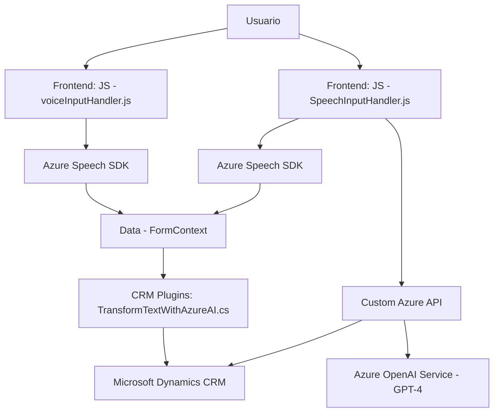

### Breve resumen técnico

El repositorio descrito implementa una solución basada en la integración de servicios de voz y procesamiento semántico mediante el uso de Azure Speech SDK y Azure OpenAI en aplicaciones CRM (Dynamics CRM). Su objetivo es mejorar la interacción de usuarios con la plataforma mediante comandos y datos procesados por voz e inteligencia artificial.

Los archivos representan funcionalidades específicas y muestran una combinación de frontend interactivo (JavaScript) y backend potenciado por plugins en C#.

---

### Descripción de la arquitectura

La solución puede considerarse **híbrida**, ya que combina:
1. Frontend basado en JavaScript que interactúa directamente con un formulario en Dynamics CRM para manejar entradas y transformación de datos.
2. Backend basado en plugins en C# para extender la lógica de negocio del CRM y comunicarse con servicios externos.

Por lo tanto, la arquitectura general puede calificarse como **n capas con integración a servicios externos**, desplazando lógica intensiva a APIs de terceros como Azure Speech SDK y Azure OpenAI.

Adicionalmente, sigue claramente el patrón **Modelo-Vista-Controlador (MVC)** desde el punto de vista de Dynamics CRM:
- **Modelo**: Datos del formulario (`formContext`).
- **Vista**: UI del formulario en Dynamics CRM.
- **Controlador**: Lógica del frontend y plugins para transformar y manejar los datos.

---

### Tecnologías utilizadas

- **Lenguajes de programación**:
  - **JavaScript**: Para interacciones dinámicas en el frontend.
  - **C#**: Para extender funcionalidades en el backend del CRM mediante plugins.

- **Frameworks y librerías**:
  - **Azure Speech SDK**: Para reconocimiento y síntesis de voz.
  - **Azure OpenAI**: Para procesamiento de texto y generación de respuestas basadas en IA.
  - **Dynamics CRM SDK**: Extensibilidad de la plataforma CRM.

- **OTRAS herramientas**:
  - **Xrm.WebApi**: Para interacciones API desde Dynamics CRM.
  - **Newtonsoft.Json**: Manipulación de objetos JSON en C#.
  - **System.Net.Http**: Realización de peticiones HTTP en el backend.

- **Patrones de diseño**:
  - **Event-driven**: Funcionalidades disparadas por eventos en el frontend y mediante `IPluginExecutionContext` en el backend.
  - **Lazy Loading**: Carga condicional del SDK de Azure en tiempo de ejecución.
  - **Encapsulación**: Métodos especializados de frontend y backend están separados según responsabilidad.

---

### Dependencias y componentes externos

1. **Servicios externos**:
   - **Azure Speech SDK**: Para síntesis y reconocimientos de voz.
   - **Azure OpenAI**: Para interpretar y transformar texto.
2. **Interacción con Dynamics CRM**:
   - Dinámicas específicas asociadas a formularios (`formContext`) que dependen del cliente.
   - Componentes internos como `Xrm.UI`, `Xrm.WebApi` y `formContext`.

---

### Diagrama Mermaid válido para GitHub

---

### Conclusión final

Este repositorio describe una solución orientada a mejorar la interacción en plataformas de CRM mediante integración de servicios de voz e IA. Aprovecha una arquitectura de **n capas** con fuertes dependencias en servicios de terceros como **Azure Speech SDK** y **Azure OpenAI**, junto con lógica extendida en plugins de Dynamics CRM. Si bien puede desarrollarse como una solución integral, tiene acoples significativos que dependen de la disponibilidad y configuración de los servicios Azure, por lo que su implementación debe considerar posibles puntos de falla externos y latencias en las APIs.