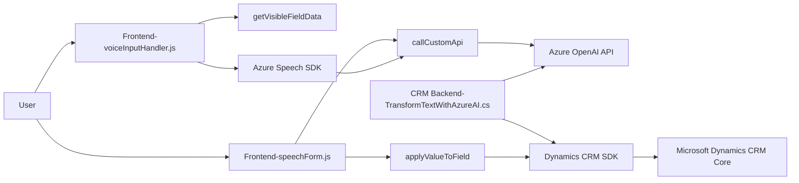

### Resumen técnico
El repositorio implementa soluciones para integraciones avanzadas con Microsoft Dynamics CRM, aprovechando tecnologías líderes como Azure Speech SDK y Azure OpenAI API. Se centra en la interacción a través de procesamiento de voz y transformaciones AI tanto a nivel del cliente frontend como en extensiones del backend (plugins).

---

### Descripción de arquitectura
1. **Tipo de solución**: La estructura y funcionalidad descrita revela un enfoque híbrido:
   - **Frontend**: Implementa componentes de interacción, como reconocimiento de voz y procesamiento de datos de formularios en el navegador.
   - **Backend (Plugin)**: Extiende Dynamics CRM utilizando un plugin de servidor que interactúa con APIs externas (Azure OpenAI) para transformar datos.

2. **Arquitectura**:
   - **Frontend**: Modularidad con patrones como Facade y callbacks (JavaScript) para simplificar la gestión de SDKs y eventos.
   - **Backend**: Sigue un esquema de **Plugin Architecture**, común en soluciones para extensiones de Microsoft Dynamics CRM.
   - **Integración basada en servicios**: Dependencia directa de servicios externos como Speech SDK y OpenAI API.

3. **Capas principales**:
   - Capa UI/Frontend (JavaScript): Procesamiento local de datos y usuarios en navegadores.
   - Middleware: Integración con APIs externas desde el frontend y el backend.
   - Backend: Extendido como plugins del CRM, conectados a servicios externos como OpenAI.

---

### Tecnologías usadas
- **Frontend**:
  - **JavaScript ES6**: Lógica principal para interacción en formularios y SDKs.
  - **Azure Speech SDK**: Reconocimiento y síntesis de voz.
  - **Microsoft Dynamics CRM context API**: Mapeo, lectura y asignación de valores en formularios CRM.

- **Backend (Plugin)**:
  - **C# con Dynamics CRM SDK**: Implementación de extensiones en el servidor.
  - **Azure OpenAI API**: Integración con modelos GPT para procesamiento avanzado de datos textuales.
  - **Newtonsoft.Json** y **System.Net.Http**: Manejo de JSON y comunicación HTTP.

---

### Dependencias o componentes externos
1. **Externas**:
   - Azure Speech SDK (voz).
   - Azure OpenAI API (GPT-based text processing).
   - Dynamics CRM SDK para plugins.

2. **Internas**:
   - Contextos del formulario CRM (`formContext`) usados intensivamente en el frontend.
   - Servicios de Dynamics CRM (`IOrganizationService`) conectan los plugins al sistema core.

---

### Diagrama Mermaid

---

### Conclusión final
La solución combina un frontend avanzado con reconocimiento de voz y un backend integrado a través de plugins en Dynamics CRM. Utiliza ampliamente Azure Speech SDK y Azure OpenAI API, logrando una arquitectura modular híbrida con integración externa líder. Aunque funcional y escalable, el manejo de claves/API en el código es un área de mejora significativa en términos de seguridad. La arquitectura implementada sugiere patrones de integración basada en servicios, particularmente útil en entornos empresariales.