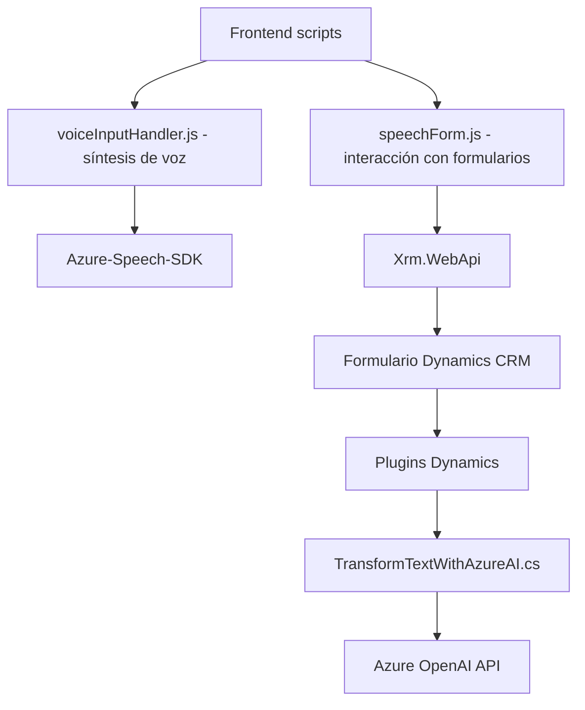

## Breve resumen técnico
Este proyecto se centra en la integración de servicios cloud (Azure Speech SDK y Azure OpenAI) con formularios dinámicos de Microsoft Dynamics CRM. Los archivos presentados implementan funcionalidades de entrada de voz, síntesis de voz y manipulación de texto con inteligencia artificial. La solución parece ser una combinación de **frontend modular basado en JavaScript** y **backend en forma de plugins**, usados directamente en el ecosistema Dynamics 365.

---

## Descripción de arquitectura
La arquitectura es **hexagonal** con integración de servicios externos y plugins. La interacción entre componentes es modular, y el flujo de datos y operaciones se basa en el diseño orientado a servicios. Los servicios externos de Azure (Speech SDK y OpenAI) desempeñan un papel central en el procesamiento del texto y la síntesis/reconocimiento de voz.

### Detalles técnicos clave:
1. **Frontend:**
   - Modular y funcional: El código JavaScript implementa procesamiento centrado en los datos de formularios (`voiceInputHandler.js` y `speechForm.js`).
   - Uso de dinámicas de carga de SDK para optimizar los recursos.
   - Azure Speech SDK permite la síntesis y reconocimiento de voz en tiempo real, vinculando la interfaz con un CRM.

2. **Plugins:**
   - `TransformTextWithAzureAI.cs` usa un patrón plugin típico de Dynamics CRM (implementa `IPlugin`).
   - Integración con Azure OpenAI para transformar texto mediante reglas personalizadas.
   - Manejador de solicitudes HTTP para interacciones con el API y generación de resultados JSON.

---

## Tecnologías usadas
1. **Frontend: JavaScript**
   - Azure Speech SDK: Synthesis y voice recognition a nivel cliente.
   - Manipulación del DOM para gestionar datos de formularios.

2. **CRM Plugins:**
   - Microsoft Dynamics CRM SDK.
   - Newtonsoft.Json para tratamiento de JSON (deserialización/serialización).
   - System.Net.Http para las llamadas al servicio de Azure OpenAI.
   - Azure OpenAI API con modelo GPT-4.

3. **Cloud technologies:**
   - Azure Speech SDK.
   - Azure OpenAI GPT-4.
   - Dynamics CRM API (`Xrm.WebApi`).

4. **Patrones identificados:**
   - Hexagonal architecture: Interacción con servicios externos mediante adaptadores.
   - Procedural programming in frontend for modular functionality.
   - Plugin design: Separa lógica empresarial y extensibilidad CRM.

---

## Diagrama Mermaid válido para GitHub:

---

## Conclusión final
El repositorio implementa una **solución híbrida** que conecta **frontend y backend** con servicios en la nube de Azure, centrada en la experiencia de usuario mediante entrada de voz y manipulación de texto inteligente. La arquitectura hexagonal permite un desacoplamiento entre el cliente (Dynamics CRM) y los servicios externos como Azure Speech SDK y Azure OpenAI API. Esto habilita la escalabilidad y la posibilidad de reutilizar o extender componentes según las necesidades futuras.