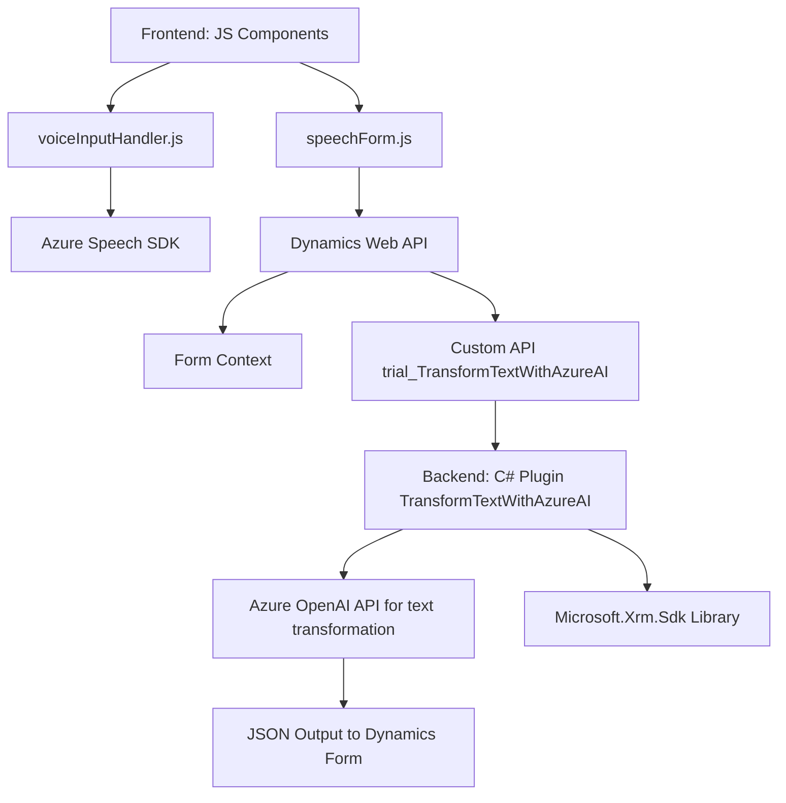

### Breve resumen técnico
El repositorio parece pertenecer a una solución compleja que integra reconocimiento de voz, sintetización de texto a voz, manipulación de datos en formularios dinámicos (Dynamics 365), y transformación avanzada de texto utilizando inteligencia artificial basada en Azure OpenAI. Los archivos representan una arquitectura distribuida con componentes para infraestructura en la nube (Azure Speech SDK y Azure OpenAI), un frontend basado en JavaScript y un backend modular con plugins para Dynamics CRM.

---

### Descripción de arquitectura
La solución tiene características de **architecture basada en capas (n capas)** con separación de responsabilidades entre frontend, backend y servicios externos. Además, presenta aspectos de integración con servicios externos (Azure Speech SDK y Dynamics Web API) y una arquitectura orientada a servicios (**SOA**). Los componentes clave son:
1. **Frontend interactivo en JavaScript**, que utiliza eventos y SDK para capturar y procesar datos por voz.
2. **Backend mediante plugins en C#**, que transforma datos y ejecuta lógica en Dynamics 365, integrando APIs externas (Azure OpenAI y Speech SDK).
3. **Servicios cloud**, aprovechando Azure para IA y procesamiento de voz.

---

### Tecnologías usadas
- **Frontend**:
  - **JavaScript**: Usado para lógica del cliente y manejo de eventos del usuario.
  - **Dynamics 365 Web API**: Interacción directa entre el frontend y el contexto del formulario CRM mediante `executionContext`.

- **Backend**:
  - **C#**: Usado en los plugins personalizados.
  - **Microsoft.Xrm.Sdk**: Framework utilizado para extender la funcionalidad de Dynamics CRM.
  - **Newtonsoft.Json / System.Text.Json**: Manejadores de datos en JSON.
  - **System.Net.Http**: Realiza comunicación HTTP para interactuar con APIs externas.
  - **Azure OpenAI API**: Utilizando modelos GPT para transformar texto.

- **Servicios externos**:
  - **Azure Speech SDK**: Manejo de síntesis y reconocimiento de voz.
  - **Azure OpenAI**: Procesamiento avanzado de texto.

---

### Diagrama **Mermaid** válido para GitHub

---

### Conclusión final
La solución presenta un enfoque **n capas orientado a servicios (SOA)**, mezclando componentes frontend y backend con dependencias importantes de servicios en la nube (Azure). Es escalable, modular y bien definida para operar sobre Dynamics 365 mediante plugins y APIs externas.

- **Fortalezas**:
  - Modulación clara entre interacción del cliente (frontend) y lógica empresarial (backend).
  - Uso de APIs modernas como Azure Speech SDK y OpenAI para procesamiento en tiempo real.

- **Áreas de mejora**:
  - Documentación técnica más detallada sobre integración de recursos de Azure.
  - Configuración de pruebas y manejo de errores en llamadas a servicios externos.

Esta solución está bien estructurada para aplicaciones empresariales robustas, interactivas y conectadas a plataformas cloud.