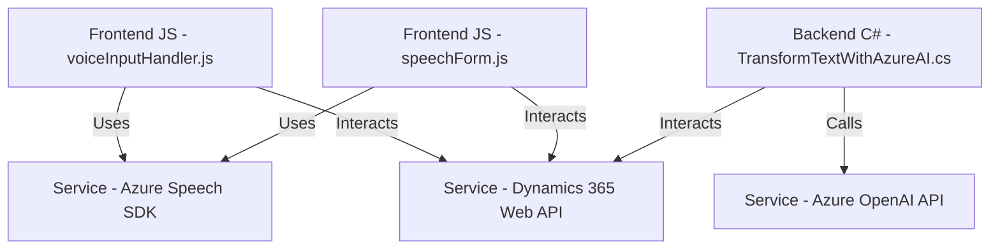

## Breve Resumen Técnico
El repositorio contiene múltiples archivos que forman un sistema integrado con **Microsoft Dynamics 365** y **Azure Cognitive Services** para enriquecer la experiencia de usuario con servicios de conversión de voz a texto y texto a voz, además de transformar y procesar datos mediante el uso de APIs inteligentes (Azure AI/OpenAI GPT). La solución tiene componentes tanto del lado del frontend como del backend.

---

## Descripción de la Arquitectura
La solución implementa una arquitectura basada en **n-capas**, con una separación entre las siguientes responsabilidades:
1. **Frontend (JS)**: Implementación de funciones que gestionan la interacción de usuario en formularios.
2. **Backend (Plugins en C#)**: Procesamiento de texto con Dynamics CRM y transformación de datos usando Azure AI (OpenAI).
3. **Servicios Externos (Azure)**: Azure Speech SDK y Azure AI para reconocer voz y transformar texto en datos estructurados.

La modularidad del código sugiere una arquitectura lógica coherente, basada tanto en la orientación a servicios como integración con APIs externas. Además, se observa el patrón **orientado a eventos** en el manejo de la lógica de voz-sobre-texto y la interacción directa con el contexto de Dynamics CRM.

---

## Tecnologías Usadas
1. **Frontend**:
   - **Azure Speech SDK**: Usado para reconocimiento de voz y síntesis de texto a voz.
   - **JavaScript**: Lógica principal orientada a la captura de datos y manejo del DOM/formularios.

2. **Backend**:
   - **C#**: Implementación de plugins para Dynamics CRM.
   - **Microsoft Dynamics 365 SDK**: Utilizado para interactuar con entidades de CRM y ejecutar plugins.
   - **Azure OpenAI API/GPT**: Transformación de texto.
   - **HttpClient y JSON Libraries (Newtonsoft)**: Para realizar solicitudes HTTP a servicios externos y procesar JSON.

3. **Arquitectura y Diseño**:
   - **Orientación a eventos**: Triggers desencadenan el procesamiento tanto en el frontend como en el backend.
   - **Modularización fuerte**: Las funcionalidades están distribuidas en funciones/archivos específicos.
   - **Integración de servicios externos**: El frontend y el plugin dependen de SDKs y APIs de Azure.

---

## Diagrama Mermaid

---

## Conclusión Final
La solución es una **plataforma integrada** que potencia la interacción de usuarios con formularios en Microsoft Dynamics 365 al incluir capacidades avanzadas de procesamiento y síntesis de voz, así como manipulación dinámica de datos y transformación. La arquitectura emplea un enfoque de **n-capas** con módulos diferenciados que encapsulan la lógica para frontend, backend y APIs externas. 

Este diseño facilita la extensibilidad, mantenimiento y escalabilidad, especialmente considerando el alto grado de dependencia con servicios externos como **Azure Speech SDK**, **Azure OpenAI API** y **Dynamics 365 Web API**. Aunque algunos aspectos podrían beneficiarse de una mayor separación de responsabilidades y seguridad (e.g., manejo seguro de claves de API), la estructura es globalmente sólida para su propósito.