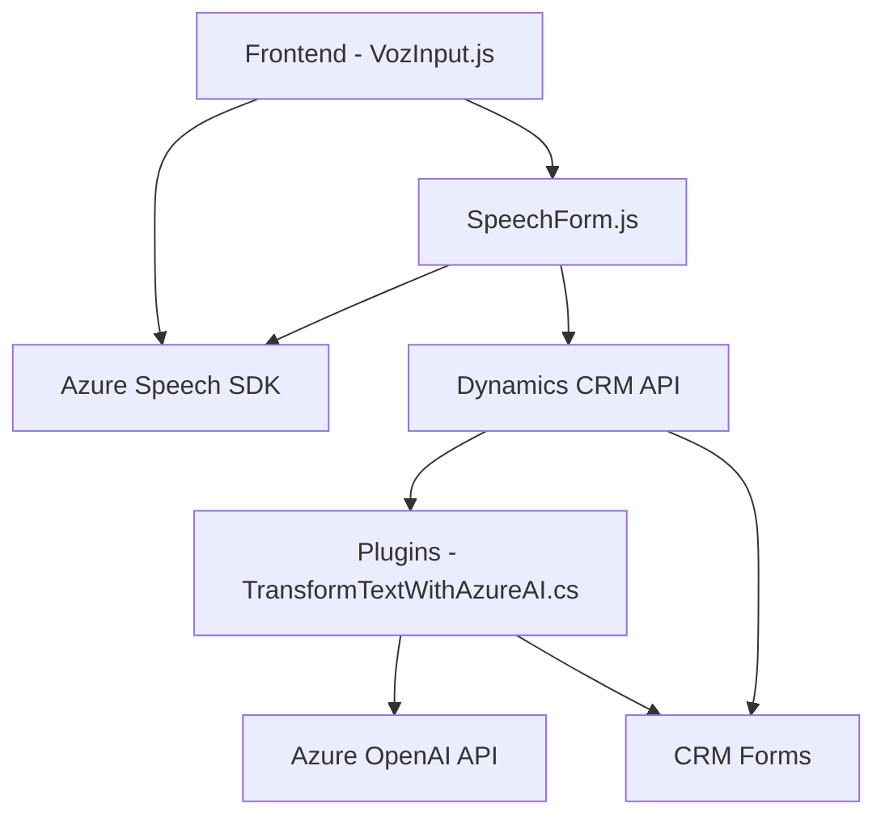

### Breve resumen técnico
El repositorio implementa una solución para interacción con Microsoft Dynamics CRM mediante APIs y SDKs, enfocada en el manejo de texto y voz. Las funcionalidades principales giran en torno al uso de Azure Speech SDK para síntesis y reconocimiento de voz, así como el empleo de Azure OpenAI para transformar texto en JSON estructurado. 

### Descripción de arquitectura
La arquitectura sigue un patrón modular con componentes claramente separados por funciones:
1. **Front-end**: Scripts JavaScript responsables de interactuar con el Azure Speech SDK y el entorno de Dynamics CRM. Permiten tanto la síntesis de voz como el reconocimiento y actualización dinámica de formularios. Se presenta lógica modular y orientada a eventos.
2. **Plugin en Dynamics CRM**: Este componente servidor usa la arquitectura Plugin Pattern y delega la transformación de texto a un servicio externo (Azure OpenAI), manteniendo el núcleo CRM aislado de la lógica de transformación.

La solución no utiliza microservicios pese a depender de múltiples servicios externos (Azure Speech SDK, Azure OpenAI), ya que los componentes funcionan como extensiones integradas en Dynamics CRM, con interacción basada en SDKs.

La arquitectura general es de **n-capas**:
- **Presentación**: Scripts JavaScript en front-end que visualizan y recopilan información del usuario.
- **Lógica de negocio**: Plugin en Dynamics CRM que procesa y transforma el texto.
- **Servicio externo**: Azure Speech SDK para voz y Azure OpenAI para transformación de texto.

### Tecnologías usadas
1. **Front-end**:
   - **JavaScript**: Para realizar lógica de síntesis de texto en voz y reconocimiento de voz.
   - **Azure Speech SDK**: Manejo de voz.
   - **Dynamics CRM API** (`Xrm.WebApi`): Para llamadas internas y actualización de formularios dinámicos.

2. **Plugin**:
   - **C#**: Desarrollo del plugin para Dynamics CRM.
   - **Microsoft Dynamics SDK**: Interacción con el entorno CRM.
   - **System.Net.Http**: Realización de llamadas REST para interactuar con Azure OpenAI.
   - **Azure OpenAI API**: Transformación avanzada de texto.
   - **Newtonsoft.Json**: Manejo avanzado de estructuras JSON.

### Dependencias o componentes externos
1. **Azure Speech SDK**:
   - Utilizado para la síntesis de texto en voz y reconocimiento de voz.
2. **Azure OpenAI API**:
   - Aplicado para transformación del texto en objetos JSON bajo normas específicas definidas por el usuario.
3. **Microsoft Dynamics CRM API**:
   - Para interactuar con datos del contexto y actualizar formularios.
4. **Newtonsoft.Json**:
   - Biblioteca usada para manipulación flexible de estructuras JSON en C#.

---

### Diagrama Mermaid válido para GitHub

---

### Conclusión final
La solución presentada es una arquitectura modular de **n-capas** que integra servicios de voz y transformación de texto con tecnologías de Microsoft Dynamics CRM. Hace uso de patrones como **delegación** (callbacks en SDK/API), separación de responsabilidades y plugin pattern. La dependencia en servicios externos (Azure Speech y OpenAI) sugiere que el diseño facilita la ampliación funcional pero introduce riesgos relacionados con la latencia o interrupción externa. Este enfoque es ideal para entornos empresariales que necesitan interacción basada en voz junto con integración avanzada de IA.