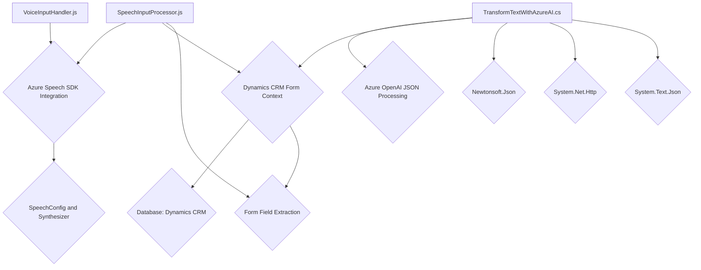

### Breve resumen técnico
El repositorio contiene los siguientes módulos:

1. **`VoiceInputHandler.js`:** facilita la síntesis de texto basado en datos visibles de formularios, usando Microsoft Azure Speech SDK. 
2. **`SpeechInputProcessor.js`:** implementa características centradas en el reconocimiento de voz a texto y procesamiento del resultado mediante una API personalizada y Dynamics 365.
3. **`TransformTextWithAzureAI.cs`:** plugin para Microsoft Dynamics CRM que utiliza Azure OpenAI para transformar texto en datos estructurados JSON siguiendo reglas específicas.

---

### Descripción de arquitectura
El repositorio presenta una arquitectura **modular multicapa** conformada por las siguientes capas:
- **Frontend/integración de formularios:** Interacción directa con el DOM (visible principalmente en los archivos `JS`), extracción y manipulación de datos de formularios.
- **Servicios externos:** Conexión y procesamiento con APIs externas como Azure Speech SDK y Azure OpenAI. Los módulos implementan patrones *Service-Oriented Architecture (SOA)*, integrando servicios cognitivos.
- **Backend/Plugins:** Extensa personalización del ecosistema Dynamics CRM mediante un plugin basado en la interfaz `IPlugin` que conecta Microsoft Dynamics con Azure OpenAI para manejo avanzado de inteligencia artificial.

---

### Tecnologías usadas
1. **Frontend:** 
   - **JavaScript:** Archivo `VoiceInputHandler.js` y `SpeechInputProcessor.js` están basados en JS ES6+.
   - **Azure Speech SDK:** Integrado dinámicamente vía URL para síntesis y reconocimiento de voz.

2. **Backend:**
   - **C#:** Archivo `TransformTextWithAzureAI.cs` utiliza C# para implementar extensiones de Dynamics CRM.
   - **Azure OpenAI:** Llamadas a servicios cognitivos para procesamiento avanzado del texto.
   - **Newtonsoft.Json:** Para manipular datos JSON.
   - **Microsoft Dynamics CRM SDK:** Extensión del contexto dinámico de CRM.

3. **Patrones arquitectónicos:**
   - **Delegate/Callback:** Usado para cargar dinámicamente el SDK de Speech.
   - **Service-Oriented Architecture (SOA):** Articulación con servicios externos como Azure Speech SDK y OpenAI.
   - **Factory Method:** Configuración de objetos como `SpeechConfig` o `AudioConfig`.
   - **Event-Driven Architecture:** Implementación basada en eventos (en plugins y en frontend).
   - **Stateless Design:** Métodos diseñados para no tener estado persistente.

---

### Diagrama Mermaid válido para GitHub

---

### Conclusión final
El repositorio implementa una solución integral centrada en la integración de inteligencia artificial (IA) y reconocimiento de voz en Microsoft Dynamics CRM. Utiliza una combinación de tecnologías de frontend y backend junto con servicios cognitivos de Azure para proporcionar una experiencia interactiva avanzada basada en voz y texto. La solución sigue patrones moduladores como SOA y un diseño multicapa que separa las responsabilidades claramente. Las dependencias externas incluyen el SDK de Azure, Dynamics CRM SDK, y librerías estándar de manipulación HTTP/JSON. Es una solución bien estructurada y que hace un buen uso de las herramientas y servicios disponibles en el ecosistema Microsoft.