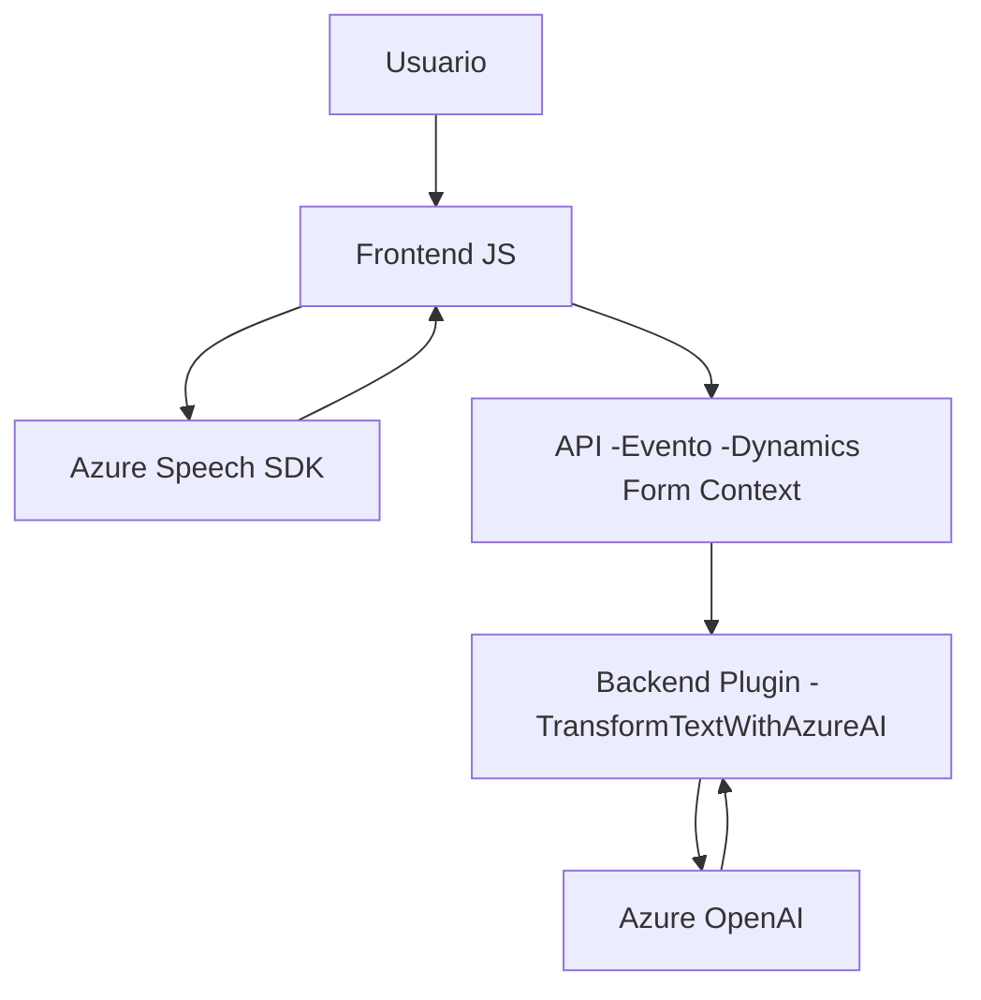

# **Análisis Técnico**

### **Breve Resumen Técnico**
El repositorio contiene múltiples archivos con un enfoque principal en una solución que utiliza tecnologías basadas en Azure y Dynamics CRM para la interacción entre usuarios y formularios mediante voz y procesamiento de texto. Se integra con APIs externas (Azure Speech SDK, Azure OpenAI) y con servicios internos de Dynamics CRM para manipulación de datos y generación de formularios procesados por IA.

---

### **Descripción de Arquitectura**
1. **Tipo de solución:**  
   Es una solución híbrida que combina funcionalidades frontend (interacción con usuario), backend (plugin en .NET para Dynamics CRM), y servicios en la nube como Azure Speech SDK y Azure OpenAI. La interacción entre módulos y servicios define claramente un sistema distribuido.

2. **Tipo de arquitectura:**  
   La arquitectura sigue una **n-capas extendida** con la división clara entre la capa de presentación (frontend JS), lógica de negocio (Dynamics CRM plugins), y servicios remotos (Azure Speech SDK y OpenAI). Adicionalmente, se observa una implementación cercana al **Patrón de Integración API**, que utiliza servicios externos para realizar tareas específicas de procesamiento de texto y voz. Aunque se distribuyen varios componentes, la solución se ejecuta en un sistema que mantiene coherencia con el modelo de datos de Dynamics CRM, alejándose del concepto de microservicios.

---

### **Tecnologías Usadas**
1. **Frontend:**
   - JavaScript para la interacción del usuario con formularios y llamadas al SDK de Azure.
   - Azure Speech SDK: Para síntesis y reconocimiento de voz.
   - Dynamics CRM Form Context API (`Xrm.WebApi.online`): Herramientas propias del CRM para gestionar datos en formularios.

2. **Backend:**
   - **C#:** Para implementar un plugin en el sistema Dynamics CRM para procesamiento de texto mediante Azure OpenAI.
   - **Azure OpenAI:** Utilizado para transformar y estructurar texto en un JSON siguiendo normas específicas.
   - **Dynamics CRM SDK:** Para integración con la lógica empresarial del CRM.
   - **Newtonsoft.Json:** Para manipular JSON en el backend.
   - **HttpClient:** Para llamadas HTTP a servicios REST como Azure APIs.

3. **Patrones Arquitectónicos:**
   - **Modularidad:** Código dividido en funciones específicas tanto en frontend como en backend, que facilita mantenibilidad y escalabilidad.
   - **Integración de SDK externo:** Implementaciones específicas para interactuar con Azure Speech SDK y OpenAI.
   - **Filtro de entrada:** Validación de datos en formularios y texto antes de su procesamiento y envío a APIs externas.
   - **Delegación:** División de tareas entre frontend, backend y servicios en la nube para mantener la separación de responsabilidades.

---

### **Dependencias y Componentes Externos**
1. **Azure Speech SDK:** Cargado dinámicamente en el frontend para procesamiento de voz. Utiliza la URL directa de Azure Speech para habilitar el reconocimiento de voz y síntesis.
2. **Azure OpenAI API:** Endpoint de inteligencia artificial para procesamiento y estructuración de texto en JSON.
3. **Dynamics CRM Services:** Librerías como Microsoft.Xrm.Sdk permiten crear plugins para manipular entidades, realizar transformaciones y llamadas remotas.
4. **JSON Libraries:** Newtonsoft.Json y System.Text.Json para manejar estructuras JSON en .NET backend.

---

### **Diagrama Mermaid**

---

### **Conclusión Final**
La solución está diseñada para integrarse con plataformas empresariales como **Microsoft Dynamics CRM**, aprovechando los servicios en la nube de Azure para mejorar la experiencia de usuario en la interfaz y agregar capacidades avanzadas de procesamiento. La arquitectura utiliza un modelo **n-capas** extendido con integración de servicios externos, logrando modularidad y simplificando futuros escalados. Su fuerte dependencia de tecnologías Azure y Dynamics CRM evidencia un enfoque específico hacia soluciones corporativas basadas en IA y automatización.