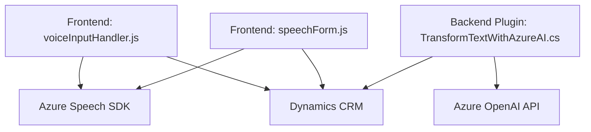

# Breve resumen técnico

El repositorio muestra una solución de integración entre diversos servicios, como **Azure Speech SDK** para reconocimiento de voz y sintetización, **Azure OpenAI** para transformación avanzada de texto, y **Microsoft Dynamics CRM**. Está dividido en tres componentes principales:

1. **Frontend/JS**: Scripts en JavaScript para capturar entrada de voz, procesar campos de formularios mediante síntesis de voz y realizar llamadas asíncronas a APIs personalizadas.
2. **Backend/Plugins**: Complementos en C# que extienden las funcionalidades de Dynamics CRM con un plugin que integra Azure OpenAI para procesamiento de texto.

---

# Descripción de arquitectura

La solución sigue una arquitectura **multicapas**, donde:
- **Frontend** gestiona la interacción del usuario mediante entrada/salida de voz y procesamiento de formularios.
- **Custom APIs** conectan Dynamics CRM al servidor Azure OpenAI para realizar transformaciones avanzadas de datos.
- **Plugins** en C# amplían Dynamics CRM utilizando servicios externos.

Este enfoque modular permite desacoplar las responsabilidades de entrada de datos, procesamiento lógico y acceso a servicios externos.

---

# Tecnologías usadas

1. **Frontend**:
   - **JavaScript** para lógica de cliente y manipulación de DOM.
   - **Azure Speech SDK** para entrada y síntesis de voz.
   - **Dynamics CRM Web API** para API REST en formularios.

2. **Backend**:
   - **C# (.NET Framework)** para los plugins de Dynamics CRM.
   - **Azure OpenAI API** para procesamiento y transformación de texto mediante IA.
   - **HTTP client libraries** para envío de solicitudes RESTful.

3. **Patrones arquitectónicos**:
   - **Event-driven programming**: Callbacks usuarios en Speech SDK y APIs de Dynamics.
   - **Modular design**: Separación en funciones específicas y componentes independientes.
   - **N capas**: Interacción entre Frontend, API externa y Plugins.

---

# Diagrama Mermaid válido para GitHub

---

# Conclusión final

La solución representa una integración avanzada entre múltiples servicios de Microsoft Azure y Dynamics CRM, utilizando una arquitectura **n capas** con modularidad, separación de responsabilidades, y comunicación asincrónica entre cliente, APIs externas y backend. Brinda capacidades enriquecidas de IA y voz que pueden potenciar flujos de trabajo empresariales complejos.

Sin embargo, aspectos como la seguridad de las credenciales (Azure API Key) deberían reforzarse, y se podría considerar la implementación de un patrón como **hexagonal architecture** para mejorar la extensibilidad.