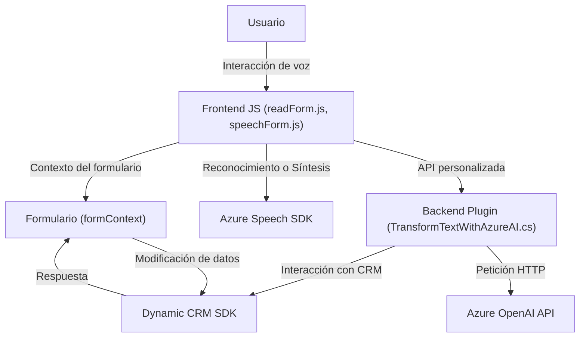

### Breve resumen técnico

El proyecto analizado es una **integración entre una frontend basada en JavaScript y un backend en forma de plugin para Dynamics CRM**, donde la funcionalidad principal gira en torno a la utilización del servicio **Azure Speech SDK** para reconocimiento y síntesis de voz, así como **Azure OpenAI** para procesamiento y transformación avanzada de texto. Los componentes trabajan en conjunto para proporcionar una interfaz de usuario que permita interactuar con un sistema empresarial, como Dynamics CRM, utilizando comandos de voz y automatización de tareas.

---

### Descripción de la Arquitectura

La solución puede clasificarse como un sistema **n-capas**, compuesto por las siguientes partes:
1. **Capa de Presentación (Frontend)**:
   - Implementada en JavaScript (**readForm.js** y **speechForm.js**), interactúa con el usuario.
   - Facilita la lectura de formularios visibles y la conversión de texto mediante síntesis de voz.
   - Ofrece soporte dinámico para integrar comandos de voz mediante el reconocimiento y la manipulación de atributos de formulario.

2. **Capa de Lógica de Negocio (Backend)**:
   - Implementada como un **Plugin de Dynamics CRM (TransformTextWithAzureAI.cs)**.
   - Amplía las capacidades del CRM mediante procesamiento avanzado con herramientas de IA de Azure.

3. **Capa de Integración**:
   - Dependencias externas:
     - **Azure Speech SDK** para funcionalidades de voz.
     - **Azure OpenAI API** para transformación y procesamiento de datos.
   - **APIs del CRM (Xrm.WebApi)** con capacidad REST para manipulación de datos del sistema.

### Tecnologías Usadas
- **Frontend:**
  - **JavaScript**: Estructura principal del código.
  - **Azure Speech SDK**: Reconocimiento y síntesis de voz.
  - **Dynamics 365 CRM Integration:** `formContext`, `data.entity.attributes` usados para manipulación de datos del formulario.

- **Backend Plugin:**
  - **C#**: Lenguaje principal utilizado.
  - **Dynamics CRM SDK** (`IPluginExecutionContext`, `IOrganizationService`): Para integrar eventos del CRM.
  - **Azure OpenAI API**: Proceso de texto mediante IA.
  - **Newtonsoft.Json.Linq** y **System.Text.Json**: Manejo del formato JSON para comunicación con APIs externas.

### Patrones Utilizados
1. **Event-driven Architecture**: Los callbacks controlan la interacción entre comandos y servicios.
2. **Facade Pattern**: Abstracción de interacción con servicios de Azure OpenAI y Azure Speech SDK.
3. **Service-Oriented Architecture (SOA)**: Uso de APIs externas como servicios para reconocimiento de voz y procesamiento de texto.
4. **Modular Functional Design**: Cada funcionalidad (reconocimiento de voz, transformación con IA, síntesis de voz) está encapsulada en funciones o métodos específicos, promoviendo separación de responsabilidades.
5. **Dependency Injection Pattern**: Aplicado en el backend para gestionar servicios del CRM.

---

### Diagrama **Mermaid** válido para GitHub

Este diagrama describe las relaciones entre los componentes del sistema:

---

### Conclusión Final

Esta solución refleja un enfoque integrado para mejorar la interacción con plataformas CRM utilizando servicios de voz e inteligencia artificial. Su **arquitectura n-capas** combina frontend dinámico en JavaScript con un backend basado en plugins, que aprovecha las capacidades avanzadas de servicios en la nube, como Azure Speech y OpenAI. Esto permite implementar un entorno altamente funcional para reconocimiento de voz, síntesis y procesamiento avanzado, junto con una experiencia de usuario mejorada.