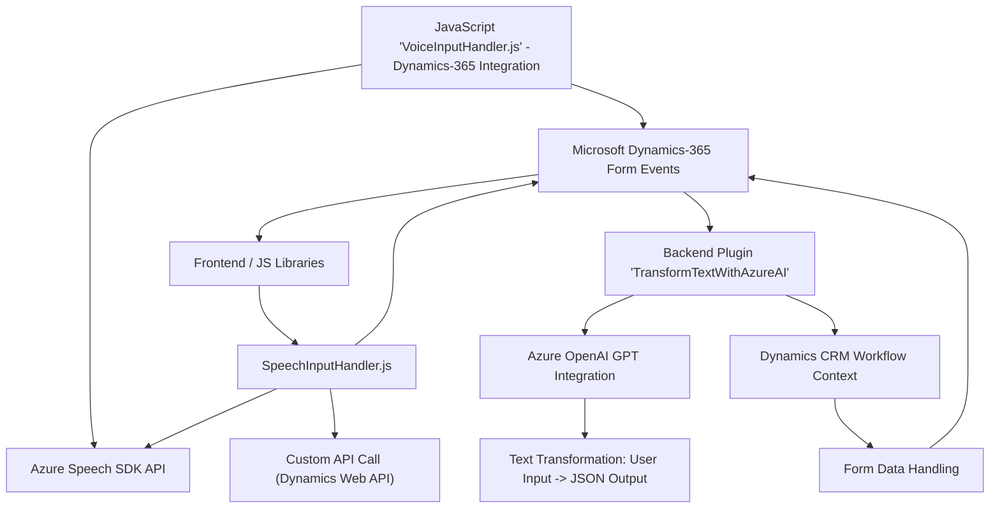

### Resumen Técnico

Este repositorio contiene componentes y archivos destinados a integrar funcionalidad de entrada y salida de voz (Text-to-Speech y Speech-to-Text) en aplicaciones Microsoft Dynamics 365 mediante Azure Speech SDK y Azure OpenAI Service. Los componentes están diseñados para manejar la accesibilidad y enriquecer la experiencia de usuario (UX) utilizando inteligencia artificial para procesar texto y gestionar formularios dinámicos.

---

### Descripción de Arquitectura

La solución combina dos elementos principales:
1. **Frontend**: Un conjunto de scripts en JavaScript para gestionar la integración de voz y la interacción con formularios en Dynamics 365. Estos scripts presentan lógica modular y reglas estrictas de separación de responsabilidad.
2. **Plugin Backend**: Un componente basado en C# que se ejecuta en el contexto de Dynamics CRM como un plugin, utilizando Azure OpenAI para generar transformaciones de texto avanzadas.

La arquitectura general tiene características híbridas:
- **N capas**: Con separación entre lógica de interfaz (frontend) y lógica de negocio (plugin backend).
- **Arquitectura de integración**: Uso extensivo de Azure Speech SDK y Azure OpenAI mediante servicios externos.
- **Microservicios**: Aunque no hay evidencia directa del uso de microservicios en el backend, la dependencia de APIs como Azure Speech y OpenAI sugiere principios de desacoplamiento.

---

### Tecnologías Usadas

1. **Frontend**:
   - **JavaScript**: Desarrollo de scripts para manipulación de formularios y entrada/salida de voz.
   - **Azure Speech SDK**: Integración con servicios de texto a voz y transcripción.
   - **Microsoft Dynamics 365**: Sistema CRM para manejar formularios dinámicos.
   
2. **Plugin Backend**:
   - **C#**: Implementación de lógica de transformación y procesamiento de texto bajo Dynamics CRM.
   - **Azure OpenAI**: Uso de GPT para procesamiento de texto.
   - **Newtonsoft.Json & System.Text.Json**: Manejo de datos JSON.

3. **Dependencias comunes**:
   - `HttpClient`: Llamadas a APIs externas (Speech/OpenAI/Dynamics).
   - `Xrm.WebApi`: Interacciones con Microsoft Dynamics CRM desde el frontend.

---

### Diagrama Mermaid

---

### Conclusión Final

La solución presenta un sistema integrado para mejorar la accesibilidad y experiencia en plataformas Dynamics 365 mediante procesamiento de voz y texto, con ayuda de tecnologías avanzadas como Azure Speech SDK y Azure OpenAI. Sigue principios modernos de arquitectura, como separación por capas y modularidad, con un claro enfoque en la interacción entre frontend y backend.

Potenciales mejoras que podrían considerarse:
- **Escalabilidad**: Implementar microservicios para desacoplar aún más las responsabilidades entre frontend, backend, y las APIs externas.
- **Seguridad y configuración dinámica**: Almacenar claves y regiones de Azure en sistemas seguros como Azure KeyVault para reducir riesgos de exposición.

En general, este repositorio es excelente para escenarios de interfaz enriquecida, accesibilidad y uso de IA en entornos empresariales.