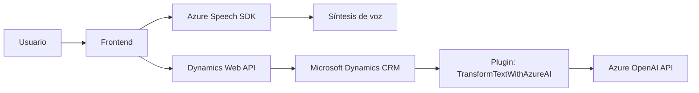

### Breve resumen técnico
El repositorio consiste en una solución que integra una **web frontend** (JavaScript) y **backend plugins** utilizados en **Microsoft Dynamics 365**, junto con la integración del **Azure Speech SDK** y **Azure OpenAI API**. Su objetivo principal es procesar información en formularios, ya sea sintetizando datos como audio (frontend) o transformando texto en datos estructurados mediante IA (plugin backend).

### Descripción de arquitectura
La arquitectura es una combinación **n capas**, donde:
1. **Frontend**: JavaScript que interactúa directamente con el usuario y procesa información visual y de voz.
2. **Backend**: Compuesto por plugins escritos en C#, diseñados para ejecutarse sobre Microsoft Dynamics CRM, procesando datos y realizando integraciones con servicios de Azure.
3. **Dependencias externas**: Utilización de Azure Speech SDK (frontend) y Azure OpenAI API (backend) para proporcionar capacidades avanzadas de voz e IA respectivamente.

### Tecnologías usadas
1. **Frontend**:
   - **JavaScript**: Para desarrollar funciones en Dynamics 365.
   - **Azure Speech SDK**: Synthesis y transcripción de voz.
   - **Dynamics Web API**: Interacciones CRUD con el contexto del formulario.
   
2. **Backend**:
   - **Microsoft Dynamics CRM Plugin Framework**.
   - **C# (ASP.NET)**: Para la lógica del plugin.
   - **Azure OpenAI API** (GPT-4).
   - **Newtonsoft.Json.Linq** y **System.Net.Http**: Manejo de JSON y peticiones HTTP.

3. **Patrones observados**:
   - **Delegación**: Métodos frontend distribuyen tareas específicas a funciones auxiliares.
   - **Modularidad**: Código organizado para tareas separadas.
   - **Gestión externa de dependencias**: Dinámica en frontend y plugin.

### Diagrama Mermaid válido para GitHub

### Conclusión final
La solución está pensada para un entorno empresarial basado en **Microsoft Dynamics 365**, donde el frontend interactúa con usuarios para procesar datos visuales o de voz. En paralelo, el backend utiliza plugins para transformar texto mediante herramientas avanzadas de IA en Azure, devolviendo contenido estructurado. La arquitectura está bien segmentada y aprovecha servicios de Microsoft para potenciar capacidades inteligentes. Soluciones como esta refuerzan la calidad del registro digital mediante integración de tecnologías claves como IA y análisis de voz.