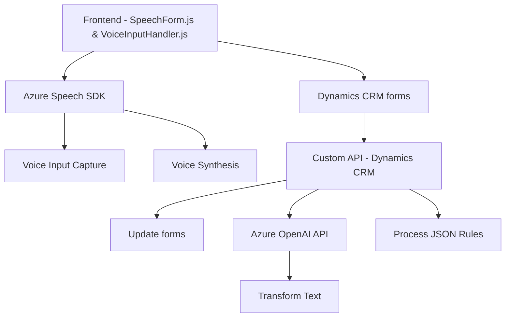

### Breve Resumen Técnico
El repositorio parece ser parte de una solución enfocada en integrar interacción por voz y procesamiento de texto con Microsoft Dynamics CRM, utilizando Azure Speech SDK y Azure OpenAI API. El sistema incluye entradas por voz, procesamiento de comandos, síntesis de voz, y transformación de texto basado en reglas.

---

### Descripción de Arquitectura
La solución está diseñada como un sistema **modular orientado a microservicios**, compuesto por varias partes que interactúan entre sí:
1. **Frontend**: Incluye JavaScript para captura de voz y procesamiento local usando el Azure Speech SDK. Los scripts procesan datos de formularios en la UI, utilizan el patrón MVC para interactuar con los modelos (formularios) y delegan solicitudes a componentes como plugins y APIs externas.
2. **Backend - Plugin en Dynamics CRM**: Se encarga de manejar solicitudes desde los clientes y procesarlas con Azure OpenAI API. Este módulo delega tareas específicas de transformación de texto a servicios externos (Azure OpenAI).
3. **Integración con servicios externos**: Uso intensivo de APIs de Azure (Speech SDK y OpenAI API) para realizar síntesis de voz y transformación de texto.

La arquitectura combina un enfoque en **microservicios** para escalar ciertas funcionalidades (transformación de texto y procesamiento de voz) con un modelo **modular**, donde cada archivo o componente tiene roles claramente definidos.

---

### Tecnologías Usadas
1. **Frontend**:
   - Lenguaje: JavaScript.
   - Frameworks/Librerías:
     - **SpeechSDK**: SDK de Azure Speech para entrada y salida de voz, y síntesis.
     - Interacción DOM y carga dinámica de scripts usando `document.createElement("script")`.
   - API usada:
     - Custom API de Dynamics CRM.
   - Patrones: Modular, MVC (implementar modelo de datos dentro de formularios), Delegate.

2. **Backend**:
   - Lenguaje: C#.
   - Frameworks/Librerías:
     - **Microsoft.Xrm.Sdk**: Integración con Dynamics CRM.
     - **Newtonsoft.Json & System.Text.Json**: Manejo y parseo de JSON.
     - **System.Net.Http**: Comunicación con servicios externos.
     - Azure OpenAI API (`gpt-4`): Transformación de texto.
   - Patrones:
     - Plugin Pattern: Seguimiento de la interfaz `IPlugin` conforme a Dynamics CRM.
     - External API Access: Utilización de servicios externos con Request-Response.

---

### Dependencias o Componentes Externos
1. **Azure Speech SDK**:
   - Utilizado para entrada y síntesis de voz.
   - Cargado dinámicamente desde el endpoint `https://aka.ms/csspeech/jsbrowserpackageraw`.

2. **Azure OpenAI API**:
   - Endpoint: `https://openai-netcore.openai.azure.com/`.
   - Integración a través de `HttpClient`. Realiza tareas específicas de procesamiento intensivo de texto (TransformTextWithAzureAI.cs).

3. **Microsoft Dynamics CRM Components**:
   - Manejo de formularios y contextos.
   - Uso del módulo `Xrm.WebApi`.

4. **Libraries (Backend)**:
   - **Newtonsoft.Json.Linq** y **System.Text.Json** para manejo de datos JSON.
   - **System.Net.Http** para comunicación externa.

---

### Diagrama Mermaid válido para GitHub Markdown

---

### Conclusión Final
La solución representa una moderna integración entre una **frontend de interacción por voz** y un **backend basado en Microsoft Dynamics CRM**, con el uso extensivo de servicios en la nube de Azure (Speech SDK y OpenAI API). La arquitectura modular y basada en microservicios permite una escalabilidad significativa en el contexto de grandes sistemas CRM.

Si el proyecto se expande en número de funciones o volumen de utilización, se recomienda considerar arquitecturas más avanzadas como **event-driven microservices** para garantizar una operación óptima. 

Optimizar el procesamiento de voz y transformaciones de texto podría incluir el uso de **caching en el backend** o implementar estrategias de preprocesamiento en el frontend para mejorar la latencia y reducción de costos de API.