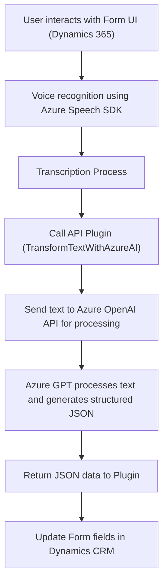

### Breve Resumen Técnico:
El repositorio analizado contiene tres archivos principales (`readForm.js`, `speechForm.js`, `TransformTextWithAzureAI.cs`) que, en conjunto, desarrollan una solución que utiliza datos de formularios en **Dynamics 365**, los manipula de manera automática con soporte de voz, y los integra con APIs externas como **Azure Speech SDK** y **Azure OpenAI API**. Esta solución tiene componentes frontend en JavaScript para la interacción con el sistema y un **plugin en C#** para el backend de Dynamics CRM.

---

### Descripción de Arquitectura:
La arquitectura sigue un enfoque híbrido que incluye:
1. **N-capas**: La solución tiene una estructura que distingue claramente entre una capa de presentación (archivos JavaScript utilizados en Dynamics 365 Model-Driven Apps), una capa de dominio (implementada como lógica en el C# Plugin), y una capa de datos (formulario de Dynamics CRM).
2. **Integración con APIs externas (Azure Cloud)**: La solución depende de servicios como **Azure Speech SDK (JavaScript)** para síntesis de voz (TTS) y reconocimiento de voz (STT), así como de la **Azure OpenAI API (C#)** para transformar texto. Esto refleja un patrón de integración con microservicios externos.
3. **Event-Driven Architecture**: Se utiliza el Azure Speech SDK para capturar eventos de voz, activando las respectivas funciones basadas en estos eventos.
4. **Modularidad**: Cada funcionalidad está implementada de manera aislada en módulos y funciones específicas, facilitando la mantenibilidad y escalabilidad.

---

### Tecnologías Usadas:
1. **Lenguajes de Programación**: 
   - **JavaScript** (frontend): Procesa datos de los formularios, realiza la captura de voz y llama a APIs externas.
   - **C#** (backend, plugin): Implementación de la transformación de datos para Dynamics CRM.
2. **Frameworks y plataformas**:
   - **Dynamics 365** (Model-Driven Apps): Proporciona un sistema de formularios para estructurar y organizar los datos de la solución.
   - **Microsoft Azure Services**:
     - Azure Speech SDK: TTS y STT para procesamiento de voz.
     - Azure OpenAI API: Texto a JSON usando IA (GPT).
3. **Diálogo con Web APIs**: Uso de estándares REST y comunicación HTTP para consumir servicios como el Azure OpenAI API.
4. **Libraries**:
   - `Newtonsoft.Json` y `System.Text.Json`: Para manejo de datos JSON en C#.
   - `System.Net.Http`: Para realizar solicitudes HTTP hacia APIs externas desde C#.
5. **Patrones de Programación**:
   - Event-driven programming.
   - Encapsulación lógica y modularidad.
   - Single Responsibility Principle (SRP).

---

### Diagrama Mermaid para GitHub Markdown:
Generación de un diagrama siguiendo las reglas establecidas:

---

### Conclusión Final:
Este repositorio representa una solución para crear una funcionalidad avanzada de interacción entre **voz**, formularios dinámicos de **Dynamics CRM**, y servicios de **Azure Cloud**. Es una arquitectura híbrida que combina **n-capas** (frontend y backend), patrones de integración de servicios externos, y procesamiento automatizado de información a través de APIs.

#### Pros:
1. Modularidad y separación de responsabilidades entre frontend (captura de datos), backend (procesamiento en Dynamics), y servicios externos (Azure).
2. Potente integración con servicios modernos como Speech SDK y OpenAI API, ofreciendo innovación en accesibilidad y experiencia de usuario.
3. Buen uso de patrones de diseño como **Event-driven** y **Encapsulation**.

#### Contras:
1. Dependencia del entorno Dynamics 365.
2. Posibles problemas de seguridad debido a credenciales sensibles como claves de API codificadas directamente en el código.
3. Necesidad de acceso a servicios premium de Azure, lo que puede representar un coste significativo.

Esta solución resulta apta para entornos corporativos que desean integrar procesamiento automatizado de voz y texto en sistemas de CRM avanzados. Sin embargo, se debe reforzar la seguridad en el manejo de las claves y considerar aspectos relacionados con la gestión de las dependencias externas para garantizar escalabilidad y robustez.