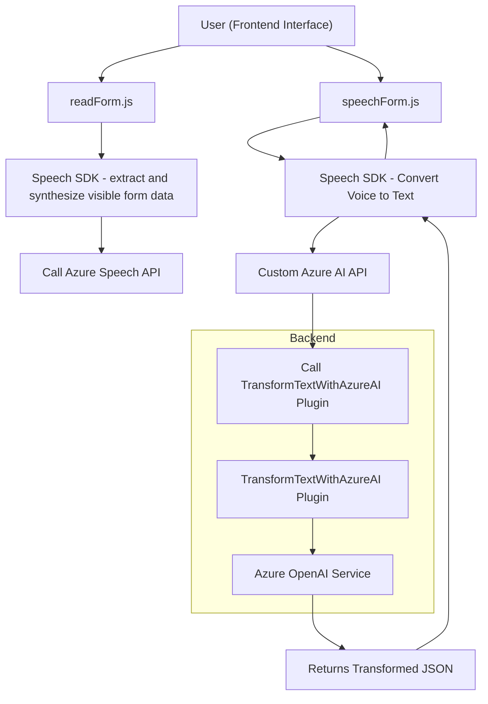

### **Análisis Técnico**

#### **Resumen técnico**
El repositorio parece estar orientado a soluciones que interactúan con Dynamics CRM y servicios de Azure. Contiene componentes frontend y backend, donde el frontend maneja formularios y entrada/salida de voz, mientras que el backend está centrado en plugins para normalizar texto mediante Azure OpenAI. Los archivos están organizados funcionalmente, interactuando con servicios externos como el Speech SDK y OpenAI para tareas específicas.

---

### **Descripción de arquitectura**
La arquitectura es de tipo **n capas** con un enfoque claro hacia la separación de responsabilidades:

1. **Capa de presentación** (Frontend): 
   - Gestiona formularios de usuario y entrada/salida de voz.
   - Utiliza SDKs como Azure Speech para interacción directa con servicios externos.
   - Implementa un enfoque modular mediante funciones especializadas para dividir responsabilidades.

2. **Capa de negocio** (Backend en Dynamics CRM): 
   - Utiliza plugins para gestionar las transformaciones de texto con el servicio Azure OpenAI.
   - Intercambia información entre el CRM y las APIs externas.
   - Implementa patrones típicos de **Plugin Architecture** y comunicación HTTP.

---

### **Tecnologías utilizadas**
1. **Frontend**:
   - **JavaScript**: Principal lenguaje para la lógica del lado cliente.
   - **Azure Speech SDK**: Utilizado para entrada/salida de voz y conversión de texto a audio.
   - **DOM API**: Manipulación de elementos HTML del formulario.
   - **Dynamics CRM Form API**: Acceso y modificación de datos en los formularios del CRM.

2. **Backend**:
   - **C# y .NET Framework**: Usados para crear el plugin de Dynamics CRM.
   - **Azure OpenAI Service**: Consumo de la API para transformar texto en estructuras JSON.
   - **System.Net.Http** y **Newtonsoft.Json.Linq**: Paquetes para manejar solicitudes HTTP y datos JSON.

---

### **Dependencias o componentes externos**
1. **Azure Speech SDK**:
   - Para la lectura y síntesis de audio.
   
2. **Azure OpenAI Service**:
   - Para la transformación avanzada basada en modelos de lenguaje.

3. **Dynamics CRM**:
   - Utilizado como base para integrar formularios y datos estructurados.

4. **API personalizada**:
   - Integra funcionalidad específica del negocio, estructurada para interactuar con datos transformados.

5. **HTTP libraries for C#**:
   - `System.Net.Http`, `Newtonsoft.Json`, etc., para llamadas HTTP y manipulación de información con servicios como Azure OpenAI Service.

---

### **Diagrama Mermaid**

---

### **Conclusión final**
Este repositorio presenta una solución de integración entre un frontend (JavaScript) y Dynamics CRM en el backend, con extensiones que interactúan con servicios avanzados de Microsoft Azure, como Speech SDK y OpenAI. La arquitectura sigue un enfoque clásico de **n capas** con interacciones de **cliente-servidor** y comunicación [HTTP]. La modularidad en los métodos facilita la escalabilidad y mantenimiento del código.