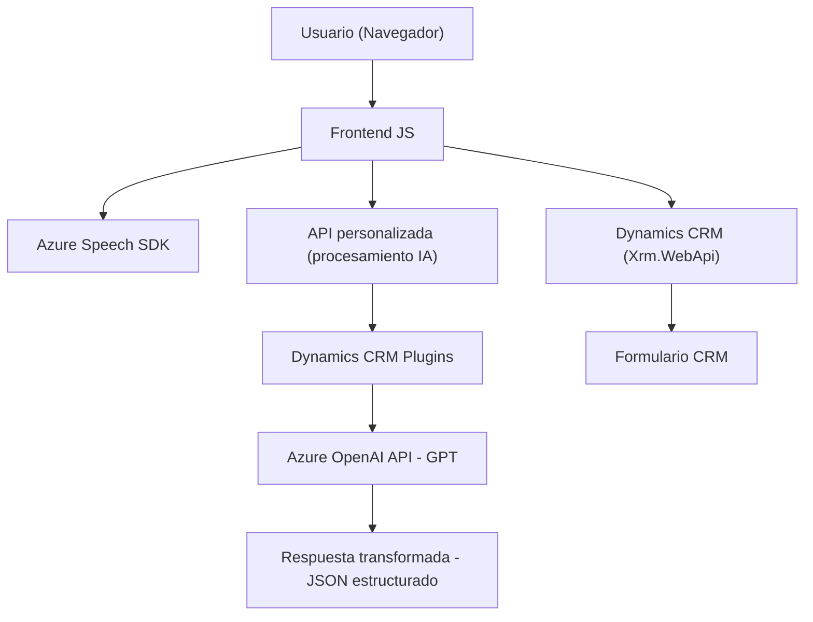

**Breve Resumen Técnico:**

El repositorio presenta una solución centrada en interfaces de voz que interactúan con formularios desde un entorno Dynamics CRM y servicios Azure. En términos generales, los archivos proporcionan:
1. **Frontend (JavaScript):** Funcionalidades de conversión de datos a audio y entrada de voz/transcripción con integración del Azure Speech SDK.
2. **Backend (.NET plugin):** Extensión del Dynamics CRM usando Azure OpenAI para transformar texto en objetos estructurados.

---

**Descripción de Arquitectura:**

La solución implementa una arquitectura cliente-servidor combinada con patrones de integración entre un servicio externo (Azure Speech y OpenAI) y Dynamics CRM. Cada archivo responde a un patrón específico:
- **Frontend (JavaScript):** Modular y event-driven. El cliente es responsable de interactuar directamente con el SDK de Azure para entrada/salida de voz y procesamiento en el navegador.
- **Backend (.NET):** Implementación de la arquitectura de **plugin** en Dynamics CRM donde se integra la lógica para procesamiento externo usando Azure OpenAI API.

La arquitectura, en su conjunto, puede clasificarse como **n-capas** por la separación del frontend (cliente) y backend (CRM+API). A nivel funcional, muestra un enfoque hacia **SOA (Service Oriented Architecture)**.

---

**Tecnologías Usadas:**
1. **Backend:**
   - .NET (para plugins y extensión de CRM).
   - Azure OpenAI API (GPT modelo `gpt-4o`).
   - HTTP Client (para consumir servicios externos).
   - Microsoft Dynamics CRM SDK (`IPlugin`).

2. **Frontend:**
   - Azure Speech SDK (transcripción y síntesis de voz en navegador).
   - JavaScript (cliente web).
   - Dynamics CRM API (interacción directa mediante `Xrm.WebApi`).

3. **Patrones de Diseño:**
   - Plugin Architecture (modificaciones de CRM través de `IPlugin`).
   - Modular y Event-Driven en el frontend.
   - SOA (interacciones con API externas a través de HTTP).
   - Command (invocaciones a APIs externas).

---

**Dependencias o Componentes Externos:**
1. **Azure Speech SDK:** 
   - Reconocimiento y síntesis de voz para clientes web.
   - Dependencia cargada desde `https://aka.ms/csspeech/jsbrowserpackageraw`.

2. **Azure OpenAI API:**
   - Transformaciones avanzadas mediante GPT.
   - Autenticación por clave API y uso de POST requests.

3. **Plugins de Dynamics CRM:**
   - APIs internas de CRM (`Microsoft.Xrm.Sdk`, `Xrm.WebApi`) para extender comportamiento nativo.

---

**Diagrama Mermaid - Compatible con GitHub Markdown:**

---

**Conclusión Final:**

La solución integra tecnologías modernas como Azure Speech SDK y OpenAI para habilitar interacciones más intuitivas (voz y lenguaje natural) con un CRM, aumentando su funcionalidad principal. Adopta una arquitectura **n-capas** con el frontend y backend claramente separados, aunque presenta un enfoque orientado a servicios mediante la integración de APIs externas. El uso de tecnologías clave como Dynamics Plugins y Azure se ajusta a todos los requisitos empresariales, con margen de mejora en la gestión de la clave API y modularización de la lógica backend.