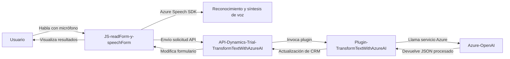

### Breve resumen técnico
El repositorio analiza tres componentes principales: dos archivos de JavaScript (`readForm.js` y `speechForm.js`) implementan lógica de cliente enfocada en reconocimiento y síntesis de voz utilizando **Azure Speech SDK** junto con interacción con **Microsoft Dynamics CRM**. El archivo **TransformTextWithAzureAI.cs** es un plugin que opera en Dynamics CRM para usar **Azure OpenAI** y transformar texto en estructuras JSON. Estos componentes integran procesamiento de voz, manipulación de formularios, y servicios de inteligencia artificial en un flujo único.

---

### Descripción de arquitectura
1. **Tipo de solución:** Cliente que interactúa con el servidor combinado con un plugin backend en Dynamics CRM.
2. **Arquitectura:** 
   - Es una arquitectura híbrida que integra un frontend en JavaScript (estructurado por módulos funcionales individuales), procesamiento backend (plugin basado en Dynamics CRM), y comunicación a servicios externos (Azure Speech SDK y Azure OpenAI). 
   - Siguiendo principios de **Service-Oriented Architecture (SOA)**, cada componente del sistema tiene una tarea específica:
     - El frontend gestiona la interacción del usuario y el reconocimiento de voz.
     - Un API personalizada en Dynamics CRM actúa como **API Gateway**.
     - Un plugin backend invoca los servicios de procesamiento IA.

---

### Tecnologías, frameworks y patrones usados
#### **Lenguajes:**
1. **JavaScript:** Módulos frontend que corren en el cliente dentro del contexto de Dynamics CRM.
2. **C#:** Usado en el desarrollo del plugin para el servidor CRM, implementando el patrón **IPlugin**.
3. **JSON:** Formato para estructurar el resultado del procesamiento desde Azure OpenAI API.

#### **Frameworks y servicios:**
1. **Microsoft Dynamics CRM SDK:** Para personalización in-app.
2. **Azure Speech SDK:** Para reconocimiento y síntesis de voz.
3. **Azure OpenAI (GPT API):** API para transformación avanzada de texto.

#### **Patrones de diseño:**
1. **Microservicios/SOA:** Componentes individuales para diferentes funcionalidades (speech recognition, CRM integration, AI processing) se comunican mediante APIs.
2. **Event-driven:** El backend y el frontend reaccionan a eventos (entrada de voz, llamadas API, almacenamiento de datos).
3. **Modularidad:** Las funciones del frontend están bien estructuradas y altamente reutilizables.
4. **Lazy loading:** En el frontend, el SDK de Azure Speech se carga dinámicamente solo cuando es necesario, optimizando el rendimiento.

---

### Diagrama Mermaid 100 % compatible con GitHub Markdown

---

### Conclusión final
Este repositorio combina múltiples tecnologías e integra servicios de **Azure** (Speech SDK y OpenAI) con **Dynamics CRM** para crear una solución que permite:
1. Capturar datos de voz de usuarios en un frontend optimizado.
2. Procesar texto en el backend a través de un servicio externo de IA.
3. Actualizar y manipular formularios dentro del dominio de Dynamics CRM.

La arquitectura sigue un enfoque modular con patrones orientados a servicios y eventos, lo que aporta flexibilidad y escalabilidad, además de aprovechar la potencia del reconocimiento de voz y la inteligencia artificial en Azure. La estructura de este repositorio es eficiente para aplicaciones donde hay una necesidad de interacción avanzada con usuarios mediante voz, mientras se integran servicios empresariales como Dynamics CRM.