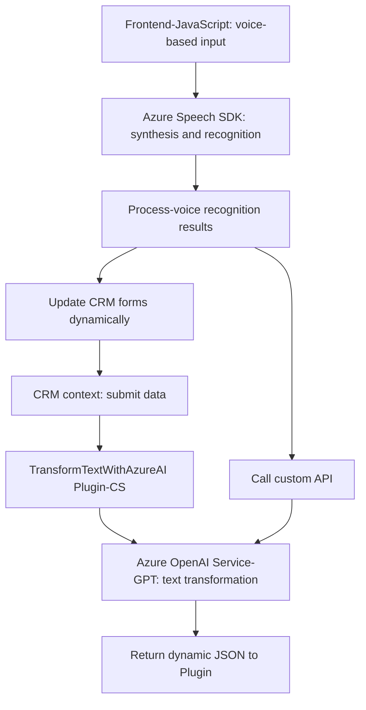

### Breve resumen técnico:
El repositorio describe una solución que integra la síntesis de voz y el reconocimiento de texto con la ayuda de **Azure Speech SDK** y **Azure OpenAI Service**, en combinación con Dynamics CRM plugins. Es un sistema híbrido que implementa tanto una interfaz de usuario dinámica (para formularios y voz) como procesamiento del lado del servidor a través de un plugin CRM y una API.

---

### Descripción de arquitectura:
1. **Tipo de solución**:  
   - Es una solución de múltiples capas que incluye:
      - *Frontend* para la interacción con el usuario mediante voz (uso de formularios y procesamiento local).
      - *Servidor CRM plugins*, que contiene lógicas asociadas al procesamiento avanzado del texto mediante Azure OpenAI Service y la entrega de resultados en formato JSON.
      - Integración con servicios externos (*Azure Speech SDK* y *Azure OpenAI Service*).

2. **Patrones observados**:  
   - **Cliente-Servidor**: Comunicación entre cliente (`speechForm.js`, `readForm.js`) y el servidor (`TransformTextWithAzureAI.cs`).
   - **Basado en eventos**: Procesos como carga del SDK y reconocimiento de voz mediante callbacks y funciones asincrónicas.
   - **Lazy Loading**: El Azure Speech SDK se carga dinámicamente según necesidad.
   - **Modularización**: Separación de responsabilidades en funciones independientes para facilitar comprensión y reusabilidad.
   - **Plugin-Architecture**: Implementación conforme a Dynamics CRM para el plugin.

3. **Arquitectura general**:  
   - **N capas (3 capas)**: Está estructurado en:
     - **Capa de presentación**: Frontend basado principalmente en formularios y JavaScript.
     - **Capa lógica**: Procesos de codificación en CRM plugins y scripts de JavaScript que administran la interacción entre cliente y servidor.
     - **Capa de servicios externos**: Integración con Azure Speech SDK y Azure OpenAI Service.

---

### Tecnologías usadas:
1. **Frontend (cliente)**:
   - **JavaScript**
   - **Azure Speech SDK**: Transcripción de texto a voz y captura de voz para procesamiento mediante AI.
   
2. **Backend y CRM plugins (servidor)**:
   - **C#: Dynamics CRM SDK** para implementar lógicas como interfaces y servicios específicos de CRM.
   - **Azure OpenAI Service**: GPT-4 para generación de respuestas transformadas y estructuradas basado en texto de entrada.
   - **HttpClient**, **JSON parsing**: Procesamiento de solicitudes HTTP y manejo de respuesta JSON.
   
3. **Servicios externos integrados**:
   - Azure Speech SDK para la síntesis y reconocimiento de voz.
   - API personalizada para soporte externo en la transformación y manejo de datos.

---

### Dependencias o componentes externos:
1. **Azure Speech SDK**: Servicios de habla basados en IA, como reconocimiento de voz (captura de datos) y síntesis de voz (emisión vocal local).
2. **Azure OpenAI Service**: Procesamiento remoto basado en GPT-4 para transformar texto en información estructurada.
3. **Dynamics CRM SDK**: Contexto del CRM para manipular contenido de formularios según reglas del negocio.
4. **API personalizada: `trial_TransformTextWithAzureAI`**: Desarrollada para utilizar directamente el procesamiento mediante Azure IA.

---

### Diagrama Mermaid:

---

### Conclusión final:
Este repositorio representa una solución híbrida que combina la interacción entre un *frontend* basado en voz y un *backend* modularizado para procesamiento avanzado. Usa tecnologías modernas como **Azure Speech SDK** y **Azure OpenAI Service**, integradas con Dynamics CRM para mejorar las capacidades de accesibilidad, interacción y automatización de datos.

La arquitectura es escalable, aprovechando tanto la modularización como la integración dinámica de APIs y servicios externos. La dependencia directa de Azure Speech y OpenAI refuerza su enfoque en IA, pero también limita su uso si estos servicios no son accesibles o si enfrentan problemas de conectividad.