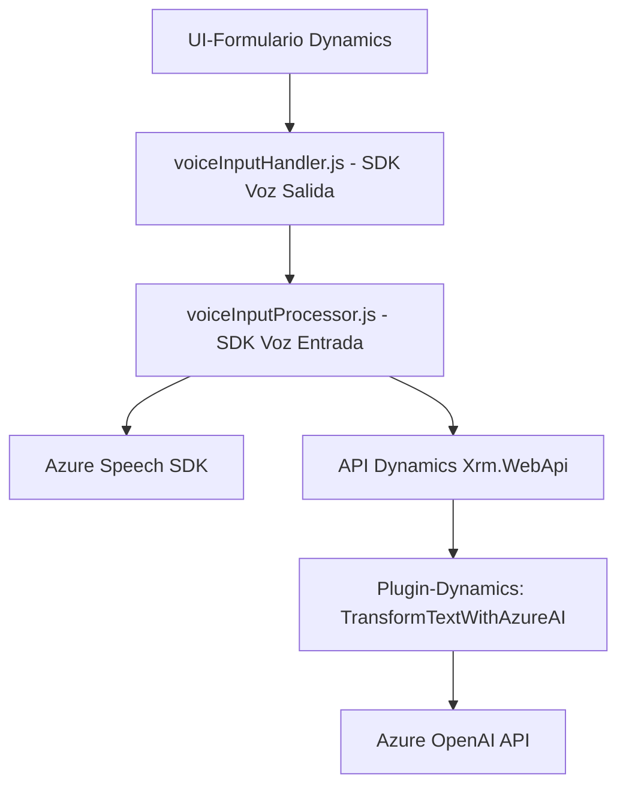

### Breve resumen técnico
El repositorio desarrollado integra **Azure Speech SDK** y **Dynamics 365** para proporcionar una funcionalidad avanzada de interacción por voz y procesamiento de texto. Está enfocado en dos aspectos:
1. Uso de voz para rellenar un formulario dinámico en Dynamics 365.
2. Transformación de texto mediante Azure OpenAI con reglas específicas en un plugin.

---

### Descripción de arquitectura
1. **Tipo de solución**: La solución es una herramienta híbrida que combina una **interfaz de usuario frontend** (en JavaScript), una **API externa** (Azure OpenAI) y un **plugin en Dynamics CRM**. Es esencialmente una **integración basada en servicios en la nube** que utiliza bibliotecas declarativas.
2. **Arquitectura**: La arquitectura sigue un **patrón de integración de n-capas** que combina:
   - **Frontend**: Interfaz web en Dynamics 365 que se encarga de la captura de voz y su síntesis.
   - **Backend externo**: Servicios Azure Speech SDK y una API personalizada (Azure OpenAI) para procesar el texto.
   - **Plugin/servicio en Dynamics CRM**: Procesa datos adicionales y completa la interacción con las entidades CRM.
3. **Patrones utilizados**:
   - **Modularización funcional**: Se separan claramente las funciones y componentes independientemente en archivos JS frente al plugin en .NET.
   - **Lazy Loading**: El SDK solo se carga bajo demanda (`ensureSpeechSDKLoaded`).
   - **Integración externa**: Procesamiento mediante APIs que operan como microservicios especializados.

---

### Tecnologías y frameworks usados
1. **Frontend (JavaScript)**:
   - **Azure Speech SDK**: Reconocimiento de voz y síntesis de texto (usando el SDK cargado vía CDN).
   - **Dynamics 365**: Framework de APIs internas (`executionContext` y `Xrm.WebApi`).
   - **Modular JS**: Organización funcional orientada a dividir responsabilidades.
   
2. **Backend-plugin (.NET)**:
   - **Microsoft.Xrm.Sdk**: Integración con Dynamics CRM.
   - **Azure OpenAI API**: Consume inteligencia artificial basada en GPT para procesamiento de texto.
   - **Newtonsoft.Json**: Manejo avanzado de objetos JSON.
   - **HttpClient**: Comunicación para solicitudes HTTP REST.
   - **C# Language and Plugin Pattern**: Definición de extensiones a eventos en Dynamics CRM.

---

### Dependencias o componentes externos
Las principales dependencias externas en la solución incluyen:
1. **Azure Speech SDK**: Se utiliza el CDN de Microsoft para obtener el paquete de JavaScript destinado al reconocimiento y síntesis de texto.
2. **Azure OpenAI API**: Consumo de servicios basados en GPT para la transformación y procesamiento de texto.
3. **Microsoft Dynamics 365 SDK**: Para interactuar con el contexto del formulario, entidades del sistema, y APIs internas (como `Xrm.WebApi`).
4. Otras dependencias de frontend:
   - Funciones internas de Dynamics (`executionContext` y `formContext`).
5. Dependencias backend-plugin:
   - .NET Framework y bibliotecas adecuadas para realizar solicitudes HTTP REST (como `HttpClient` y `Newtonsoft.Json`).

---

### Diagrama Mermaid válido

---

### Conclusión final
Este repositorio implementa una integración avanzada que combina datos de voz y texto. Utiliza una arquitectura de **n-capas**: frontend dinámico JS para captura de voz, backend (plugin en .NET) para procesamiento interactivo, servicios cloud como **Azure Speech SDK** para síntesis y **Azure OpenAI API** para transformación. La modularidad de los archivos JS y la separación en backend aseguran una fácil extensión, pero se podría mejorar la implementación eliminando claves y configuraciones duras del código fuente, pasando a un entorno más seguro.