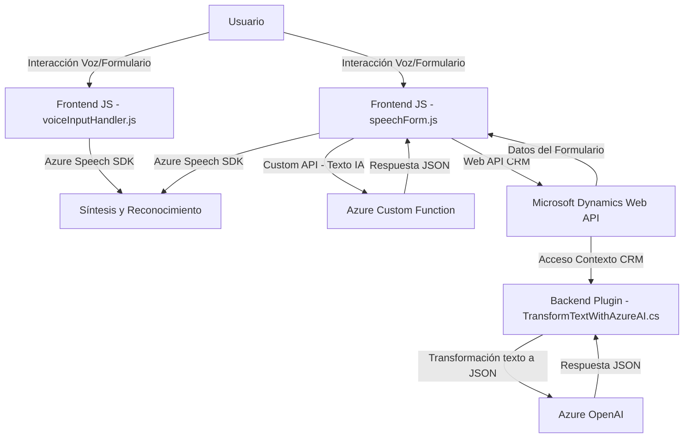

### Breve resumen técnico:
El repositorio expuesto incluye tres archivos que corresponden a una solución compleja con partes de frontend (interfaz web), integración con servicios de Azure y Microsoft Dynamics CRM, e interacción con APIs externas. Está diseñado para manejar accesibilidad, procesamiento de datos, y generación de JSON basado en inteligencia artificial mediante Azure OpenAI. Centraliza la creación de experiencias dinámicas en aplicaciones empresariales.

---

### Descripción de la arquitectura:
La arquitectura de este sistema parece ser de **n-capas** con una fuerte orientación al uso de servicios en la nube (Azure y Dynamics CRM). Las capas identificables son:
1. **Frontend**: Archivos JS para interacción con usuarios y servicios en tiempo real (ej. formulación de voz y entrada/salida de datos en formularios).
2. **Backend - CRM Plugins**: Plugin en C# que utiliza el patrón de integración para el análisis y preprocesamiento de datos con Azure OpenAI.
3. **Servicios en la Nube**: Uso de APIs de Azure Speech SDK para reconocimiento y síntesis de voz, y Azure OpenAI para procesamiento semántico.

No es una arquitectura monolítica ni basada enteramente en microservicios, sino en un modelo híbrido que mezcla componentes de integración directa con servicios definidos de terceros y partes de procesamiento local.

---

### Tecnologías usadas:
1. **Frontend**:
   - *JavaScript* para lógica de interacción con el usuario.
   - SDK de Azure Speech (`SpeechSDK`) para síntesis y reconocimiento de voz.
   - **API REST** para comunicación con los servicios de CRM y una Custom API.

2. **Backend**:
   - *C# Plugin* implementado en un modelo de extensión para Microsoft Dynamics CRM.
   - Azure OpenAI vía comunicación RESTful para procesamiento de texto.
   - Gestión de dependencias: `Newtonsoft.Json` para manejo estructurado de JSON.

3. **Patrones de diseño en el sistema**:
   - **Modularización funcional**: Cada función cubre una tarea específica como reconocimiento, síntesis de voz, asignaciones o actualización de datos.
   - **Adapter Pattern**: Traducción de datos desde API hacia objetos entendibles por la CRM o el contexto del formulario.
   - **Event-driven Programming**: Uso de callbacks para sincronización y recuperación del estado, aplicando una lógica asíncrona con promesas.
   - **Client-Server**: Comunicación entre microservicio (API) y los sistemas CRM/Azure.

---

### Dependencias o componentes externos presentes:
1. **Azure Speech SDK**:
   - Utilizado para la síntesis de voz y reconocimiento de comandos hablados.
   - Instalado y cargado dinámicamente en el browser con un script alojado por Azure.

2. **Azure OpenAI**:
   - Utilizado por el plugin de Dynamics CRM para transformar texto en estructuras JSON.

3. **Microsoft Dynamics CRM Web API**:
   - Permite la interacción con los datos y la actualización dinámica de formularios en el entorno CRM.

4. **Frontend frameworks**:
   - Aunque el código presentado es puro Javascript, podría estar integrado con herramientas como jQuery o React (aunque no se especifica en el repositorio).

5. **JSON libraries**:
   - `Newtonsoft.Json` para manejo avanzado de JSON en los plugins backend.

6. **Custom API**:
   - La API externa `trial_TransformTextWithAzureAI` (probablemente alojada en Azure Functions o equivalente) para procesamiento avanzado de texto.

---

### Diagrama Mermaid:

---

### Conclusión final:
El sistema está diseñado para aplicaciones empresariales integradas, específicamente aquellas que buscan accesibilidad y procesamiento de datos dinámico con inteligencia artificial. La arquitectura **n-capas** empleada combina varias tecnologías modernas como Azure Speech SDK, Microsoft Dynamics Web API y Azure OpenAI para ofrecer una experiencia fluida entre interacción humana y servicios cloud. Aunque cumple con su propósito, sería recomendable mejorar los aspectos de seguridad (gestión de claves) y explorar patrones de desacoplamiento.