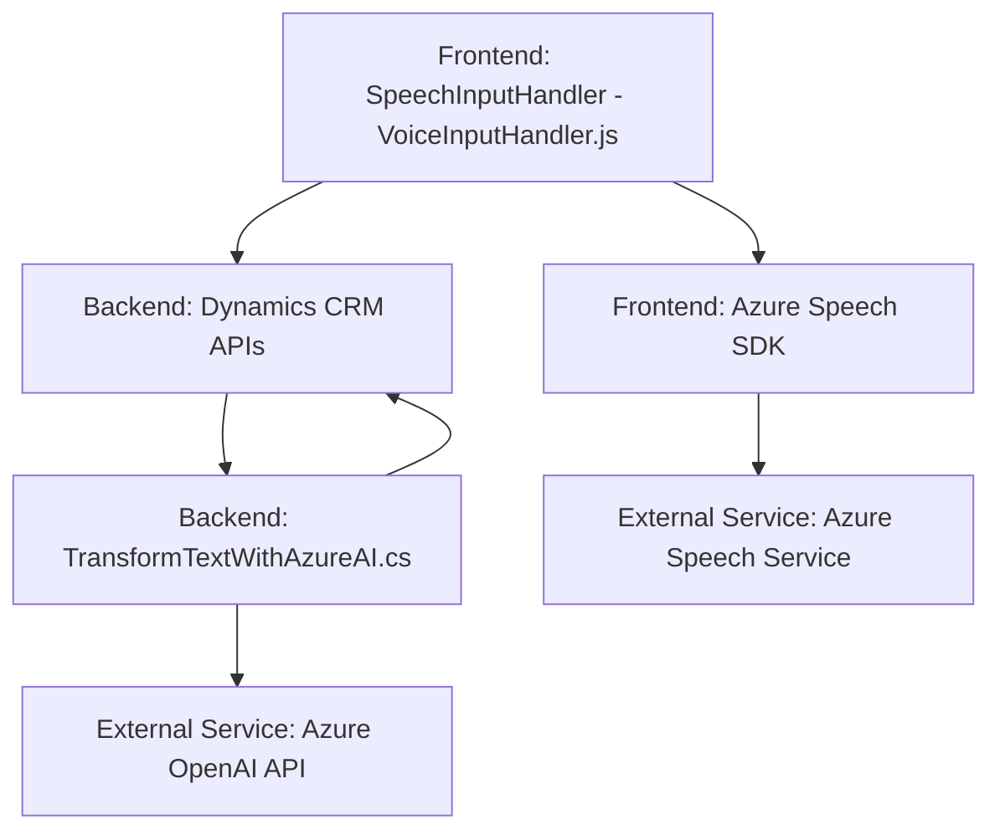

# Análisis detallado del repositorio

## Resumen técnico

Este repositorio contiene una solución que integra funcionalidades de síntesis y reconocimiento de voz, manipulación de formularios y procesamiento de datos mediante APIs externas en un entorno como Dynamics 365. Los archivos están organizados en tres niveles principales:
- **Frontend:** Archivos en JavaScript que se integran con el DOM de formularios, usando **Azure Speech SDK** para entrada y salida de voz.
- **Backend (Plugins):** Un plugin, desarrollado en C#, que se integra con Dynamics CRM para consumir el servicio **Azure OpenAI** y procesar texto como JSON para su uso posterior.
- **API Externas:** Llamadas a servicios como Dynamics 365 APIs, Azure Speech SDK y Azure OpenAI API.

---

## Descripción de la arquitectura

La arquitectura es **híbrida**, combinando elementos de diferentes estilos:
1. **Cliente-servidor**: Es una solución que conecta una capa de cliente web para formularios (JavaScript) con un backend vía APIs.
2. **N-capas**: El diseño separa claramente la lógica de cliente (interacción y presentación), los servicios del backend (plugins) y las APIs externas (Azure Speech y OpenAI).
3. **SOA (Service-Oriented Architecture)**: Hace uso extensivo de servicios externos (Azure Speech Service y Azure OpenAI) para tareas como reconocimiento, síntesis y procesamiento de texto.

---

## Tecnologías usadas

1. **Frontend:**
   - Lenguaje: JavaScript.
   - Framework/SDK: **Azure Speech SDK**.
   - Entorno web integrado: Dynamics 365 (utilización de `executionContext` y API para formularios).

2. **Backend:**
   - Lenguaje: C#.
   - Framework: **Dynamics CRM SDK**.
   - API: **Azure OpenAI**.

3. **Patrones de diseño:**
   - **Facade Pattern:** Simplificación del acceso a funcionalidades dentro del frontend.
   - **Separation of Concerns:** División clara de responsabilidades en la lógica.
   - **Template Method:** Métodos reutilizables para procesar lógica similar.
   - **Plugin-based architecture**: Extensibilidad del backend con `IPlugin`.
   - **Service Oriented Architecture (SOA):** Consumo de servicios de terceros para encapsular tareas especializadas.

---

## Referencias a dependencias o componentes externos

1. **Desde frontend:**
   - **Azure Speech SDK**: Sintetización y reconocimiento de voz.
   - **Dynamics APIs** (`Xrm.Page`): Para interactuar con formularios y asignar valores.

2. **En el plugin backend:**
   - **Azure OpenAI API**: Procesamiento de texto basado en IA.
   - **JSON Manejo y deserialización**: Usando namespaces como `Newtonsoft.Json.Linq`.

3. **Framework Dynamics 365 CRM**:
   - Gestión de datos del formulario.
   - Instrumentación del flujo de datos entre el sistema y los servicios externos (Azure APIs).

---

## Diagrama Mermaid válido para GitHub

---

## Conclusión final

Este repositorio implementa una solución orientada a la interacción mediante voz con formularios en un sistema de CRM (probablemente Dynamics 365). Su arquitectura está cuidadosamente diseñada para separar responsabilidades, utilizando capas de cliente, backend y servicios externos. Los componentes de frontend y backend se comunican con APIs para manipular formularios y realizar tareas complejas como síntesis y procesamiento de voz mediante **Azure Speech SDK** y **Azure OpenAI API**.

Adicionalmente, el sistema emplea varios patrones de diseño importantes, asegurando modularidad y mantenibilidad. Aunque la arquitectura es predominantemente SOA, la solución también utiliza elementos de una arquitectura multicapa con una integración fuerte con un sistema CRM.