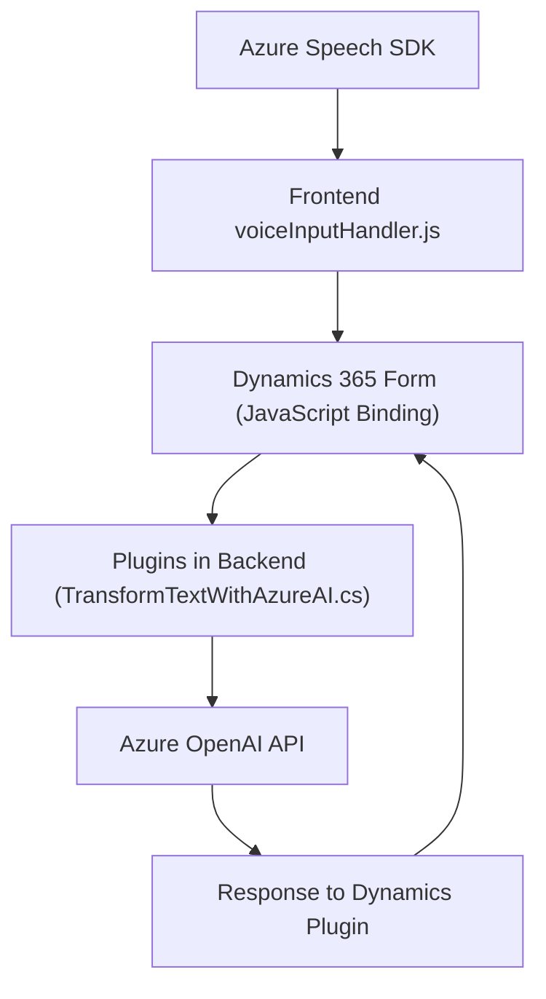

### Breve resumen técnico:
El repositorio contiene tres archivos principales, que en conjunto implementan una solución interconectada entre un frontend basado en JavaScript, plugins para Dynamics CRM en C#, y servicios cognitivos de Azure (Speech SDK y OpenAI). El objetivo principal de la solución es utilizar entrada de voz y procesamiento de texto para actualizar formularios dinámicamente con integración a Dynamics 365 y Azure.

---

### Descripción de arquitectura:
La solución utiliza:
1. **Frontend** (JavaScript): Manejo de la entrada de voz utilizando servicios de Azure Speech SDK y APIs de Dynamics. Implementa procesamiento modular para entrada de datos y jerarquías del formulario.
2. **Backend/Plugins** (C#): Extiende Dynamics CRM con un plugin basado en la arquitectura de Dynamics que transforma texto utilizando Azure OpenAI para obtener datos estructurados en formato JSON.
3. **Servicios Cognitivos**: Procesamiento de entradas a través de Azure Speech SDK (entrada de voz) y Azure OpenAI (procesamiento avanzado de texto).

La arquitectura es una mezcla de:
- **Arquitectura de N capas**:
   - Backend: Plugins y APIs para Dynamics CRM.
   - Frontend: Procesamiento de datos y entrada por voz.
   - Servicios externos: Integración con Azure SDKs y APIs.
- **Integración de Servicios Externos**:
   - Servicios de Microsoft Azure para Speech y OpenAI.

---

### Tecnologías usadas:
1. **Frontend:** 
   - **JavaScript**: Código modular y event-driven architecture.
   - Azure Cognitive Services Speech SDK.
   - APIs de Dynamics 365 para manipulación de formularios.
2. **Backend/Plugins:** 
   - **Microsoft Dynamics SDK**: Extensión de sistemas CRM.
   - **C#**: Para desarrollo del plugin de reglas con integración directa con Azure OpenAI.
   - .NET Framework.
3. **Servicios Cognitivos:**
   - Azure OpenAI API (GPT-4): Para procesamiento avanzado de texto.
   - Azure Speech SDK: Reconocimiento y síntesis de voz.

---

### Diagrama Mermaid (válido para GitHub Markdown):

---

### Conclusión final:
Esta solución está diseñada para garantizar una integración fluida entre el frontend que manejará la interacción con el usuario y el backend que procesa comandos y datos mediante APIs avanzadas. Utiliza una arquitectura modular con principios de buenas prácticas en código (como separación de responsabilidades y estructuras event-driven) y patrones de diseño para la interacción con servicios externos.

El enfoque de N capas proporciona escalabilidad, mientras que la integración con Azure Speech SDK y OpenAI añade capacidades avanzadas para voz y análisis de texto. Esta solución podría ser ideal para entornos empresariales que utilizan Dynamics CRM y requieren extensibilidad con tecnologías de inteligencia artificial y reconocimiento de voz.