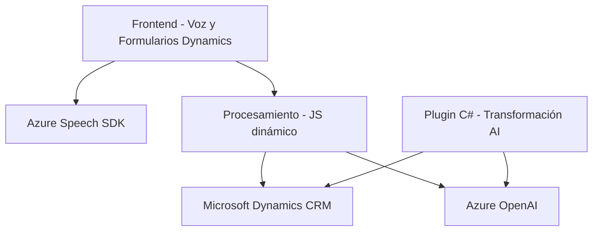

### Breve resumen técnico
El repositorio presenta una solución para la integración de procesamiento de voz y texto mediante Microsoft Azure, orientada a formularios dinámicos en Microsoft Dynamics CRM. Partes clave del sistema incluyen un frontend (JavaScript), procesamiento de voz (Azure Speech SDK) y un backend que actúa como un plugin en Dynamics CRM.

---

### Descripción de arquitectura
1. **Tipo de solución**:  
   La solución combina elementos de **frontend** para la interfaz de usuario, una **API externa** (Azure Speech SDK y OpenAI), y un **plugin** backend para **Microsoft Dynamics CRM**.  

2. **Arquitectura aplicada**:  
   La arquitectura sigue un **modelo n-capas** combinado con la integración de **servicios externos**. Las capas se pueden desglosar de la siguiente manera:
   - **Frontend de presentación**: Manejo de entrada/salida de voz en la UI usando SDK dinámico (Azure Speech SDK).
   - **Capa de lógica de negocio**: Procesos relacionados con mapeo de campos, transcripción, transformación de texto con IA (JS).
   - **Backend y capa de integración**: Plugin de Dynamics CRM para transformar texto invocando la API de Azure OpenAI.

3. **Otros patrones usados**:  
   - **Modularidad**: Separación en base a funciones específicas en cada archivo.
   - **Facade pattern**: Métodos que simplifican el uso del SDK y la API externa.
   - **Integración de servicios**: Dependencia directa de Azure Speech SDK y OpenAI.

---

### Tecnologías usadas
1. **Frontend**:  
   - Lenguaje: **JavaScript**.  
   - Frameworks/Bibliotecas:
     - **Azure Speech SDK** para reconocimiento de voz y síntesis.  
     - Manipulación de formularios en Dynamics CRM usando APIs nativas (`executionContext` y `Xrm.WebApi.online`).  

2. **Backend**:  
   - Lenguaje: **C#** (Plugin para Dynamics CRM).  
   - Servicios externos:
     - **Azure OpenAI**: Para transformar texto con inteligencia artificial.  
   - Herramientas:
     - `Newtonsoft.Json` para manejo de JSON.  
     - `System.Net.Http` para llamadas a APIs externas.  

3. **Externos dependientes**:
   - Azure Speech SDK: Integración en tiempo real.
   - Azure OpenAI (API personalizada): Transformación avanzada de texto.
   - Dynamics CRM APIs: Actualización y manipulación de datos.

---

### Diagrama Mermaid

---

### Conclusión final
La solución presentada es una integración de varias tecnologías y capas, centrada en ofrecer capacidades avanzadas de entrada y salida de voz en entornos de Microsoft Dynamics CRM. La arquitectura sugiere una orientación hacia **servicios n-capas** con dependencia clave de **Azure Speech SDK** y **Azure OpenAI**, optimizando el procesamiento de datos dinámicos y admitiendo modificaciones en tiempo real.