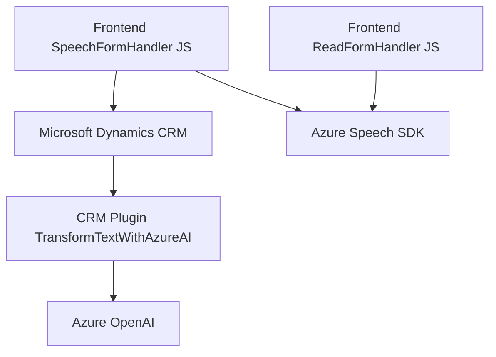

### Breve resumen técnico
El repositorio integra soluciones de síntesis y reconocimiento de voz, interacción con un sistema CRM y procesamiento de texto mediante el servicio de inteligencia artificial de Azure. Está compuesto por tres archivos clave y opera como un conjunto organizado de funcionalidades orientadas principalmente al frontend y a la integración de servicios externos.

---

### Descripción de arquitectura
La solución presenta una arquitectura basada en **n capas**, donde cada capa está enfocada en una responsabilidad específica:

1. **Capa de presentación (Frontend)**: Los archivos JavaScript (`readForm.js`, `speechForm.js`) implementan la lógica para procesar la entrada de voz y sintetizar texto, interactuando directamente con el usuario.
2. **Capa de negocio**: El archivo `TransformTextWithAzureAI.cs` actúa como un plugin en el lado del servidor (Dynamics CRM), encargándose de realizar tareas de procesamiento de texto mediante Azure OpenAI y devolviendo datos estructurados.
3. **Capa de integración (API externa)**: Los módulos JavaScript y los plugins están diseñados para interaccionar con servicios de Azure como Speech SDK y OpenAI API.

El uso de SDKs externos y un plugin en el backend sugiere una cierta orientación hacia **microservicios**, especialmente a través de la integración con Azure OpenAI como herramientas externas independientes, aunque el diseño general aún aplica los principios de una arquitectura **n capas**.

---

### Tecnologías usadas
1. **Frontend**:
    - JavaScript para lógica del cliente.
    - **Azure Speech SDK**: Para interacción con servicios de síntesis y reconocimiento de voz.
    - **Dynamics Web API**: Manipulación de formularios y datos en el CRM.

2. **Backend**:
    - **Microsoft Dynamics CRM Plugin**: Para extender la funcionalidad del sistema CRM.
    - **Azure OpenAI**: Para procesamiento avanzado de texto.
    - Bibliotecas .NET como `System.Net.Http` y `System.Text.Json` para solicitudes web y manejo de estructuras JSON.

3. **Patrones arquitectónicos**:
    - **Event-driven**: Uso de eventos como disparadores para la grabación de voz y el reconocimiento.
    - **Service-Oriented Architecture (SOA)**: Uso de servicios externos de Azure, como OpenAI y Speech SDK.
    - **Callback pattern**: Es común en el manejo de SDKs, como el `ensureSpeechSDKLoaded`.
    - **Single Responsibility Principle**: Cada archivo se enfoca en tareas específicas (interacción con SDK, procesamiento AI, actualización de formularios).

---

### Diagrama Mermaid

---

### Conclusión final
La solución es un sistema **orientado al procesamiento de voz y texto** integrado con un CRM y servicios externos de Azure. La arquitectura general sigue un enfoque modular con **n capas**, donde distintas piezas de código tienen su responsabilidad bien definida. Sin embargo, el uso de servicios como Azure Speech SDK y OpenAI apunta hacia la implementación de microservicios ligeros para mejorar la interoperabilidad y la escalabilidad del sistema.

La utilización de patrones como **event-driven** y **SOA** es adecuada, dado que agilizan la interacción entre capas y con servicios externos. Sin embargo, para mejorar la robustez, puede ser útil incluir pruebas unitarias y logs más detallados, especialmente en los métodos que interactúan con APIs externas.