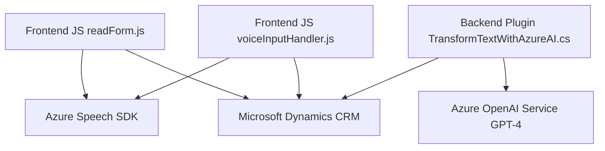

### Breve resumen técnico:
El repositorio presenta componentes para una solución de software orientada a la integración de voz, procesamiento de datos, interacción con formularios dinámicos y transformación de texto mediante inteligencia artificial. Predominantemente utiliza el Azure Speech SDK y OpenAI para ejecutar síntesis, reconocimiento de voz y procesamiento semántico del texto. Los archivos son parte de un sistema colaborativo que incluye frontend en JavaScript y backend en C# para Dynamics CRM.

---

### Descripción de arquitectura:
La solución tiene una arquitectura basada en **microservicios y capas (n-capas)**. Los componentes destacan por dividir tareas específicas:
1. **Frontend/JS**:
   - Modularización de código en archivos responsables de funcionalidades distintas (entrada de voz, síntesis de texto, actualización de formulario).
   - Uso de servicios de Azure para interactuar con la entrada y salida de voz.
2. **Backend/Plugins**:
   - Lógica dentro de Dynamics CRM mediante plugins (`TransformTextWithAzureAI`).
   - Dependencia directa de servicios de Azure para procesamiento avanzado, con interacción mediante APIs REST.

La solución tiene características de **Service-Oriented Architecture (SOA)**, donde los servicios de Azure (Speech SDK y OpenAI) son puntos focales de integración.

---

### Tecnologías usadas:
1. **Frontend**:
   - **Azure Speech SDK**: Para reconocimiento de voz y síntesis de texto a voz.
   - **JavaScript**: Lenguaje base para manejar interacciones y lógica en el navegador.
   - **Microsoft Dynamics 365 SDK (Xrm.WebApi)**: Interfaz para interactuar con los datos del formulario.

2. **Backend**:
   - **C# .NET Framework**: Implementación del plugin en formato de clase para Dynamics CRM.
   - **Azure OpenAI**: API externa usada para transformar texto en JSON estructurado.
   - **Dependency Injection (Microsoft Dynamics)**: Para manejar servicios contextuales dentro del plugin.

---

### Diagrama Mermaid válido para GitHub:

---

### Conclusión final:
Esta solución utiliza un enfoque modular y altamente integrador que aprovecha servicios en la nube (Azure Speech SDK y OpenAI) junto con tecnologías robustas como Dynamics CRM. Esto permite una arquitectura flexible centrada en microservicios y orientada a tareas específicas como el procesamiento de voz, transformación de texto y actualización de formularios dinámicos. Es apta para aplicaciones en entornos empresariales, interacción mediante voz e integración con sistemas externos.