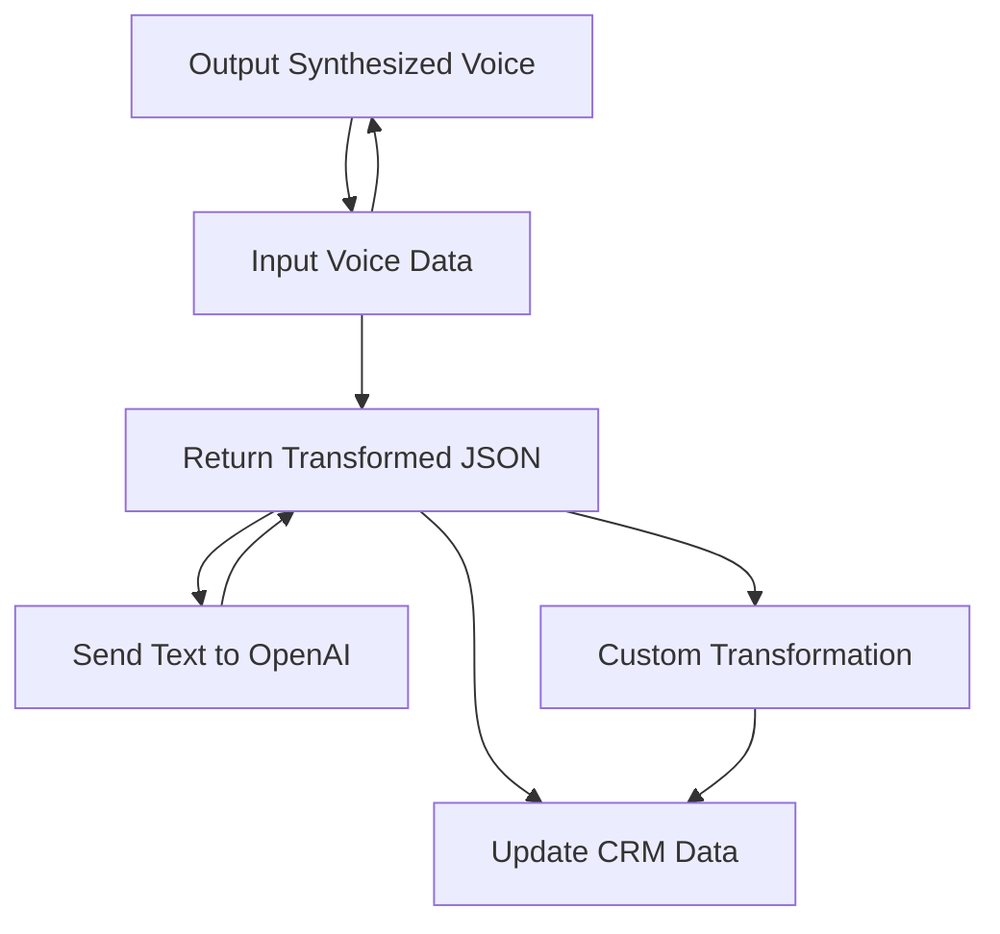

## Breve resumen técnico

Este repositorio representa una solución híbrida que integra **front-end**, **plugins de CRM**, y **servicios en la nube** (específicamente Azure Speech SDK y Azure OpenAI). El objetivo principal es implementar accesibilidad y automatización de tareas mediante procesamiento de voz y transformación de texto estructurado.

La solución incluye:
- Un **front-end** con funciones para entrada/síntesis de voz y manipulación de formularios.
- Un **plugin back-end** diseñado para trabajar dentro de Microsoft Dynamics CRM, utilizando Azure OpenAI para transformaciones avanzadas.
- Dependencia directa de servicios en la nube como Azure Speech SDK y OpenAI.

---

## Descripción de arquitectura

### Tipo:
La solución presenta una arquitectura **híbrida** compuesta por las siguientes capas:
1. **Presentación** (Front-end): Scripts JavaScript interactúan con el DOM y con Azure Speech SDK.
2. **Lógica de Negocio**:
   - Plugins de Dynamics CRM para interactuar con datos del sistema y realizar transformaciones de texto.
   - Transformación personalizada de datos mediante OpenAI.
3. **Servicios Externos**: 
   - Azure OpenAI y Azure Speech SDK manejan la parte de inteligencia artificial y síntesis/entrada de voz.
4. **Persistencia**: Dynamically maneja datos persistentes directamente en CRM.

### Arquitectura:
- **Estratificada**:
   - Front-end se comunica con servicios de Azure para funcionalidades específicas (voz, OpenAI).
   - Plugins implementan lógica de negocio en Microsoft Dynamics CRM, gestionando datos y dependencias del sistema.
   - A nivel de diseño, los componentes siguen el **patrón de plugin** en CRM y principios de **service-oriented architecture (SOA)** para integrar servicios en la nube.

---

## Tecnologías usadas

1. **Lenguajes/especificaciones:**
   - JavaScript para el front-end.
   - C# (.NET Framework/Core System) para el backend en forma de plugin.

2. **Servicios en la Nube:**
   - **Azure Speech SDK** para conversión texto-voz/voz-texto.
   - **Azure OpenAI (GPT)** para transformación y generación de texto.

3. **Microsoft Dynamics SDK**:
   - Uso de interfaces como `IPlugin`, `IOrganizationService`, y demás para interactuar con datos y eventos en CRM.

4. **Librerías adicionales:**
   - `Newtonsoft.Json` en el plugin para manejar JSON.
   - `System.Net.Http` para enviar integraciones REST hacia OpenAI.

5. **Patrones:**
   - **Modularidad** y **patrón funcional** en front-end scripts.
   - **Plugin pattern** en el sistema CRM.
   - **Service-oriented architecture (SOA)** para integrar servicios de nube como OpenAI y Speech SDK.

---

## Diagrama Mermaid válido para GitHub

---

## Conclusión final

La solución en el repositorio combina las capacidades del front-end preprocesamiento, servicios de inteligencia artificial y un plugin CRM en un diseño extensible. Sus tecnologías claves (Azure Speech SDK, Azure OpenAI y Microsoft Dynamics CRM) permiten interacción natural por voz y automatización de tareas CRM mediante IA. Al adoptar patrones de modularidad y servicios orientados, esta arquitectura es apta para escenarios empresariales que aprovechan funcionalidades nativas de la nube y de Dynamics CRM.