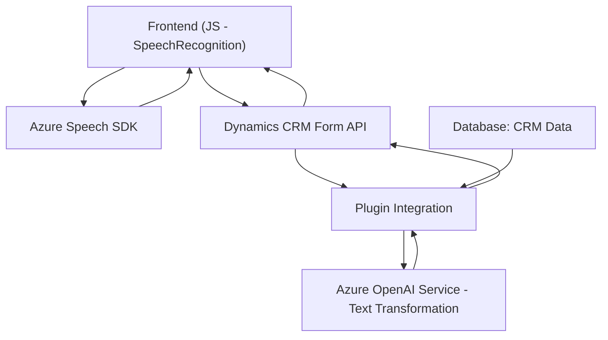

### Breve Resumen Técnico

El repositorio describe una solución integral orientada a la interacción con datos a través de reconocimiento de voz y manipulación de texto utilizando Microsoft Azure. Consta de tres principales componentes:

1. **Frontend**: Establece la integración de funciones relacionadas con la síntesis y reconocimiento de voz a través del Azure Speech SDK. Ideal para interactuar con formularios de un CRM (posiblemente Dynamics 365).
   
2. **Plugin (`TransformTextWithAzureAI.cs`)**: Implementa lógica empresarial en el backend como un plugin de Dynamics CRM. Utiliza servicios como Azure OpenAI para la transformación avanzada de texto.

3. **Integración API vía CRM**: Permite la comunicación entre cliente y backend mediante APIs personalizadas, con un enfoque en el procesamiento dinámico de datos.

---

### Arquitectura

La solución se basa en una **arquitectura distribuida de componentes** con características de una arquitectura de **n capas**, ya que organiza claramente la lógica en un nivel de **presentación (frontend)**, un nivel de **servicio (API/plugin)** y un **nivel externo (Azure Speech SDK/Azure OpenAI)**.

#### **Elementos de arquitectura detectados:**
1. **Nivel de Presentación**:
   - `readForm.js` y `speechIntegration.js` proporcionan funcionalidades de interacción directa con el usuario, capturan la voz y procesan eventos en formularios.
   - Frontend interactúa con servicios externos (Azure API) y el backend.

2. **Nivel de Middleware (Plugin)**:
   - La clase en `TransformTextWithAzureAI.cs` se comporta como una capa que conecta el CRM con el servicio externo (Azure OpenAI).

3. **Servicios Externos**:
   - Uso de **Azure Speech SDK**: para reconocimiento y síntesis de voz en tiempo real.
   - Uso de **Azure OpenAI**: para transformar texto en un sistema CRM.

Esta arquitectura aprovecha integraciones con servicios externos y sigue principios de separación de responsabilidades, donde cada capa cumple un rol específico en el flujo de la aplicación.

---

### Tecnologías Usadas

1. **Frontend**:
   - **JavaScript** como lenguaje base.
   - **Azure Speech SDK** para las funcionalidades de reconocimiento y síntesis de voz.
   - **Dynamics CRM APIs** (`Xrm.WebApi`): Para realizar modificaciones y obtener datos en formularios del sistema CRM.

2. **Backend**:
   - **C#**: Lenguaje para construir el plugin.
   - **Microsoft Dynamics SDK**: Interacción directa con el CRM como un plugin.
   - **Azure OpenAI Service**: Utilizado para procesamiento avanzado de texto.
   - **HTTP client libraries**: Para comunicación con servicios externos.

3. **Patrones de Programación**:
   - **Callback Pattern**: Garantizar que las tareas asincrónicas (como la carga de Azure SDK) se ejecuten antes de iniciar las acciones dependientes.
   - **Encapsulación modular**: Separación de responsabilidades en funciones y métodos específicos.
   - **Facade Pattern**: Simplificación del uso de servicios externos como el SDK de voz y OpenAI mediante métodos encapsulados como `speakText` y `GetOpenAIResponse`.
   - **Client-Server Interaction**: Comunicación directa cliente-servidor en el plugin y frontend.

4. **Dependencias Externas**:
   - **Azure Speech SDK**: Reconocimiento y síntesis de voz.
   - **Azure OpenAI Service**: Procesamiento avanzado de texto.
   - **Microsoft Dynamics CRM APIs**: Para manipulación directa de datos del CRM.
   - **HTTP Request libraries** (en C#) para comunicación con Azure OpenAI.

---

### Diagrama Mermaid

---

### Conclusión Final

La solución presentada combina un frontend dinámico con capacidad de reconocimiento/síntesis hablado (Azure Speech SDK) y un backend que potencia las funcionales del CRM utilizando un plugin basado en Azure OpenAI. Es modular, extensible y distribuida, ideal para sistemas empresariales como Dynamics 365 en escenarios que requieren convergencia entre voz y procesamiento avanzado de datos.

#### **Puntos fuertes**:
- Modularidad, separación de responsabilidades.
- Integración estándar con servicios externos.
- Expansibilidad usando SDKs poderosos como Azure Speech y OpenAI.

#### **Áreas para optimización**:
1. Configuración dinámica: Uso de variables de entorno para evitar hardcoding (claves de API, endpoints).
2. Escalabilidad: Evaluar integración de patrones como **hexagonal architecture** para desacoplar aún más los servicios.