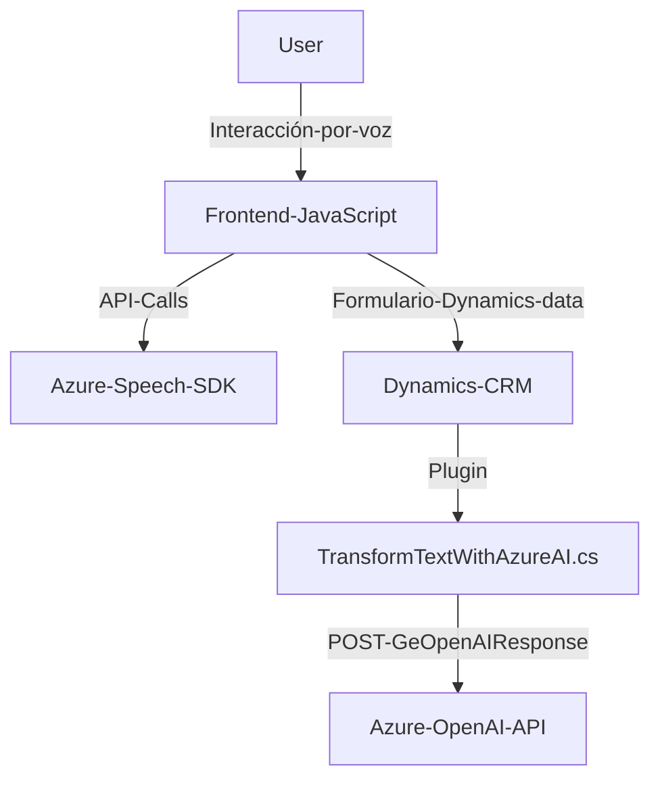

### Breve resumen técnico

El repositorio parece implementar funcionalidades que combinan entrada y síntesis de voz, procesamiento de formularios en Dynamics CRM, e integración con servicios de inteligencia artificial de Azure para transformar datos. Incluye tanto lógica del frontend en JavaScript como lógica backend en forma de plugins para Dynamics CRM.

---

### Descripción de arquitectura

La solución incluye tres capas principales de interacción:
1. **Frontend**: Responsable del manejo de formularios y voz en el navegador mediante el Azure Speech SDK.
2. **Backend (Plugins)**: Implementación de lógica personalizada en Dynamics CRM utilizando C# y Azure OpenAI para transformar datos.
3. **Servicios externos**: Conecta con Azure Speech SDK y Azure AI para funcionalidades de síntesis de voz e inteligencia artificial.

La arquitectura parece seguir un enfoque modular y basado en capas:
- **Frontend desacoplado**: Funcionalidad adaptada al navegador para interactuar con formularios de Dynamics CRM.
- **Backend extensible**: Plugins de Dynamics CRM que sirven como interfaz hacia servicios externos como Azure.
- **Microservicio externo**: Aunque no explícitamente presentado, los servicios de Azure funcionan como externos, promoviendo una arquitectura híbrida de aplicaciones con externalización.

La solución puede ser clasificada como "API + Frontend", ya que la funcionalidad del frontend se integra con APIs y un backend estático CRM mediante plugins.

---

### Tecnologías usadas

**Frontend:**
- **JavaScript**: Lenguaje de programación principal.
- **Azure Speech SDK**: Utilizado para síntesis y transcripción de voz.
- **Browser APIs**: Para manejar DOM y cargar scripts dinámicos.

**Backend:**
- **Microsoft Dynamics CRM SDK**: Para desarrollar plugins en C# que interactúan con la plataforma Dynamics CRM.
- **Azure OpenAI**: Para transformar texto utilizando inteligencia artificial avanzada.
- **C# .NET Framework**: Para implementar la lógica de transformación como plugin.
- **REST APIs**: Comunicación con servicios de Azure OpenAI mediante `HttpClient`.

---

### Diagrama **Mermaid**

---

### Conclusión final

La solución implementa una arquitectura modular que integra diferentes tecnologías:
- **Frontend**: permite interacción con formularios mediante entrada y síntesis de voz, utilizando Azure Speech SDK.
- **Backend**: se complementa con plugins de Dynamics CRM que hacen uso de Azure AI para la transformación dinámica de datos.
- **Patrones clave**: Delegación, Facade para interacción con servicios externos, y modularización.
- **Dependencias principales**: Azure Speech SDK, Azure OpenAI, Microsoft Dynamics CRM SDK.

Es una arquitectura de software orientada a la integración de servicios externos en un entorno CRM, con una interacción usuario-sistema basada en voz y automatización de procesos mediante inteligencia artificial.