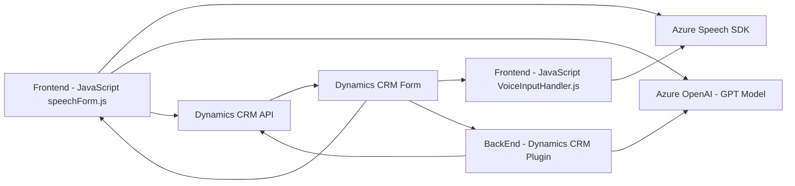

## Breve resumen técnico:
El repositorio contiene una solución destinada a integrar las capacidades de **Azure Speech SDK** y **Azure OpenAI API** con **Microsoft Dynamics CRM**, permitiendo la síntesis de texto a voz, reconocimiento de voz y transformación de texto natural en formatos estructurados con integración directa en formularios del CRM. La solución incluye:
- Funcionalidades frontend en **JavaScript** para interactuar con la interfaz de usuario del CRM.
- Plugins en **C#**, diseñados para transformar texto usando modelos de Azure OpenAI.

---

## Descripción de arquitectura:
Esta solución puede considerarse una arquitectura híbrida que combina:
- **N capas**: Dividida entre frontend (interacción con usuario y representación visual) y backend (lógica mediante plugins y API).
- **Integración con servicios externos**: Se apoya en servicios de Azure para ampliar las capacidades del sistema CRM, como reconocimiento de voz y procesamiento avanzado de texto con IA.
- **Event-driven architecture**: Tanto el frontend como los plugins se activan basados en eventos del usuario (grabación de voz, interacción con campos de formularios) o contexto del CRM.

---

## Tecnologías usadas:
1. **Frontend**:
   - **JavaScript**: Programa las funcionalidades frontend relacionadas con la voz y lectura de datos.
   - **Azure Speech SDK**: Para síntesis y reconocimiento de voz.
   - **Microsoft Dynamics CRM WebAPI**: Acceso y manipulación de datos del CRM.

2. **Backend**:
   - **Microsoft Dynamics CRM Plugins**:
     - **Azure OpenAI API** (Chat GPT-4) para transformación de texto en JSON estructurado.
   - **C#**: Desarrollo del plugin.
   - **Librerías .NET**, incluyendo `HttpClient` para llamadas externas.

3. **Patrones**:
   - **Event-Driven Programming**: Acciones basadas en eventos como la interacción con formularios o reconocimiento de voz.
   - **Modularización funcional**: Funciones separadas por responsabilidad y propósito para facilitar mantenibilidad.
   - **External Service Integration**: Usar SDK y APIs externos para funcionalidades avanzadas con Azure.

---

## Diagrama **Mermaid** válido para GitHub:

---

## Conclusión final:
La solución en este repositorio combina frontend en **JavaScript** y backend en **C#** para integrar capacidades avanzadas como reconocimiento y síntesis de voz junto con herramientas de IA para procesamiento de texto. Su arquitectura es **modular** y sigue un enfoque de **n-capas** con integración de servicios externos de **Azure** y **Microsoft Dynamics CRM API**. Este setup optimiza la interacción usuario-sistema, mejorando la respuesta a eventos y la conversión de información entre voz, texto y estructuras interpretables. Sin embargo, podría beneficiarse de una mayor separación de responsabilidades y documentación más detallada sobre sus dependencias externas.
