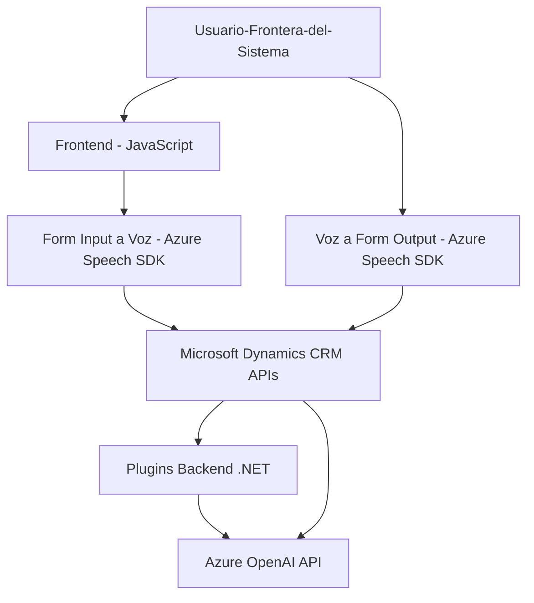

### Análisis basado en el repositorio:

#### Breve resumen técnico:
El repositorio contiene archivos que apuntan a tres componentes:
1. **Frontend**: Formularios en JavaScript que procesan datos con Azure Speech SDK para interacción de voz (texto a voz y voz a texto).
2. **Plugins en Dynamics CRM**: Back-end que amplía las capacidades de Dynamics CRM mediante servicios externos como Azure OpenAI y proporciona resultados procesados en formato JSON.

El enfoque del proyecto parece estar orientado a integrar accesibilidad e IA en un entorno empresarial usando Microsoft Dynamics CRM.

---

#### Descripción de la arquitectura:
La solución emplea **n capas**:
1. **Frontend**: JavaScript en la capa cliente, implementa interacciones como entrada y salida por voz en formularios.
2. **Backend**: Plugins implementados para Dynamics CRM con lógica de negocio personalizada. Proveen transformación de texto utilizando Azure AI y otras validaciones antes de actualizar valores en el sistema.
3. **Servicios externos**: Integración directa con APIs de terceros de Azure (Azure Speech SDK y Azure OpenAI).

El diseño implementa una arquitectura **orientada a eventos**: cada interacción con un formulario o un plugin desencadena una serie de pasos interdependientes, y utiliza el patrón de **integración por capas**.

---

#### Tecnologías y frameworks usados:
1. **Frontend**:
   - **Vanilla JavaScript**: Para manipulación de DOM y formularios asociados al contexto de Dynamics 365.
   - **Azure Speech SDK**: Para procesamiento de entrada de voz y síntesis de texto a voz.
   - **Microsoft Dynamics CRM APIs**: Para comunicación con datos del sistema.

2. **Backend**:
   - **C# (Framework relacionado: .NET)**: Construcción de plugins.
   - **Microsoft Dynamics CRM**: Plataforma de backend del sistema.
   - **Azure OpenAI Services**: Para análisis y transformación de texto usando inteligencia artificial.
   - **System.Net.Http & System.Text.Json**: Realización de solicitudes HTTP y manejo de datos JSON.

3. **Integraciones externas**:
   - **Azure Speech SDK**: Procesamiento de entrada y salida de voz basada en IA.
   - **Azure OpenAI API**: Modelo GPT utilizado para transformar texto según reglas definidas.
   - **Xrm SDK**: Biblioteca nativa de Dynamics CRM para manipulación de entidad/dato.

---

#### Dependencias o componentes externos presentes:
1. **Azure Speech SDK**: Provee configuraciones para reconocimiento de voz y síntesis de texto.
2. **Azure OpenAI**: Interconexión basada en HTTP y solicita transformaciones de texto con modelos de IA.
3. **Microsoft Dynamics**:
   - **Xrm.WebApi**: Gestión de formularios y entidades en Dynamics CRM.
   - **IPlugin y IPluginExecutionContext**: Desde el SDK de Dynamics para implementar plugins.
4. **JavaScript Libraries**:
   - Dinámico: Integración con scripts externos como `https://aka.ms/csspeech/jsbrowserpackageraw`.
5. **System Dependencies**:
   - **Newtonsoft.Json.Linq & System.Text.Json**: Manejo de estructuras JSON (aunque parcialmente utilizada en el backend).

---

### Generación de diagrama Mermaid para resumir la arquitectura:

---

#### Conclusión final:
Esta solución combina una arquitectura de **n capas** y orientación a eventos dentro de Microsoft Dynamics CRM para mejorar la experiencia de usuario con funcionalidades de accesibilidad y procesamiento avanzado de texto. Utiliza tecnologías modernas como Azure Speech SDK y OpenAI para ofrecer una experiencia interactiva con el usuario, mientras se asegura la integración adecuada en sistemas empresariales preexistentes.

Sin embargo, el proyecto puede mejorar aspectos del manejo centralizado de dependencias (por ejemplo: uso redundante de Newtonsoft.Json junto con System.Text.Json) y expandir pruebas para manejar excepciones específicas del entorno CRM o conexiones API.