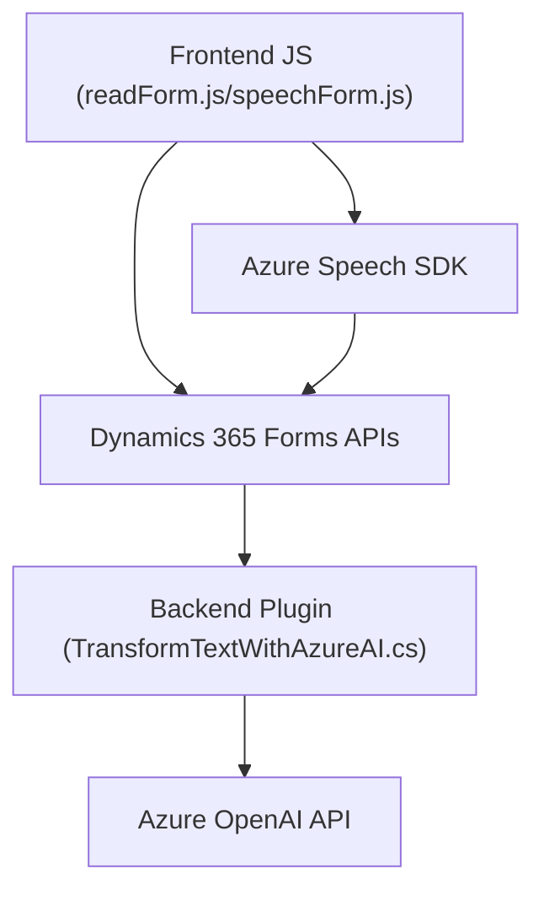

### Resumen técnico

El repositorio presenta varias archivos relacionados con una solución integrada, basada en la interacción entre interfaces de usuario (formularios), servicios API, y el uso de herramientas de Inteligencia Artificial como Azure Speech SDK y OpenAI mediante Dynamics 365. Este flujo facilita procesos empresariales como la síntesis de voz, la transcripción y la manipulación de datos de formularios.

---

### Descripción de la arquitectura

La solución consta de una **arquitectura híbrida** compuesta por las siguientes capas:
1. **Capa de Frontend**: Implementada como scripts en JavaScript (`readForm.js`, `speechForm.js`) que interactúan con el SDK de Azure Speech y manejan formularios de Dynamics 365. La lógica claramente modular promueve la legibilidad y reutilización.
2. **Capa de Backend (Plugins)**: Representada por `TransformTextWithAzureAI.cs`, que extiende funcionalidad personalizada de Dynamics CRM mediante plugins. Aquí se utilizan patrones como plugin-based y cliente/servidor para interacción con APIs.
3. **Servicios externos**:
   - **Azure Speech SDK** para reconocimiento y síntesis de voz.
   - **Azure OpenAI APIs** para transformación de texto basada en IA.

---

### Tecnologías utilizadas

1. **Frontend**:
   - **JavaScript**: Para lógica de negocio del cliente y manipulación dinámica de formularios.
   - **Azure Speech SDK**: Reconocimiento y síntesis de voz.
   - **Dynamics 365 Client-Side API**: Interacción directa con la plataforma y sus formularios.
   - **Fetch API/HTTP**: Para conectarse a APIs personalizadas.

2. **Backend**:
   - **C# (Microsoft.Xrm.Sdk)**: Desarrollo del plugin extendiendo Dynamics CRM.
   - **Newtonsoft.Json**: Manejo de estructuras JSON.
   - **Azure OpenAI**: Procesamiento textual con IA.

---

### Diagrama **Mermaid**

---

### Conclusión final

La solución se organiza alrededor de una arquitectura híbrida y orientada a servicios con capas diferenciadas: frontend para interacción y manipulación de formularios, y backend con lógica empresarial extensible mediante plugins en Dynamics CRM. 

Los principales beneficios de esta estructura son:
- Modularidad y mantenibilidad.
- Integración con servicios externos como Azure AI y Speech SDK para procesar datos de forma avanzada.
- Escalabilidad debido al diseño desacoplado entre cliente, backend y servicios externos.

Es ideal para entornos empresariales que usan Dynamics 365 como núcleo operativo, donde la inteligencia artificial mejora la experiencia y eficiencia del usuario.