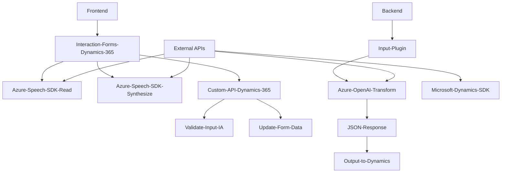

### Breve resumen técnico
El repositorio presenta una solución híbrida para la interacción entre voz, formularios de Dynamics 365, procesamiento de texto mediante Azure OpenAI, y generación de voz con Azure Speech SDK. Consiste en tres partes principales:

1. **Frontend:** Implementación en JavaScript para la interacción en formularios web (Dynamics 365) y entrada/salida vinculada a servicios de Azure.
2. **Backend:** Plugin en C# para procesar texto enviado por Dynamics CRM mediante Azure OpenAI.
3. **Integración de servicios:** Uso extensivo de servicios en la nube (Azure Speech SDK, OpenAI en Azure).

---

### Descripción de arquitectura
La solución utiliza una **arquitectura mixta**:
- **Cliente-servidor:** Las interacciones se dividen en una capa cliente (JavaScript) que procesa formularios y vincula funciones con servicios en la nube, y una capa servidor (C#) que se integra como plugin en Dynamics CRM.
- **N capas:** Separación clara de responsabilidades entre el cliente, plugins en Dynamics CRM, y APIs externas (Azure Speech y OpenAI).
- **Integración con nube:** Dependencia de SDKs y APIs de Azure para la ejecución de síntesis y procesamiento de texto.

---

### Tecnologías usadas
1. **Frontend:**
   - JavaScript ES6+.
   - Azure Speech SDK (procesamiento de voz y generación de audio).
   - DOM API (manipulación de formularios y carga dinámica de scripts).

2. **Backend:**
   - C# (implementación de plugin en Dynamics CRM).
   - Microsoft Dynamics SDK (gestión de datos en el CRM).
   - Azure OpenAI (procesamiento de texto con GPT-4).
   
3. **Dependencias múltiples:**
   - `Newtonsoft.Json` y `System.Text.Json` para manejar estructuras JSON necesarias en el procesamiento.
   - `System.Net.Http` para enviar solicitudes al servicio Azure OpenAI.

---

### Diagrama Mermaid (válido para Markdown en GitHub)

---

### Conclusión final
La solución está diseñada para habilitar funcionalidades avanzadas de interacción mediante voz y texto en la plataforma Dynamics 365, aprovechando servicios de Azure. Utiliza una arquitectura híbrida (cliente-servidor y n-capas) con un enfoque modular y patrones definidos para manejo de datos y ejecución de plugins. La integración con Microsoft Dynamics SDK y la dependencia en servicios de Azure (Speech, OpenAI) son los principales componentes externos y puntos de comunicación de la solución.