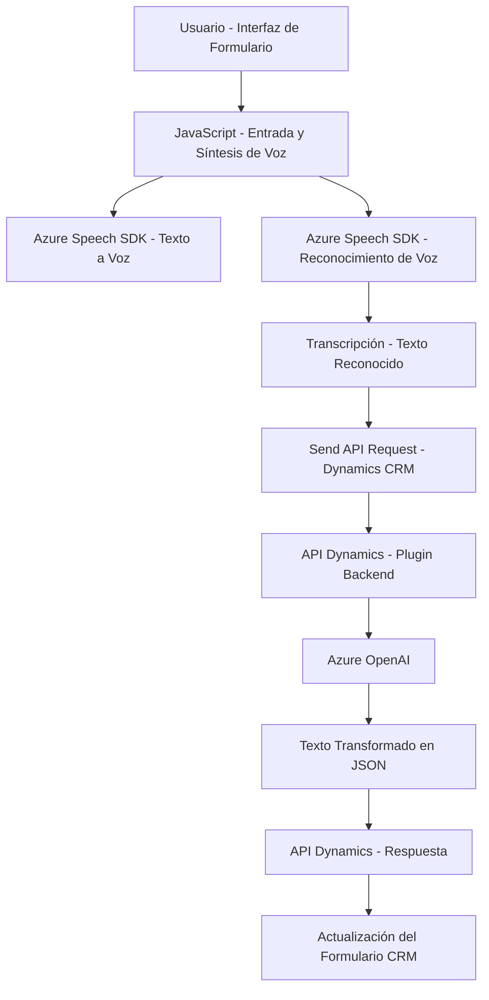

### Breve resumen técnico
El repositorio incluye componentes frontend y plugins del backend diseñados para integrar funcionalidades de voz y texto mediante el servicio Azure Speech SDK y Azure OpenAI dentro de sistemas de Dynamics CRM. Esto aprovecha múltiples tecnologías como APIs externas, mapeo de datos y procesamiento de voz, y se distribuye en diferentes capas de funcionalidad.

---

### Descripción de arquitectura

**Arquitectura:**  
Este sistema está desarrollado bajo un enfoque de arquitectura de **plugins para Dynamics CRM** combinado con **capas funcionales independientes** que se integran mediante servicios externos como Azure SDKs (Speech y OpenAI). 

1. **Frontend:** Utiliza JavaScript para interacciones con formularios basadas en **entrada de voz** y **síntesis de voz**, y para realizar llamadas a APIs externas. Por lo tanto, es un sistema modular con enfoque en la interfaz de usuario.
2. **Backend:** Es un plugin en C# basado en la arquitectura extensible de Dynamics CRM (utilizando `IPlugin`), con lógica encapsulada para transformación de texto. Este plugin interactúa directamente con el servicio Azure OpenAI.

**Patrones utilizados:**  
- **Modularización:** Código dividido en funciones y métodos con responsabilidades específicas.
- **Integración con servicios externos:** Llamadas a Azure SDK (Speech y OpenAI).
- **Condicionalidad:** Validación de existencia de SDK antes de ejecutarlo.
- **Procesamiento dinámico:** Mapeo dinámico de datos entre interfaz de usuario y modelo en Dynamics CRM.
- **Extensibilidad:** Uso de componentes y plugins extensibles en Dynamics CRM.

---

### Tecnologías usadas
1. **Frontend (JavaScript)**:
   - Lenguaje: JavaScript (ES6).
   - SDK: Azure Speech SDK para síntesis de voz y reconocimiento de voz.
   - Integración con CRM: Funciones específicas para interactuar con la API de Dynamics CRM.
   - Programación asincrónica (`async/await`).

2. **Backend (C#, Dynamics Plugin)**:
   - Lenguaje: C# (.NET Framework).
   - Servicios de Dynamics CRM: `IPlugin`, `IOrganizationService`.
   - Integración con Azure OpenAI: Llamadas HTTP mediante `HttpClient`.

3. **Servicios externos**:
   - **Azure Speech SDK**: Para síntesis de texto a voz y reconocimiento de voz.
   - **Azure OpenAI**: Para transformar texto conforme a reglas predefinidas.

4. **Dependencias principales**:
   - `Microsoft.Xrm.Sdk`: Interacción con Dynamics CRM.
   - `System.Net.Http`: Para realizar llamadas a APIs externas.
   - `Newtonsoft.Json.Linq`: Gestión avanzada de JSON.
   - Azure SDKs accesibles desde endpoints específicos.

---

### Diagrama Mermaid válido para GitHub

---

### Conclusión final

El repositorio implementa una solución que interconecta el reconocimiento de voz, la síntesis de texto a voz y la transformación mediante inteligencia artificial, todo dentro del ecosistema Dynamics CRM. La arquitectura es **modular y en capas** con una fuerte dependencia de servicios externos (Azure SDKs). Esto la hace escalable y reutilizable. Sin embargo, aspectos de configuración (como las claves de API) podrían refinirse usando un gestor de secretos para evitar inseguridades en entornos de producción. 

Esta solución destaca por:
1. Realizar una integración eficiente entre frontend y backend.
2. Utilizar enfoques modernos como plugins de Dynamics y programación asincrónica.
3. Aplicar procesamiento dinámico del contexto del formulario, aprovechando el potencial de Azure para inteligencia artificial y análisis de datos.

