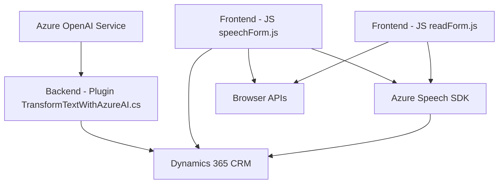

### Breve resumen técnico

El repositorio parece pertenecer a una solución que integra una plataforma de CRM (Dynamics 365) con servicios externos de Azure (Speech SDK y OpenAI). Tiene componentes frontend y backend que procesan datos relacionados con formularios y entrada/salida de voz. La funcionalidad está diseñada para convertir texto en voz, reconocer voz y transcribirla, así como transformar texto entrante en datos estructurados mediante IA.

---

### Descripción de arquitectura

La solución presenta una arquitectura de **varias capas** que combina diferentes tecnologías con una separación clara:

1. **Capa de Presentación (Frontend)**:
   - Implementación en JavaScript que interactúa con la UI y usa el Speech SDK de Azure.
   - Modularidad: el código está enfocado en tareas como leer formularios, procesar transcripciones y sintetizar o reconocer voz de entrada.

2. **Capa de Lógica de Negocio (Backend)**:
   - Plugins para Dynamics CRM escritos en C#. Este backend maneja interacciones con el contexto del CRM, usa lógica personalizada y llama a servicios externos como Azure OpenAI.

3. **Capa de Servicios Externos**:
   - Azure Speech SDK para gestión de reconocimiento y síntesis de voz.
   - Azure OpenAI para transformación de texto con IA.

Los componentes están organizados según las responsabilidades: frontend para la interacción del usuario (con voz y formularios) y backend para procesamiento empresarial y transformación de datos.

Patrones arquitectónicos presentes:
- **Event-Driven Architecture**: Los métodos como `ensureSpeechSDKLoaded` dependen de eventos, como la disponibilidad del SDK o interacción del usuario.
- **Modularidad**: Cada función y clase está segmentada para realizar tareas específicas.
- **Integración con servicios externos**: Uso de SDKs y APIs en el frontend y backend para conectarse con Azure Speech y OpenAI.

---

### Tecnologías usadas

- **Frontend**:
  - **JavaScript** para interacción y procesamiento de datos en el navegador.
  - **Azure Speech SDK** para la síntesis y reconocimiento de voz.

- **Backend**:
  - **C# (.NET Framework)** para implementar lógica de negocio en forma de plugins dentro de Dynamics CRM.
  - **Azure OpenAI Service** para transformar texto con IA.
  - **Newtonsoft.Json** para manejo de JSON.
  - **System.Net.Http** para solicitudes HTTP externas.

- **Plataforma asociada**:
  - **Dynamics 365 CRM** para interacción empresarial y formularios.

---

### Dependencias o componentes externos

- **Dependencias del frontend**:
  - **Azure Speech SDK**: Sintetizar voz y reconocimiento de entrada de voz.
  - **Browser APIs**: Manipulación de DOM y carga dinámica de scripts.

- **Dependencias del backend**:
  - **Azure OpenAI Service**: Procesamiento de texto mediante IA avanzada.
  - **Dynamics CRM Plugin API (Microsoft.Xrm.Sdk)**: Para interactuar con formularios CRM y extender su funcionalidad.

---

### Diagrama Mermaid

---

### Conclusión final

La solución implementa una **arquitectura n-capas** con una integración sólida entre frontend, backend y servicios externos. El frontend interactúa con formularios y voz del usuario usando el Speech SDK, mientras que el backend realiza transformaciones más avanzadas con el servicio OpenAI y aplica resultados a un formulario en Dynamics CRM. Por su modularidad y diseño bien segmentado, este repositorio es ideal para escenarios empresariales que necesitan síntesis de voz, reconocimiento y procesamiento de datos en tiempo real con IA.